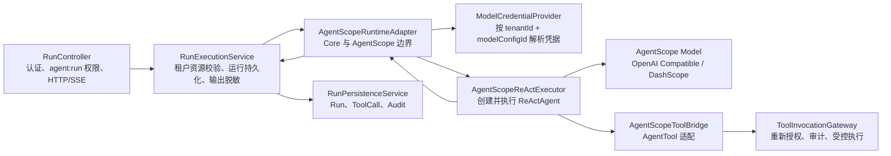
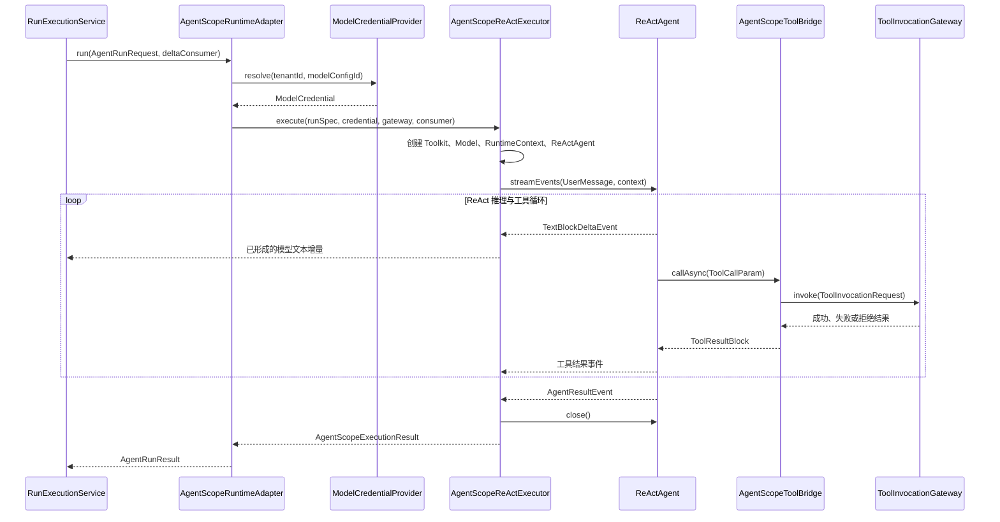

# CM Agent AgentScope Adapter

## 1. 模块定位

`cm-agent-agentscope-adapter` 是 CM Agent 领域运行契约与 AgentScope Java 2.0.0 之间的适配层。它把 Core 提供的 `AgentRunRequest` 转换为真实的 `ReActAgent` 单轮执行流程，再把模型输出、工具调用记录和失败状态转换回 `AgentRunResult`。

这个模块的核心价值不是简单调用模型，而是在使用 AgentScope 推理与工具循环的同时，保留 CM Agent 的企业治理边界：

- 租户、Agent、主体和 Run 上下文始终来自已经校验的领域请求。
- 模型凭据由外部 `ModelCredentialProvider` 按租户和模型配置解析，适配器不读取数据库或配置文件。
- AgentScope 只能调用本次运行可见的工具，实际执行必须再次经过 `ToolInvocationGateway`。
- 工具授权拒绝、审计或持久化基础设施失败、模型超时、工具超时具有不同终态语义。
- AgentScope 类型不会进入 `cm-agent-core`，Core 保持与具体智能体框架无关。

模块本身不依赖 Spring、Spring Security、JDBC、Controller 或 Repository 实现。Spring 条件装配、模型凭据加解密、运行持久化和 HTTP/SSE 接口都位于 `cm-agent-server`。

## 2. 模块边界



职责分界如下：

| 层次 | 负责内容 | 不负责内容 |
| --- | --- | --- |
| Core | `AgentRuntime`、运行请求与结果、凭据和工具网关契约 | AgentScope API、Spring 装配、数据库 |
| Adapter | AgentScope 模型、ReActAgent、事件流、工具桥接、终态映射 | HTTP、认证、Repository、凭据存储、审计实现 |
| Server | Spring Bean 装配、认证授权、凭据解密、工具治理、持久化、SSE | AgentScope 内部事件和 Provider Builder 细节 |

## 3. 依赖关系

模块直接依赖：

- `cm-agent-core`：稳定的领域对象与运行时接口。
- `agentscope-core:2.0.0`：`ReActAgent`、`RuntimeContext`、Toolkit、事件和模型执行配置。
- `agentscope-extensions-model-openai:2.0.0`：OpenAI Compatible 模型实现。
- `agentscope-extensions-model-dashscope:2.0.0`：DashScope 原生模型实现。
- `jackson-databind`：工具输入 Schema 解析和调用参数序列化。
- Reactor：由 AgentScope 提供，用于模型事件流和异步工具结果。

三个 AgentScope 依赖在本模块 POM 中声明为 `optional`。嵌入式使用者需要在最终运行应用中显式提供所需的 AgentScope Core 与 Provider 扩展；`cm-agent-server` 已承担这项运行时装配职责。

## 4. 核心类型

### 4.1 `AgentScopeRuntimeAdapter`

[`AgentScopeRuntimeAdapter`](src/main/java/com/cmagent/agentscope/AgentScopeRuntimeAdapter.java) 是模块对 Core 暴露的主要入口，实现 `AgentRuntime`。

它负责：

1. 使用 `request.tenantId()` 和 `request.modelConfig().id()` 解析模型凭据。
2. 将领域请求包装为 `AgentScopeRunSpec`。
3. 调用内部 `AgentScopeExecutor`。
4. 使用注入的 `Clock` 补充开始和结束时间。
5. 将内部执行终态映射为 `AgentRunResult`。

凭据缺失或不可解密时，`ModelCredentialUnavailableException` 会被转换为固定的 `FAILED` 结果，错误文本为“模型凭据不可用”。异常原因、密文和 API Key 都不会进入对外结果。

适配器同时覆盖 `AgentRuntime` 的流式方法。非流式与流式调用使用同一执行链，区别仅在于是否向上层传递文本增量。

### 4.2 `AgentScopeRunSpec`

[`AgentScopeRunSpec`](src/main/java/com/cmagent/agentscope/AgentScopeRunSpec.java) 是 `AgentRunRequest` 的轻量只读视图，提供运行标识、租户标识、Agent 标识、主体标识和用户输入等常用字段。

这些字段不会在适配层复制保存，而是统一从已经完成领域校验的请求派生，避免出现两份不一致的租户或主体上下文。

### 4.3 `AgentScopeExecutor`

[`AgentScopeExecutor`](src/main/java/com/cmagent/agentscope/AgentScopeExecutor.java) 是包内执行策略接口，用于隔离 `AgentScopeRuntimeAdapter` 与真实 ReAct 实现。

- 三参数 `execute` 是唯一抽象方法，便于测试使用 Lambda 或 Fake Executor。
- 四参数 `execute` 增加文本增量消费者；默认实现回退到非流式路径。
- 该接口是适配器内部测试缝隙，不是对外公开 SPI。

### 4.4 `AgentScopeModelFactory`

[`AgentScopeModelFactory`](src/main/java/com/cmagent/agentscope/AgentScopeModelFactory.java) 根据领域模型配置创建 AgentScope `Model`。每次运行都会创建新的模型实例，不跨租户缓存带凭据的模型。

当前映射规则：

| `ModelProviderType` | AgentScope 实现 | 生成选项入口 |
| --- | --- | --- |
| `OPENAI_COMPATIBLE` | `OpenAIChatModel` | `generateOptions` |
| `DASHSCOPE_NATIVE` | `DashScopeChatModel` | `defaultOptions` |

两种 Provider 都会映射：

- API Key：来自当前运行解析出的 `ModelCredential`。
- Base URL：来自当前租户的 `ModelConfig`。
- 模型名：优先使用 `AgentDefinition.modelName`，为空时回退到 `ModelConfig.modelName`。
- 温度：来自 `AgentDefinition.temperature`。
- `stream(true)`：用于向 ReAct 事件流提供模型文本增量，不代表 HTTP 接口必然采用流式响应。

### 4.5 `AgentScopeRuntimeOptions`

[`AgentScopeRuntimeOptions`](src/main/java/com/cmagent/agentscope/AgentScopeRuntimeOptions.java) 保存三项运行策略：

| 选项 | 默认值（Server） | 作用 |
| --- | --- | --- |
| `modelTimeout` | `60s` | 单次模型执行超时 |
| `toolTimeout` | `30s` | 单次 AgentScope 工具执行超时 |
| `modelMaxAttempts` | `2` | AgentScope 模型最大尝试次数，允许范围为 1 到 5 |

工具执行的 `maxAttempts` 在执行器中固定为 `1`。工具可能产生外部副作用，适配器不会让 AgentScope 隐式重试；如果某类工具允许重试，应在受治理网关或具体执行器中基于幂等策略显式实现。

### 4.6 `AgentScopeReActExecutor`

[`AgentScopeReActExecutor`](src/main/java/com/cmagent/agentscope/AgentScopeReActExecutor.java) 是真实执行核心，负责创建 Toolkit、Model、RuntimeContext 和 ReActAgent，订阅事件流，处理超时与中断，并映射最终结果。

每次运行都会创建独立的：

- `Toolkit`
- `ObjectMapper`
- `AgentScopeRunGate`
- 一组 `AgentScopeToolBridge`
- AgentScope `Model`
- `RuntimeContext`
- `ReActAgent`

这种“每次运行独立实例”的策略使并发运行之间不共享可变工具记录、上下文和带凭据模型，也让模型配置变更与凭据轮换能够在下一次运行生效。

`RuntimeContext` 的映射如下：

| AgentScope 字段 | 值 | 原因 |
| --- | --- | --- |
| `userId` | `tenantId:principalId` | 防止不同租户的同名主体发生碰撞 |
| `sessionId` | `runId` | 当前是单轮运行，不复用跨运行会话 |
| `tenantId` extra | 当前租户 ID | 为框架扩展保留可信租户上下文 |
| `agentId` extra | 当前 Agent ID | 关联 Agent |
| `principalId` extra | 当前认证主体 ID | 关联调用主体 |
| `runId` extra | 当前 Run ID | 关联运行、工具和诊断 |

ReActAgent 的关键设置：

- `name`、`sysPrompt`、`maxIters` 来自 `AgentDefinition`。
- 模型执行配置使用 `modelTimeout` 和 `modelMaxAttempts`。
- 工具执行配置使用 `toolTimeout`，并固定单次尝试。
- `enableMetaTool(false)`、`enableTaskList(false)`，避免未经 CM Agent 治理的旁路能力。

AgentScope 返回的是 Reactor 事件流，但 Core 的 `AgentRuntime` 当前仍是同步契约。执行器使用 `blockLast()` 等待事件流结束，因此调用线程会阻塞到运行完成或失败。

AgentScope 2.0.0 的 `ReActAgent.close()` 当前为空实现，执行器仍在 `finally` 中统一调用它，以保持稳定生命周期顺序，并兼容后续版本或测试替代实现可能增加的资源释放行为。

### 4.7 `AgentScopeToolBridge`

[`AgentScopeToolBridge`](src/main/java/com/cmagent/agentscope/AgentScopeToolBridge.java) 把一个 `ToolDefinition` 适配为 AgentScope `AgentTool`。

暴露给 AgentScope 的只有：

- 工具名称
- 工具描述
- 输入 JSON Schema

模型发起调用后，桥接器使用领域请求中的可信上下文构造 `ToolInvocationRequest`：

- `tenantId`
- `agentId`
- `principal`
- `runId`
- AgentScope 生成的 `toolCallId`
- 领域工具 ID
- 模型提交的工具名称
- JSON 输入

桥接器不会根据 `ToolDefinition.endpoint` 自动发起网络请求。请求必须交给 `ToolInvocationGateway`，由 Server 实现重新核对工具定义、租户归属、Agent 授权、注册执行器和审计要求。

工具 Schema 在桥接器构造阶段解析，根节点必须显式为 `type: object`。无效 Schema 会在模型调用开始前失败，避免模型拿到一个实际无法执行的工具。

`callAsync` 使用 `Mono.fromCallable` 包装同步网关。这个包装提供延迟订阅和响应式取消信号，但不会自动切换线程，也不会把同步网关变成非阻塞调用；实际调度由 AgentScope 工具执行链决定。

工具记录只保存排序后的输入字段名摘要，不保存参数值。未知异常统一转换为“工具调用失败”，避免输入值、异常堆栈或内部实现细节进入运行结果。

### 4.8 `AgentScopeRunGate`

[`AgentScopeRunGate`](src/main/java/com/cmagent/agentscope/AgentScopeRunGate.java) 是一次运行内所有工具桥接器共享的并发与中止门控。

它解决四类问题：

1. **串行进入治理网关**：公平 `ReentrantLock` 保证同一运行的工具网关调用按顺序进入，等待线程可响应中断。
2. **首次基础设施失败优先**：审计或持久化等基础设施失败一旦发生，会被原子保存；后续工具调用不会继续越过网关。
3. **抑制迟到结果**：网关调用前后都检查超时和取消状态。即使外部调用忽略中断并迟到返回，也不会再创建成功记录。
4. **Agent 中断去重**：超时事件和异常处理可能同时请求中断，实际 `interrupt` 最多执行一次；中断失败会被保留。

AgentScope 2.0.0 的工具超时不能只依赖通用取消信号判断。执行器会按 `toolCallId` 聚合 `ToolResultTextDeltaEvent`，在 `ToolResultEndEvent` 到达时，同时检查：

- 该调用尚未由桥接器形成成功、失败或拒绝记录。
- 完整文本精确等于 AgentScope 根据当前 `toolTimeout` 生成的超时包装。

这种精确识别可以防止普通工具错误或模型文本伪造超时信号。

### 4.9 `AgentScopeExecutionResult`

[`AgentScopeExecutionResult`](src/main/java/com/cmagent/agentscope/AgentScopeExecutionResult.java) 是适配器内部终态快照，包含状态、输出、工具记录和安全错误说明。

- 不允许使用 `RUNNING`，因为它只表示上层持久化流程的中间状态。
- 工具记录通过 `List.copyOf` 防御性复制。
- 成功、失败和拒绝通过命名工厂创建。
- 工具授权拒绝优先于最终模型消息，避免模型在拒绝后生成说明文本时把 Run 误判为成功。

## 5. 一次完整运行的执行顺序



上层 `RunExecutionService` 在进入适配器之前已经完成：

1. 从认证主体取得可信 tenant。
2. 查询并校验当前租户的 Agent 和模型配置。
3. 根据授权关系筛选本次运行可见工具。
4. 创建 `RUNNING` 记录，获得最终 `runId`。

适配器返回后，上层继续负责：

1. 对最终输出和工具记录执行脱敏。
2. 将 Run 更新为终态并保存 ToolCall。
3. 写入严格审计事件。
4. 返回普通 HTTP 结果，或发送 SSE `completed` 事件。

## 6. 事件与流式输出

执行器只处理和转发明确需要的 AgentScope 事件：

| 事件 | 用途 | 是否向上层输出 |
| --- | --- | --- |
| `TextBlockDeltaEvent` | 最终回答文本增量 | 是，非空时传给消费者 |
| `ToolResultTextDeltaEvent` | 聚合工具结果文本、识别框架超时 | 否 |
| `ToolResultEndEvent` | 判断工具结果是否由桥接器完成 | 否 |
| `AgentResultEvent` | 保存最终 `Msg` | 否，最终通过 `AgentRunResult` 返回 |

思考过程、工具参数和工具原始输出不会通过文本增量通道发送给控制台。

适配器支持文本增量回调，但不实现 HTTP。Server 的 `/api/agents/{agentId}/runs/stream` 使用 SSE 将增量发送给浏览器；浏览器断开只停止发送，不代表 AgentScope 运行被取消，后端仍会完成运行、持久化和审计收口。

## 7. 工具结果与运行终态

| 场景 | ToolCall 状态 | Run 状态 | 对外错误 |
| --- | --- | --- | --- |
| 模型完成且无工具拒绝 | 按各次调用实际结果 | `SUCCEEDED` | 空 |
| 工具普通执行失败，但模型形成最终回答 | `FAILED` | 可以是 `SUCCEEDED` | Run 可无错误 |
| 任一工具被授权策略拒绝 | `DENIED` | `DENIED` | 使用受控拒绝原因 |
| 事件流结束但没有最终消息 | 保留已完成记录 | `FAILED` | “Agent 运行失败” |
| 模型或工具超时 | 保留超时前记录 | `FAILED` | “Agent 运行超时” |
| 已知模型 Provider 或 HTTP 传输故障 | 保留已完成记录 | `FAILED` | “Agent 运行失败” |
| 模型凭据不可用 | 无工具调用 | `FAILED` | “模型凭据不可用” |
| 工具审计、持久化等基础设施失败 | 不伪造普通失败记录 | 向上抛出 | 由 Server 严格失败边界处理 |
| 未知编程错误 | 视发生阶段而定 | 不在适配器内伪装成已知错误 | 向上抛出并由 Server 记录诊断 |

失败优先级中有两个重要原则：

- 基础设施失败不能被 AgentScope 响应式链消费后降级成普通工具错误。
- 授权拒绝决定整个 Run 的 `DENIED` 终态，即使模型随后生成了可读说明。

## 8. 凭据与多租户安全

适配器依赖 `ModelCredentialProvider`，但不限定凭据存储方式。Server 默认使用 `DatabaseModelCredentialProvider`：

1. 按 `tenantId + modelConfigId` 查询当前租户模型配置的 API Key 密文。
2. 使用由部署环境提供的 AES-256 主密钥执行 AES/GCM 解密。
3. 创建只供当前模型调用使用的 `ModelCredential`。
4. 缺失、损坏、版本不支持或主密钥不匹配统一转换为 `ModelCredentialUnavailableException`。

安全边界：

- 明文 API Key 不进入 `AgentRunRequest`、`AgentRunResult`、ToolCall、DTO、日志或审计。
- `AgentScopeRuntimeAdapter` 只使用领域请求中的 tenant 和模型配置 ID，不接受客户端覆盖 tenant。
- 每次运行创建独立带凭据模型，不跨租户复用。
- 工具输入记录只保存字段名，原始值仍只在受控调用链中使用。
- Provider 原始响应、内部 URL、异常堆栈和密钥不会作为受控错误文本返回。

生产环境也可以提供自定义 `ModelCredentialProvider` Bean，对接外部 Secret Manager；适配器无需修改。

## 9. Server 装配与配置

`AgentScopeRuntimeConfiguration` 仅在 `cm-agent.agentscope.enabled=true` 时生效，并在没有用户自定义 `AgentRuntime` 时创建 `AgentScopeRuntimeAdapter`。

推荐配置结构：

```yaml
cm-agent:
  fake-runtime-enabled: false
  agentscope:
    enabled: true
    model-timeout: 60s
    tool-timeout: 30s
    model-max-attempts: 2
  model-credentials:
    encryption-key: ${CM_AGENT_MODEL_CREDENTIAL_ENCRYPTION_KEY}
```

约束：

- 真实 AgentScope Runtime 与 fake runtime 不能同时启用。
- 模型和工具超时必须为正数。
- 模型最大尝试次数必须为 1 到 5。
- 默认数据库凭据提供者需要 Base64 编码的 256 位 AES 主密钥。
- `CM_AGENT_MODEL_CREDENTIAL_ENCRYPTION_KEY` 是加密主密钥，不是 Provider API Key。
- Provider API Key 通过模型配置管理流程加密写入数据库，不通过 YAML 明文列表配置，也不会由查询接口回显。

直接嵌入时，可以绕过 Server 的 Spring 装配并自行创建适配器：

```java
AgentScopeRuntimeOptions options = new AgentScopeRuntimeOptions(
        Duration.ofSeconds(60),
        Duration.ofSeconds(30),
        2
);

AgentRuntime runtime = AgentScopeRuntimeAdapter.create(
        credentialProvider,
        toolInvocationGateway,
        options,
        Clock.systemUTC()
);
```

嵌入式调用方必须自行保证 `ModelCredentialProvider` 和 `ToolInvocationGateway` 的租户隔离、授权、审计、敏感信息保护及失败语义。

## 10. 测试结构

模块测试分为四组：

| 测试类 | 主要覆盖内容 |
| --- | --- |
| `AgentScopeModelFactoryTest` | 两种 Provider、模型名回退、运行选项校验 |
| `AgentScopeRuntimeAdapterTest` | 请求映射、成功/拒绝/超时、凭据脱敏、未知异常传播 |
| `AgentScopeToolBridgeTest` | Schema、调用上下文、成功/失败/拒绝、并发、取消、迟到结果、基础设施失败 |
| `AgentScopeRuntimeContractTest` | 本地 OpenAI Compatible Stub、真实 ReActAgent 与 Toolkit、流式文本、并发隔离、超时中断、关闭与异常优先级 |

运行模块及其上游测试：

```powershell
$env:JAVA_HOME = '<JDK-21>'
mvn -pl cm-agent-agentscope-adapter -am test
```

合同测试使用本地 HTTP Stub，不需要真实模型 API Key，也不会访问公网模型服务。

## 11. 当前能力边界

当前适配器提供：

- AgentScope Java 2.0.0 同步单轮 ReAct 运行。
- OpenAI Compatible 和 DashScope Native Provider。
- 最终回答文本增量回调。
- 受治理工具调用、工具记录和授权拒绝映射。
- 模型超时、工具超时、Provider 故障与基础设施失败区分。
- 并发运行隔离、工具调用串行门控和迟到结果抑制。

当前不提供：

- 多轮会话持久化。
- AgentScope State Store、Memory 或跨 Run 上下文复用。
- HITL、手动取消或通用任务恢复。
- AgentScope Meta Tool、Task List、内置文件/Shell 工具。
- 根据工具 endpoint 自动执行 MCP、A2A 或 HTTP 请求。
- 对外 HTTP、SSE、认证、持久化或审计实现。

超时或中断只能停止本地执行链继续接受结果，不能证明外部工具副作用已经回滚。具有副作用的工具必须使用 `runId`、`toolCallId` 或业务幂等键完成去重和补偿设计。

## 12. 扩展注意事项

### 新增模型 Provider

新增 Provider 通常需要同时修改：

1. Core 的 `ModelProviderType`。
2. 本模块 POM 中对应的 AgentScope Provider 扩展依赖。
3. `AgentScopeModelFactory` 的 Builder 映射。
4. Provider 配置、错误分类和合同测试。

升级 AgentScope 版本前，必须重新核对以下行为：

- Provider Builder 的默认选项入口。
- `streamEvents` 的事件类型和顺序。
- 模型与工具 `ExecutionConfig` 的超时和尝试语义。
- 工具超时包装文本与 `ToolResultEndEvent` 状态。
- `interrupt(RuntimeContext)` 和 `close()` 的生命周期行为。

### 新增工具执行方式

不要在 `AgentScopeToolBridge` 中根据 endpoint 直接联网。新的 LOCAL、HTTP、MCP 或 A2A 执行方式应注册到 Server 的受治理工具执行层，并继续由 `ToolInvocationGateway` 完成：

- tenant、tool ID 和名称一致性校验
- Agent 工具授权复核
- 风险策略与审计
- 超时、幂等和敏感数据处理

### 修改失败映射

修改异常、超时、取消或关闭逻辑时，应同时覆盖：

- Run 与 ToolCall 状态是否一致。
- 基础设施失败是否仍保持严格传播。
- 拒绝是否优先于普通成功或 Provider 失败。
- 固定对外错误是否仍然脱敏。
- 中断和关闭失败是否保留正确的主异常与 suppressed exception。
- 迟到工具结果是否仍被拒绝记录。

## 13. 常见问题

### 为什么 AgentScope 模型已经配置流式，运行方法仍然阻塞？

模型的 `stream(true)` 决定是否产生文本增量；`AgentScopeReActExecutor` 仍使用 `blockLast()` 等待完整事件流，以满足 Core 当前的同步 `AgentRuntime` 契约。Server 可以把增量转成 SSE，但最终终态仍在运行结束后持久化。

### 为什么工具调用需要串行？

同一次 Run 的所有桥接器共享公平门控。串行进入治理网关可以确保第一次严格基础设施失败或超时发生后，等待中的工具不会继续执行，也使失败传播和工具记录更可预测。不同 Run 使用独立门控，仍可并发执行。

### 为什么工具失败后 Run 仍可能成功？

普通工具失败会作为错误结果返回给 ReActAgent，模型可能基于该错误形成有效最终回答。只有授权拒绝、超时、Provider 故障、缺少最终消息或严格基础设施失败会按各自规则改变 Run 终态。

### 为什么不能把响应式取消直接当成工具超时？

AgentScope 2.0.0 的取消信号可能来自超时、订阅释放或其他执行控制。适配器只有在桥接器未完成且框架结果文本与当前超时包装精确一致时才认定工具超时，避免误报。

### 为什么适配器不直接读取数据库中的模型 API Key？

数据库与加密属于 Server 基础设施职责。适配器只依赖 `ModelCredentialProvider`，既能保持无 JDBC/Spring 依赖，也允许生产部署替换为外部 Secret Manager，而不改变 AgentScope 执行逻辑。
