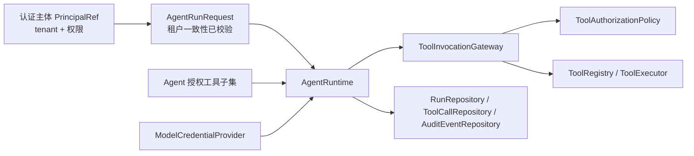

# CM Agent Core

## 1. 模块定位

`cm-agent-core` 是 CM Agent 的领域模型与契约层。它定义智能体、模型配置、工具治理、运行记录、审计和持久化的核心领域对象与接口，是整个项目的依赖重心：`server → starter/persistence/console/agentscope-adapter → core → api`，任何能力的演进都必须先在 Core 形成稳定契约，再由外层模块落地实现。

Core 不是执行层。它本身不执行模型调用、发起网络请求、访问数据库或做 Web 认证；它回答“CM Agent 管理什么、系统部件之间如何对话”，执行与落地由以下模块承担：

| 实现模块 | 对 Core 契约的落地 |
| --- | --- |
| `cm-agent-agentscope-adapter` | 实现 `AgentRuntime`，把领域运行请求交给 AgentScope Java 2.0.0 执行 |
| `cm-agent-persistence` | 实现 10 个 `core.repository` 接口与审计仓储，落地 JDBC + Flyway |
| `cm-agent-server` | 实现受治理工具调用编排、认证授权和 HTTP API |
| `cm-agent-spring-boot-starter` | 提供默认内存实现、Fake Runtime 与可覆盖的默认 Bean |

## 2. 依赖原则：零框架

Core 只依赖同工程的 `cm-agent-api`（`PrincipalRef`、`TenantContext` 等最小共享契约）。不依赖 Spring、Spring Security、Spring Web、JDBC、Jackson 或任何 AgentScope SDK。全部 66 个类型基于 Java 21 标准库（`record`、枚举、`Optional`、`ConcurrentHashMap`、`Comparator`）实现。

这一约束保证了：

- 领域不变量校验（非空、范围、租户一致性）不依赖任何框架注解，构造失败即刻失败。
- 升级 Spring Boot 或 AgentScope 版本时，Core 层二进制兼容性不受影响。
- 各实现模块可被彻底替换，而领域契约保持稳定。

## 3. 包结构

```
com.cmagent.core
├── audit        审计事件与审计仓储契约
├── domain       33 个不可变领域 record 与枚举
└── ...          其余子包见下文
```

| 子包 | 类型数 | 职责 |
| --- | --- | --- |
| `core.audit` | 3 | 审计事件 `AuditEvent`、审计仓储 `AuditEventRepository`、游标分页 `AuditPageRequest` |
| `core.domain` | 33 | 不可变领域 record 与枚举：Agent、模型配置、工具、Run、会话消息、分页 |
| `core.repository` | 10 | 按租户隔离的持久化 SPI，由 `cm-agent-persistence` 落地 JDBC 实现 |
| `core.runtime` | 9 | `AgentRuntime`、受治理工具调用网关、模型凭据契约 |
| `core.security` | 5 | 权限评估与工具授权策略及默认实现 |
| `core.tool` | 6 | 工具注册表、执行器、按调用来源校验的执行请求 |

## 4. 核心 SPI

### 4.1 `AgentRuntime`

Core 最核心的运行时 SPI。实现类只需实现 `run(AgentRunRequest)`；接口通过默认方法提供向后兼容的流式扩展：

| 方法 | 语义 |
| --- | --- |
| `run(request)` | 同步执行一次运行，返回 `AgentRunResult` 终态 |
| `run(request, Consumer<String>)` | 非破坏性流式扩展：无法增量输出的实现仍完整执行，调用方以最终结果为权威 |
| `runStructured(request, Consumer<AgentTextDelta>)` | 旧 Runtime 无需修改：默认实现把 `output` / `toolCalls` 自动转换为 `MessageContentBlock` 构造 assistant 消息快照 |

真实实现见 `cm-agent-agentscope-adapter` 的 `AgentScopeRuntimeAdapter`；本地与测试使用 `FakeAgentRuntime`。

### 4.2 工具治理 SPI（`core.tool` + `core.runtime`）

工具治理遵循“运行前筛选 + 调用时复核”两层模型。Core 只定义契约，编排由 Server 实现：

- `ToolRegistry` + `ToolExecutor`：注册并执行工具。`ToolRegistrationSnapshot` 把定义与执行器绑定成一致快照，避免查询和执行之间定义被更新、执行器被替换的不一致风险。
- `ToolExecutionRequest`：按 `ToolInvocationSource`（`AGENT` / `DEBUG` / `MCP` / `LEGACY`）严格校验上下文完整性：AGENT 请求必须绑定 agentId 与 runId；DEBUG / MCP 不得绑定 Agent 上下文；主体必须属于当前租户。
- `ToolInvocationGateway`：受治理工具调用的统一入口。模型运行链路上的工具调用必须经过该网关重新授权，不能信任模型提交的工具名称。
- `ModelCredentialProvider` / `ModelCredential`：按 `tenantId + modelConfigId` 解析模型凭据。`ModelCredential` 的 `toString()` 恒定脱敏，永不输出 API Key。

### 4.3 安全策略 SPI（`core.security`）

- `PermissionEvaluator`：普通资源访问的权限编码判定。
- `ToolAuthorizationPolicy`：工具调用的授权校验。默认实现 `DefaultToolAuthorizationPolicy` 依次校验：工具同租户 → 工具已启用 → Agent 已获得该工具的 `ToolGrant` 授权。任何一步不满足即拒绝，拒绝原因使用受控中文文案。
- `AuthorizationDecision`：`(allowed, reason)` 决策对象。

### 4.4 持久化与审计 SPI

10 个仓储接口（`AgentDefinitionRepository`、`ModelConfigRepository`、`ToolDefinitionRepository`、`ToolGrantRepository`、`ToolCallRepository`、`RunRepository`、`ConversationRepository`、`ConversationMessageRepository`、`McpToolPublicationRepository`、`HttpToolConfigRepository`）遵循统一模式：

- 方法一律以 `tenantId` 为首参，读写都要求显式租户条件。
- 列表查询使用有界游标分页（如 `RunPageRequest`、`AuditPageRequest`），避免无界扫描。
- `RunRepository` 提供 `keysetOrder()` 与 `isStrictlyBeforeCursor()` 静态工具，比较器与数据库 keyset 查询一致：`startedAt DESC, id DESC`，ID 按存储的规范化小写字符串比较以对齐数据库 `CHAR(36)` 序；Core 单元测试无需数据库即可验证分页语义。
- `AuditEventRepository.appendAll` 约定支持事务的实现必须把整个批次作为原子单元写入；游标分页能力通过 `supportsCursorPagination()` 显式声明，不支持的实现收到带游标的请求时抛 `UnsupportedOperationException`。

`AuditEvent` 是不可变审计记录，保留主体、动作、资源、结果与时间。审计在 Server 中是严格依赖：审计持久化不可用时请求不能被伪装为成功。

### 4.5 内置轻量实现

Core 内置两个轻量实现，仅用于本地开发、单元测试与第一阶段纵切，不是生产持久化方案：

- `InMemoryToolRegistry`：基于 `ConcurrentHashMap`，同 ID 覆盖注册，未注册工具返回失败结果。
- `FakeAgentRuntime`：回显输入的假运行时，输出确定性行为，单段输出适配流式协议。

## 5. 领域模型核心类型（`core.domain`）

### 5.1 租户一致性是领域不变量

租户隔离不是在查询时后补的 `WHERE` 条件，而是领域不变量：`AgentRunRequest`、`ToolExecutionRequest`、`ToolInvocationRequest` 等跨上下文对象的紧凑构造器内强制校验主体、Agent、模型绑定、工具必须同租户，构造非法对象直接抛 `IllegalArgumentException`，非法状态在进入任何编排逻辑之前就被拒绝。

### 5.2 Run 与工具调用记录

- `RunRecord`：运行持久化事实。紧凑构造器校验 `RUNNING` 不得有 `finishedAt`、终态必须有 `finishedAt` 且完成时间不早于开始时间；通过 `create()` 静态工厂创建，`complete()` 产出终态副本，状态机在构造时闭环。
- `RunToolCall` / `RunToolCallBatch`：运行内单次工具调用记录及其批量落库载体。
- `RunStatus`：`RUNNING` / `SUCCEEDED` / `FAILED` / `DENIED`，授权拒绝是独立终态，不混入失败。

### 5.3 Agent、模型与工具

- `AgentDefinition`：名称、系统提示词、模型配置引用（`modelProviderId`）、temperature、`maxIterations`（1–30）、启用状态与工具集合，集合防御性复制为不可变列表，temperature 限定 0–2。
- `ModelConfig`：Provider 类型、显示名、`baseUrl`、模型名与启用状态。构造器要求 baseUrl 是无用户信息（user info）与片段（fragment）的 HTTP(S) 绝对地址。API Key 不属于该领域对象——凭据密文由仓储管理，明文只在运行时经 `ModelCredentialProvider` 短暂存在。
- `ToolDefinition` / `ToolGrant`：工具名称、类型（`LOCAL` / `MCP` / `A2A` / `HTTP`）、风险级别（`LOW` / `MEDIUM` / `HIGH`）、输入 JSON Schema、endpoint 元数据、启用状态，以及 Agent 级授权关系。
- `HttpToolConfig` 及参数类型：动态 HTTP 工具配置，包括方法、参数位置（PATH / QUERY / HEADER / BODY）、数据类型与默认值；HEADER 位置支持 `secret/...` 引用写法，Header 密钥不进入领域对象。
- `McpToolPublication`：工具在 MCP Streamable HTTP 端点的发布记录。

### 5.4 会话消息模型

`Conversation`、`ConversationMessage`（带会话内 `sequence` 序号）、`ConversationMessageDraft`、`ConversationRunResult`、`MessageContentBlock`（`text` / `toolUse` / `toolResult` 工厂方法）、`MessageRole`、`MessageContentType`、`AgentMessageSnapshot`、`AgentRuntimeResult`、`AgentTextDelta` 共同构成消息一等公民的会话模型，支撑持久化会话与会话式 SSE。

### 5.5 关键枚举

| 枚举 | 取值 | 说明 |
| --- | --- | --- |
| `RunStatus` | `RUNNING / SUCCEEDED / FAILED / DENIED` | 运行终态语义 |
| `ToolType` | `LOCAL / MCP / A2A / HTTP` | 工具类型，编辑时锁定 |
| `ToolRiskLevel` | `LOW / MEDIUM / HIGH` | HIGH 风险工具调试需二次确认 |
| `MessageContentType` | `text / toolUse / toolResult` | 消息内容块类型 |
| `ModelProviderType` | `OPENAI_COMPATIBLE / DASHSCOPE_NATIVE` | 模型 Provider 适配目标 |

## 6. 一次被治理的 Agent 运行中 Core 契约的位置



Core 定义了其中所有节点类型，但不持有任何节点实现。真实链路为：Server 从 JWT 得到 `PrincipalRef` → 以 tenant 查询启用的 `AgentDefinition` 与 `ModelConfig` → 读取 `ToolGrant` 预筛选授权工具 → 构造租户一致性已校验的 `AgentRunRequest` → `AgentRuntime` 执行期间每次工具调用经 `ToolInvocationGateway` 重新授权（`ToolAuthorizationPolicy`）并执行（`ToolRegistry`）→ 结果经 `RunRepository` / `ToolCallRepository` 收口，全程写 `AuditEventRepository` 审计。

## 7. 测试结构

模块测试（16 个测试类，JUnit 5 + AssertJ，`mvn -pl cm-agent-core -am test`，无任何外部依赖）：

| 包 | 测试类 | 覆盖内容 |
| --- | --- | --- |
| `tool` | `InMemoryToolRegistryTest` | 注册/覆盖/查找/执行/未注册失败/快照一致性 |
| `security` | `DefaultToolAuthorizationPolicyTest` | 租户不匹配、工具禁用、未授权、放行 |
| `security` | `DefaultPermissionEvaluatorTest` | 权限匹配/不匹配判定 |
| `runtime` | `FakeAgentRuntimeTest` | 确定性回显、流式输出、终态字段 |
| `runtime` | `ModelCredentialTest` | 空白 Key 拒绝、`toString()` 脱敏断言 |
| `runtime` | `ToolInvocationRequestTest` | 全字段非空与租户一致性校验 |
| `runtime` | `ToolInvocationInfrastructureExceptionTest` | 基础设施异常语义 |
| `audit` | `AuditPageRequestTest` | 游标分页请求校验 |
| `domain` | `AgentDefinition`、`AgentRunRequest`、`ConversationMessage`、`HttpToolConfig`、`ModelConfig`、`RunPageRequest`、`RunRecord`、`RunToolCall` 共 8 个测试类 | 各领域 record 的不变量与状态机（如 `RunRecord` 的 RUNNING/终态约束） |

运行模块测试：

```powershell
mvn -pl cm-agent-core -am test
```

## 8. 扩展注意事项

### 新增领域概念

优先扩展现有包；新领域对象保持不可变 `record`，租户字段与范围校验放在紧凑构造器中；需要持久化时同步新增 `core.repository` 接口、`cm-agent-persistence` 的 JDBC 实现和不容遗漏的 Flyway 迁移——迁移的表和字段必须提供数据库原生中文注释，且同时兼容 PostgreSQL 16 与 MySQL 8.4。

### 新增运行时实现

实现 `AgentRuntime` 时必须同时决定是否覆盖流式方法。信任边界不变：租户信息来自领域请求，运行时不得信任客户端覆盖 tenant；凭据只能经 `ModelCredentialProvider` 解析，明文 Key 不得进入结果、日志或审计。

### 新增工具执行方式

不在 Core 内实现网络执行。新的 LOCAL / HTTP / MCP / A2A 执行方式应注册到 Server 的受治理执行层，并继续经 `ToolInvocationGateway` 完成租户一致性、Agent 授权、风险策略与审计。

## 9. 常见问题

### 为什么 Core 不做租户查询过滤封装（如注解式多租户）？

多租户在 Core 是显式契约：仓储方法显式携带 `tenantId` 首参、跨上下文 record 构造时校验同租户。显式参数让每个读写点的租户边界在代码评审中可见，比依赖框架隐式拦截更符合本项目的可审计目标。

### 为什么 `ModelCredential` 的 `toString()` 要恒定脱敏？

凭据对象会在异常消息、日志和调试输出中出现；恒定脱敏使意外打印不再泄露 API Key，这是最后一道防线，不能替代“Key 不进入 DTO、日志和审计”的主动边界。

### 为什么 DEBUG / MCP 工具调用不能绑定 agentId 和 runId？

这两类调用不来自 Agent 运行链路。允许绑定会伪造运行上下文，使工具调用记录与审计被错误归因到某次运行。`ToolExecutionRequest` 在构造时直接拒绝这种组合，保持调用记录与审计的可信度。

### 为什么审计仓储的 `appendAll` 不逐条吞异常？

`AuditEventRepository.appendAll` 的默认实现按顺序追加；支持事务的实现必须原子写入整个批次。审计是严格依赖，批次中任何一条失败都不能让调用方误以为审计已完成——这是“审计严格失败语义”在 Core 契约层的表现。

## 10. 相关文档

- [回到根 README](../README.md)
- [中文路线图](../docs/roadmap.md)
- [技术架构](../docs/technical-architecture.md)
- [工具开发指南](../docs/tool-development-guide.md)
- [Adapter 模块说明](../cm-agent-agentscope-adapter/README.md)

