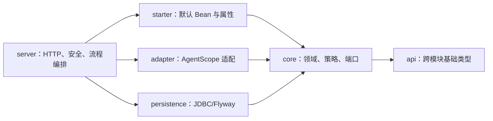

# CM Agent 首期实现技术说明

## 1. 对应任务与实现边界

本文对应 [CM Agent 设计说明](../specs/2026-06-18-cm-agent-design.md)，记录首期纵切在当前仓库中的落地结构。实现采用 Maven 多模块分层，不引入 JPA 或 Spring Data；领域与 Repository 契约保持在 core，Web 与运行编排留在 server，JDBC/Flyway 实现独立于 persistence。

## 2. 模块实现

| 模块 | 已落地职责 |
| --- | --- |
| `cm-agent-api` | `PrincipalRef`、租户上下文、分页和统一错误响应。 |
| `cm-agent-core` | Agent、Tool、Run、Audit 等领域 record，权限策略、工具注册表、运行与 Repository 契约。 |
| `cm-agent-persistence` | Flyway V1--V5 及 `Jdbc*Repository`，以 tenant 条件隔离数据。 |
| `cm-agent-spring-boot-starter` | `CmAgentProperties` 与自动装配。 |
| `cm-agent-server` | JWT/RBAC、Controller、运行编排、审计、memory/JDBC 接线和 MCP 端点。 |
| `cm-agent-console` | 随 server 发布的静态管理控制台。 |
| `cm-agent-agentscope-adapter` | AgentScope 2.0.0 的模型、工具和运行时适配。 |

## 3. 主数据流与安全边界

请求先由 `JwtAuthenticationFilter` 解析主体，Controller 从主体取得 tenant，再通过 `PermissionEvaluator` 进入业务。管理写操作由 `ManagementCommandService` 编排，并通过 `AuditAppender` 写入严格审计；运行由 `RunExecutionService`、`GovernedToolInvocationService` 和 `RunPersistenceService` 完成。任何客户端 tenant、Secret 原文或运行时凭据都不作为可信输入或返回值。

## 4. 持久化与运行模式

默认 memory 模式仅供 local/test 使用，`JdbcPersistenceConfiguration` 在 `cm-agent.persistence.mode=jdbc` 时装配 JDBC Repository，Flyway 顺序执行 V1--V5。生产和类生产 profile 由 `ProfileSafetyValidator` 拒绝 memory、bootstrap admin 与开发 JWT 回退；数据库查询和写入均以 `tenant_id` 作为边界。

## 5. 验证入口

首期能力由 core 单元测试、server MockMvc 测试、persistence 的 PostgreSQL/MySQL Testcontainers 测试、控制台资源/纯函数测试及示例工程测试共同覆盖。常用回归命令为 `mvn -q test`；涉及 Flyway 或 Testcontainers 时按项目约定在 Rocky Linux 容器环境执行。

## 6. 代码定位

- 父模块：[pom.xml](../../../pom.xml)
- 领域与契约：`cm-agent-core/src/main/java/com/cmagent/core`
- 服务端入口：`cm-agent-server/src/main/java/com/cmagent/server`
- 数据库迁移：`cm-agent-persistence/src/main/resources/db/migration`
- 生产说明：[README.md](../../../README.md) 与 `docs/*.md`

## 7. 开发者应先建立的心智模型

整个工程可以看成四层，其中依赖只能向内收敛：

理解代码时不要从 Controller 逐文件向下猜。先找 core 中的领域对象和端口，再找 server 的流程编排，最后看 persistence 或 adapter 如何实现端口。这样可以区分“业务规则”“Spring 接线”和“基础设施细节”。

## 8. 一次典型请求如何穿过系统

以运行 Agent 为例：

1. `JwtAuthenticationFilter` 验证 Bearer Token，把 `JwtSession` 放进 Spring Security 上下文。
2. `RunController` 把会话转换为 `PrincipalRef`，检查 `agent:run`，解析游标或请求体。
3. `RunExecutionService` 按 `principal.tenantId()` 查询 Agent、ModelConfig 和授权工具；客户端没有覆盖 tenant 的机会。
4. `RunPersistenceService.start` 先创建 `RUNNING` 记录和启动审计。
5. `AgentRuntime` 可以是 `FakeAgentRuntime`，也可以是 `AgentScopeRuntimeAdapter`；选择由条件化 Bean 决定。
6. 工具调用统一进入 `GovernedToolInvocationService`，每次重新加载工具和授权，而不是信任运行开始时的快照。
7. `RunPersistenceService.complete` 在短事务内完成 Run、ToolCall 和审计；返回前再次脱敏。

管理写请求走另一条主链：Controller → `ManagementCommandService` → 多个 Repository → `AuditAppender`。凡是跨多个 Repository 或要求业务与审计一致提交的逻辑，都应留在命令服务，不能下沉到 Controller。

## 9. 核心领域不变量

| 不变量 | 落地位置 | 开发含义 |
| --- | --- | --- |
| tenant 由认证主体决定 | Controller、Service、Repository SQL | 新接口不能接受 tenant 参数覆盖当前主体。 |
| 领域集合不可被外部修改 | record 紧凑构造器、`List.copyOf` | 返回集合后不能再假设调用方会保持只读。 |
| 工具定义与执行器是两种状态 | `ToolDefinitionRepository`、`ToolRegistry` | 数据库里存在工具，不代表 LOCAL 运行时已经注册。 |
| ModelConfig 不携带运行凭据 | `ModelCredentialProvider` | 模型 API Key 不从数据库领域对象读取。 |
| 审计失败不能伪装成功 | `AuditAppender`、事务服务 | 严格写操作应失败或回滚，不能只打日志继续。 |
| 历史记录必须可追溯 | Run/ToolCall/Audit、工具墓碑 | 删除管理对象时不能破坏历史外键和审计语义。 |

## 10. Bean 选择与运行形态

Starter 使用 `@ConditionalOnMissingBean` 提供默认权限策略、工具注册表和 fake runtime。server 根据 `cm-agent.persistence.mode` 选择 memory 或 JDBC Repository；真实 AgentScope runtime 只在 `cm-agent.agentscope.enabled=true` 时装配，并与 fake runtime 互斥。

开发扩展时优先提供自定义 Bean 覆盖默认实现，而不是修改 Starter：例如自定义 `ModelCredentialProvider`、`ToolAuthorizationPolicy` 或 `ToolRegistry`。新增实现必须继续满足 tenant、审计和敏感信息边界。

## 11. 错误、审计与排障顺序

统一异常处理把参数错误、未认证、无权限、资源不存在、冲突和基础设施故障映射为稳定 HTTP 状态。排障时按以下顺序定位：

1. 查看 HTTP 状态和受控错误码，先判断是校验、授权、冲突还是 503。
2. 按 tenant、resource type、resource id 查询审计事件，确认请求进入了哪个阶段。
3. 对运行问题再查 Run 状态和 ToolCall；`RUNNING` 长时间未收口通常意味着完成持久化或进程终止问题。
4. JDBC 模式检查 Flyway 版本与 Repository SQL，memory 模式检查补偿路径和当前进程状态。
5. 真实 runtime 问题再区分模型凭据、Provider、工具治理与 AgentScope 生命周期。

## 12. 新能力放置判断

- 新的跨模块稳定请求/响应基础类型放 `cm-agent-api`。
- 新领域不变量、策略或端口放 `cm-agent-core`。
- SQL、mapper、Flyway 放 `cm-agent-persistence`。
- 默认可替换 Bean 放 Starter。
- HTTP、认证、审计触发和流程编排放 server。
- AgentScope 特有类型转换放 adapter，不能让 core 反向依赖 AgentScope。
- 页面状态和纯函数分别放 `app.js` 与 `console-core.js`，可测试逻辑不要绑死 DOM。
