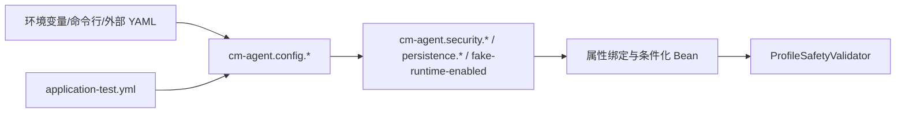

# 测试启动 Profile 实现技术说明

## 1. 对应任务

本文对应 [测试启动 Profile 设计](../specs/2026-06-22-test-launch-profile-design.md)。实现将本地开发、测试和生产配置显式分离：应用不再隐式选用开发 profile，启动方必须指定实际运行环境。

## 2. 配置装配

`cm-agent-server/src/main/resources/application.yml` 保留公共、安全默认配置；`application-local.yml` 与 `application-test.yml` 承载本地或测试专用值。测试 profile 使用独立的 fake runtime、memory 持久化、测试 JWT 配置与受控 bootstrap 数据，避免测试依赖生产凭据或外部模型服务。

## 3. 启动与安全校验

Spring 根据 `spring.profiles.active` 加载 profile。`ProfileSafetyValidator` 在启动阶段拒绝生产、类生产或 Supabase 场景开启 bootstrap admin、开发 JWT 回退或 memory 持久化。这样既保留本地快速验证能力，也避免空 profile 或错误 profile 静默进入不安全配置。

## 4. 测试覆盖

`ApplicationProfileConfigurationTest` 覆盖 profile 绑定与安全组合，Web 测试通过 `@ActiveProfiles("test")` 固定测试配置。README 给出了显式启动命令；任何临时密钥只允许通过本地环境变量或命令参数注入，不能写入 YAML。

## 5. 代码定位

- 公共与测试配置：`cm-agent-server/src/main/resources/application*.yml`
- 安全校验：`cm-agent-server/src/main/java/com/cmagent/server/security/ProfileSafetyValidator.java`
- 配置测试：`cm-agent-server/src/test/java/com/cmagent/server/config/ApplicationProfileConfigurationTest.java`
- 使用说明：[README.md](../../../README.md)

## 6. 配置解析链

本项目的 profile 文件不是直接覆盖所有 `cm-agent.*` 运行键，而是先定义一层 `cm-agent.config.*` 变量，再由 `application.yml` 映射到最终属性：

例如 test profile 给出 `cm-agent.config.fake-runtime-enabled=true`，公共 YAML 再把它传递给 `cm-agent.fake-runtime-enabled`。排查“YAML 写了但 Bean 没变化”时，应同时检查变量层和最终绑定层，不能只搜索一个键。

## 7. 启动阶段的实际顺序

1. Spring 解析显式 active profile，并合并公共配置、profile 配置、环境变量和命令行参数。
2. `CmAgentProperties`、`CmAgentPersistenceProperties`、`AgentScopeRuntimeProperties` 等完成绑定。
3. 条件化配置决定 Repository 和 `AgentRuntime` 实现。
4. `ProfileSafetyValidator.afterPropertiesSet()` 校验 profile 组合及 runtime 组合。
5. test profile 才允许 fake runtime、memory 和测试 bootstrap admin 组合。

没有 active profile 时，按正式基线应启动失败；这样可防止开发默认值被误带到未知环境。若工作区存在临时本地覆盖，应以提交基线和部署文档为准，不能把临时值写进实现文档或生产模板。

## 8. local 与 test 的职责差异

| 维度 | local | test |
| --- | --- | --- |
| 使用者 | 本地人工调试 | 自动化测试和受控测试启动 |
| 凭据来源 | 本地环境变量 | Maven 测试 system property/测试环境变量 |
| 持久化 | memory | 通常 memory；JDBC 测试另行显式装配 |
| Runtime | fake | fake 或测试专用受控 Bean |
| 数据生命周期 | 进程级 | 单测试上下文或测试类级 |

测试代码应显式写 `@ActiveProfiles("test")`。需要验证 production、mysql、postgres 或 supabase 组合时，应创建专门的配置测试上下文，不能依赖开发机器当前环境变量。

## 9. 常见失败及定位

- “必须显式配置 profile”：检查 `spring.profiles.active` 或 `CM_AGENT_PROFILE` 是否为空。
- “真实运行时与 fake runtime 不能同时启用”：检查最终的两个布尔属性，不只看 profile 文件。
- JWT secret/管理员密码为空：确认测试 system property 名称与 YAML 占位符一致。
- 测试意外连接数据库：检查 `cm-agent.persistence.mode` 是否被外部环境覆盖为 jdbc。
- 测试加载了真实模型：检查是否存在自定义 `AgentRuntime` Bean 或启用了 AgentScope。

## 10. 修改 profile 时的回归清单

新增或修改 profile 后至少验证：属性最终值、条件 Bean 数量、冲突 profile 启动失败、严格环境安全项、测试凭据不出现在日志，以及 README 中的启动命令仍可复制执行。配置键发生变化时要同步 `application.yml` 的变量转发和所有 profile 文件。
