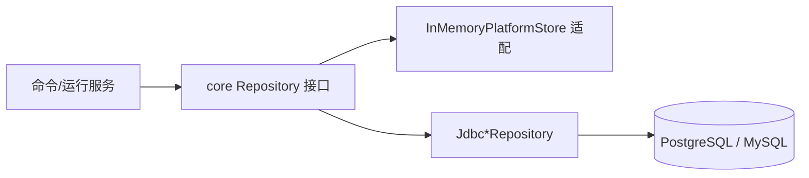

# 生产化持久化实现技术说明

## 1. 对应任务

本文对应 [生产化持久化设计说明](../specs/2026-06-25-production-persistence-design.md)。实现采用“Repository 契约 + JDBC 实现 + memory 回退”的渐进路线，未引入 JPA；Agent、Tool、Grant 与后续 Run、ToolCall、Audit 共享同一租户隔离模型。

## 2. Repository 与装配

core 的 `AgentDefinitionRepository`、`ToolDefinitionRepository`、`ToolGrantRepository` 等接口只依赖领域类型。persistence 中对应的 `Jdbc*Repository` 使用 `JdbcClient`、命名参数和显式行映射；server 在 `ServerRepositoryConfiguration` 与 `JdbcPersistenceConfiguration` 中按持久化模式装配 JDBC 或 `InMemoryPlatformStore`。

## 3. 数据与一致性

Flyway V1 建立基础表和 tenant 相关索引，后续 V2--V5 扩展运行查询、HTTP/MCP 与工具墓碑。所有读写、唯一性检查和删除均带 `tenant_id`；跨租户对象不暴露存在性。命令型流程在 JDBC 模式下通过事务把业务变更与成功审计一并提交，memory 模式使用受限的快照补偿维持等价语义。

## 4. API 行为

Controller 仅解析认证主体、校验请求并调用服务或 Repository；不直接访问 DataSource。持久化故障转换为不泄露 SQL/连接信息的统一错误响应，严格审计失败会使同一写操作失败而不是产生无审计变更。

## 5. 验证与运维

`Jdbc*RepositoryTest`、`MigrationTest` 和运行时 JDBC 测试验证 PostgreSQL 16、MySQL 8.4、迁移顺序及 tenant 条件。数据库集成验证仅在 Rocky Linux 的容器环境执行；生产凭据、完整 JDBC URL 和 JWT secret 不进入测试断言、日志或文档。

## 6. 代码定位

- 契约：`cm-agent-core/src/main/java/com/cmagent/core/repository`
- JDBC：`cm-agent-persistence/src/main/java/com/cmagent/persistence`
- 迁移：`cm-agent-persistence/src/main/resources/db/migration`
- 配置：`cm-agent-server/src/main/java/com/cmagent/server/config`

## 7. Repository 为什么放在 core

Repository 在这里是领域端口，不是“数据库工具类”。Service 依赖接口后，同一套业务流程才能同时运行在 memory 与 JDBC 上。接口参数必须携带 tenant，返回 core 领域对象，不能暴露 `ResultSet`、数据库列名、Web DTO 或 Spring Security 类型。

新增持久化能力时，顺序应是：先定义领域语义和 Repository 方法，再写 memory 行为测试，再写 JDBC 实现和双库测试，最后接入服务。这样能防止 SQL 细节反向定义业务规则。

## 8. 表与领域对象的关键映射

| 表 | 主要领域对象 | 重要实现点 |
| --- | --- | --- |
| `agent_definitions` | `AgentDefinition` | `tool_ids_json` 是 Agent 配置快照，授权变更需同步维护。 |
| `tool_definitions` | `ToolDefinition` | V5 后活动查询必须过滤 `deleted_at IS NULL`。 |
| `tool_grants` | `ToolGrant` | `(tenant_id, tool_id, agent_id)` 唯一，防止重复授权。 |
| `runs` | `RunRecord` | 只允许同 tenant 的 `RUNNING` 记录完成。 |
| `tool_calls` | `RunToolCall` | batch 写入前必须整体校验 tenant，避免部分跨租户写入。 |
| `audit_events` | `AuditEvent` | principal/resource 为历史软引用，不追随业务删除。 |
| `tool_http_configs` | `HttpToolConfig` | 与工具以 `(tool_id, tenant_id)` 复合外键关联。 |
| `tool_mcp_publications` | `McpToolPublication` | 只保存发布意图，调用时仍重新检查工具和运行时。 |

V1 中 `model_configs.encrypted_api_key` 是历史 schema 字段；当前运行链只读取非敏感模型元数据，真实 API Key 由 `ModelCredentialProvider` 提供。开发者不能因为列存在就恢复从数据库读取明文凭据。

## 9. tenant 隔离的三层防线

1. Controller 从 JWT 会话生成 `PrincipalRef`，不接受请求体 tenant。
2. Service 把 `principal.tenantId()` 传给所有 Repository，并在跨对象操作时验证 tenant 一致。
3. SQL 的 `SELECT`、`UPDATE`、`DELETE`、唯一性查询和锁定查询都带 `tenant_id`。

复合外键如 `(agent_id, tenant_id)` 和 `(tool_id, tenant_id)` 是第四层数据库保护。新增表若引用租户资源，应优先保留这种复合关系，避免一个合法 tenant 行引用另一个 tenant 的资源。

## 10. 事务边界

JDBC 模式由 `DataSourceTransactionManager` 和 `TransactionTemplate` 提供短事务：

- 管理命令：业务写入与成功审计同事务。
- Run 开始：创建 `RUNNING` 与启动审计同事务。
- Run 完成：状态更新、ToolCall 批次与完成审计同事务。
- 模型和外部 HTTP 调用：绝不包在数据库事务中。

memory 模式没有数据库事务。创建时通常先审计或记录旧快照；后续写入失败时通过受限补偿恢复。补偿方法不是业务恢复 API，不能从 Controller 暴露。

## 11. 并发与软删除

工具更新、授权和删除在同 JVM 使用基于 `tenantId + resourceId` 的条带锁；JDBC 删除/更新还使用 `SELECT ... FOR UPDATE` 保证多实例串行化。条带锁只优化单进程语义，不能当分布式锁。

V5 的工具删除是墓碑更新：保存原名称、替换内部唯一名称、禁用并写 `deleted_at`。这样原业务名称可复用，同时保留 ToolCall 外键锚点。任何新查询若漏掉墓碑过滤，都会让已删除工具重新出现在管理、调试或 MCP 路径中，因此这是 Repository 审查的重点。

## 12. 数据访问错误语义

- 唯一约束冲突：转换为 409，不暴露具体数据库约束名。
- tenant 内行不存在或跨租户：统一 404。
- 数据源/Flyway/事务失败：统一 503 或受控基础设施异常。
- JSON 字段反序列化失败：属于数据完整性故障，不应返回原始行内容。
- 审计写入失败：写命令回滚；不能返回 2xx。

## 13. 开发与排障步骤

修改 Repository 时先用 `dependency:tree` 确认依赖没有漂移，再运行对应单元测试。涉及 schema 时新增 Vn 迁移，不修改历史版本；用 PostgreSQL 和 MySQL 两种 Testcontainers 从空库执行全迁移。排障时先确认 Flyway 版本，再用 tenant 条件复现 Repository 查询，最后检查事务是否由同一个 DataSource/事务管理器承载。
