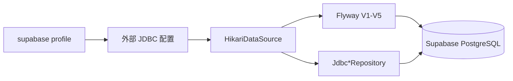

# Supabase 持久化自动化实现技术说明

## 1. 对应任务

本文对应 [Supabase 持久化自动化设计说明](../specs/2026-06-29-supabase-persistence-automation-design.md)。Supabase 被实现为受支持的 PostgreSQL JDBC/Flyway 部署目标，而非新增存储模式或引入 Supabase Java SDK。

## 2. 配置模型

`application-supabase.yml` 只声明 profile 语义和占位符绑定；DataSource、JDBC 持久化模式与 Flyway 仍沿用标准 Spring Boot PostgreSQL 链路。连接地址、用户名、密码和 JWT secret 必须由环境变量或 secret manager 注入，仓库不保存可用凭据。

## 3. 启动保护

Supabase profile 属于类生产环境。`ProfileSafetyValidator` 禁止其启用 memory、bootstrap admin 与开发 JWT fallback，并要求受控配置满足运行所需条件。Flyway 使用现有迁移版本向 hosted PostgreSQL 演进，不修改已发布的迁移历史。

## 4. 自动化验证

仓库通过 profile 绑定与安全护栏测试确保 Supabase 走 JDBC/Flyway 路径。需要连接真实 Supabase development branch 时，验证流程仅执行项目 schema 迁移与 tenant 隔离检查，日志不得输出完整连接串、密码或 Token；连接不可用时应明确记录为外部环境未验证，而不是降级为本地 memory 成功。

## 5. 代码定位

- Supabase profile：`cm-agent-server/src/main/resources/application-supabase.yml`
- JDBC 接线：`cm-agent-server/src/main/java/com/cmagent/server/config/JdbcPersistenceConfiguration.java`
- 启动护栏：`cm-agent-server/src/main/java/com/cmagent/server/security/ProfileSafetyValidator.java`
- 部署说明：[docs/deployment.md](../../deployment.md)

## 6. 为什么没有 `supabase` Repository

Supabase 在本项目中提供托管 PostgreSQL，不改变领域模型和数据访问协议。因此 `supabase` 是部署 profile，而 `cm-agent.persistence.mode` 仍然是 `jdbc`。这避免出现两套 Repository、两套迁移或 Supabase SDK 与 JDBC 并行写入同一数据的情况。

## 7. 启动链与失败点

1. `application-supabase.yml` 把外部配置映射到 `cm-agent.config.*`。
2. 公共 YAML 形成最终 `cm-agent.persistence.jdbc.*` 和安全属性。
3. `CmAgentPersistenceProperties.validate` 检查 JDBC 必填项。
4. `JdbcPersistenceConfiguration` 创建 Hikari、执行 Flyway，再创建 `JdbcClient` 和 Repository。
5. `ProfileSafetyValidator` 检查 jdbc、真实 runtime、禁用 bootstrap admin/fake runtime/明文 HTTP。

任一步失败都应中止启动。尤其不能在 Supabase 不可达时退回 memory；否则健康检查可能成功，但数据会写进错误存储。

## 8. 连接配置原则

项目只需要标准 PostgreSQL JDBC URL、用户、密码和驱动名。连接池、直连端口或网络策略由部署环境决定，仓库文档不记录真实主机和凭据。SSL 参数应在受控外部 JDBC URL 中设置，并根据 Supabase 环境要求验证证书；不得为了连通性在代码里全局关闭证书校验。

模型 API Key 与 Supabase 数据库凭据是两套独立 Secret：前者由 `ModelCredentialProvider` 读取，后者只进入 DataSource。两者都不能写入 `model_configs`、审计事件或应用日志。

## 9. 自动化验证分层

- 本地静态层：验证 profile 属性映射、安全护栏和 Bean 条件。
- PostgreSQL 合同层：Testcontainers 从空库执行 V1–V5，并跑所有 `Jdbc*Repository` 测试。
- Supabase development branch：执行 Flyway、基础 CRUD、tenant 隔离和重启后数据仍存在的冒烟验证。
- 部署层：验证健康检查、连接池建立、错误日志脱敏和 strict profile 限制。

真实 Supabase 验证应使用临时/开发分支，验证前记录目标 Git 提交与迁移版本。验证失败时区分 DNS、TLS、凭据、连接数、Flyway 权限和 SQL 兼容性，不要把所有失败归为“数据库不可用”。

## 10. 迁移与回滚判断

Flyway 迁移只允许前向新增版本。应用回滚到旧版本前，要确认旧代码能读取新 schema；若新迁移增加非空约束或改变语义，应先设计兼容窗口。Supabase 的备份或分支恢复属于平台运维能力，不能替代仓库内的可重复迁移。

## 11. 开发者排障清单

遇到 Supabase 启动或持久化问题时依次确认：active profile 是否只有严格 profile、最终 persistence mode 是否 jdbc、外部四项 JDBC 配置是否存在、Flyway schema history 是否到当前版本、连接用户是否有 DDL/DML 权限、Repository SQL 是否仍包含 tenant。日志和工单中只记录脱敏主机标识与错误类别。
