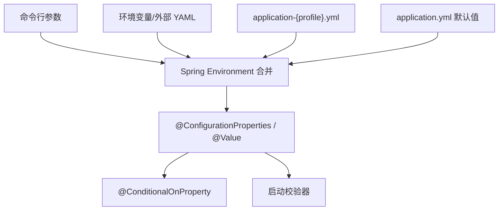

# 服务端 YAML 变量覆盖实现技术说明

## 1. 对应任务

本文对应 [服务端 YAML 配置变量覆盖设计](../specs/2026-07-13-server-yaml-variable-overrides-design.md)。实现以公共 YAML 给出安全默认值，profile YAML 使用 Spring 占位符承接部署环境变量，实现“同一构件、不同环境注入”。

## 2. 配置优先级与边界

`application.yml` 定义公共 `cm-agent`、安全、审计和持久化键；`application-local.yml`、`application-test.yml`、`application-postgres.yml`、`application-mysql.yml`、`application-supabase.yml` 与 `application-production.yml` 覆盖环境差异。Spring 的命令行参数、环境变量和外部 YAML 可以覆盖文件值，配置类通过 `@ConfigurationProperties` 绑定，避免在业务代码读取散落的环境变量。

## 3. 敏感配置处理

JWT secret、数据库密码、模型 API Key 与 HTTP 工具 Secret 均只通过占位符或受控 Provider 注入。配置、异常响应、审计和文档只展示键名或脱敏摘要。开发专用回退只在 local/test 允许，production/Supabase 必须由 `ProfileSafetyValidator` 阻断不安全组合。

## 4. 兼容性与验证

现有 profile 名称和配置键保持可用；legacy profile 选择器的异常回退已收口到安全失败路径。配置绑定、profile 组合和启动安全性由 `ApplicationProfileConfigurationTest`、`ServerRepositoryConfigurationTest` 等测试覆盖，部署文档同步列出变量注入方式。

## 5. 代码定位

- 配置文件：`cm-agent-server/src/main/resources/application*.yml`
- 属性对象：`cm-agent-spring-boot-starter/src/main/java/com/cmagent/starter/CmAgentProperties.java`
- Server 属性：`cm-agent-server/src/main/java/com/cmagent/server/config`
- 配置说明：[docs/configuration.md](../../configuration.md)

## 6. 两层配置的设计原因

本项目刻意区分“部署变量层”和“运行属性层”：

- `cm-agent.config.*`：部署者覆盖的中间变量，profile 文件主要写这一层。
- `cm-agent.*`：Java 属性类和条件注解最终读取的运行键，公共 `application.yml` 负责映射。

例如：

```yaml
# profile 或外部配置
cm-agent:
  config:
    persistence-mode: jdbc

# application.yml
cm-agent:
  persistence:
    mode: ${cm-agent.config.persistence-mode:memory}
```

这样 profile 可以只声明差异，Java 代码始终读取稳定的最终键。但代价是增加一个间接层：新增配置时必须同时完成属性类字段、公共 YAML 映射、相关 profile 覆盖和测试。

## 7. 覆盖优先级的理解方式

从结果看，命令行参数和环境/外部配置通常高于打包在应用内的 YAML；同一层中 profile 文件覆盖公共文件。开发者不应依赖记忆判断最终值，而应在配置测试中读取 `Environment` 或绑定后的属性对象断言。



特别注意：Shell 环境变量名、Spring relaxed binding 和项目自定义占位符不是同一概念。文档中的推荐入口应保持唯一，避免同时支持多组近似名称后难以判断实际来源。

## 8. 配置消费方

| 最终前缀 | 消费方 | 决定的行为 |
| --- | --- | --- |
| `cm-agent.security` | JWT、bootstrap admin、安全配置 | 登录、Token、API 文档和启动护栏。 |
| `cm-agent.persistence` | `CmAgentPersistenceProperties` | memory/JDBC、DataSource 与 Flyway。 |
| `cm-agent.agentscope` | `AgentScopeRuntimeProperties` | 真实 runtime、超时、重试和凭据索引。 |
| `cm-agent.http-tools` | `HttpToolProperties` | HTTP 开关、协议、主机、超时、响应上限。 |
| `cm-agent.mcp` | `McpServerProperties` | MCP 端点、Origin/Host 白名单。 |

条件化 Bean 使用的是最终键。若只修改 `cm-agent.config.agentscope-enabled` 却没有公共映射，`AgentScopeRuntimeConfiguration` 不会被激活。

## 9. 安全默认值与严格 profile

公共默认值应趋向关闭外部执行能力：无 profile、无 Secret 或无白名单时不应意外开启真实模型、HTTP 或 MCP。production/prod/supabase 还通过 `ProfileSafetyValidator` 二次拒绝 memory、bootstrap admin、开发 JWT、fake runtime 和明文 HTTP。

YAML 只负责声明，Validator 才是最后的运行期防线。新增安全敏感开关时，应同时在属性类中校验合法范围，并判断是否需要加入严格 profile 组合校验。

## 10. 修改与排障方法

修改配置的最小闭环：新增字段 → 公共 YAML 映射 → 目标 profile 值 → 属性绑定测试 → 条件 Bean 测试 → 严格 profile 失败测试 → 中文配置/部署文档。排障时打印“键是否存在”和脱敏后的布尔/枚举结果即可，禁止记录 Secret、密码或完整 JDBC URL。
