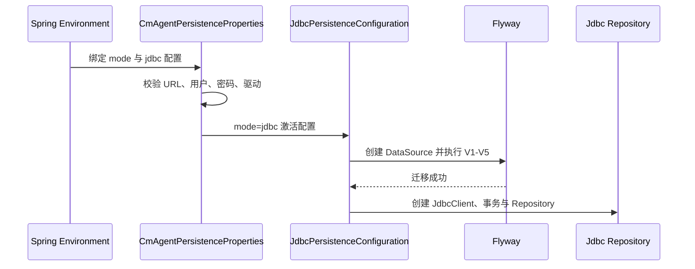

# 内网虚拟机数据库 Profile 实现技术说明

## 1. 对应任务

本文对应 [内网虚拟机数据库 Profile 配置设计](../specs/2026-07-13-vm-database-profiles-design.md)。实现将内网 PostgreSQL 与 MySQL 作为显式 JDBC profile，而不是把地址写入公共配置或改变默认存储行为。

## 2. Profile 实现

`application-postgres.yml` 与 `application-mysql.yml` 分别绑定对应驱动、JDBC URL 占位符、用户名、密码、`cm-agent.persistence.mode=jdbc` 和 Flyway。公共配置不携带内网地址，运行时通过环境变量或受控外部配置覆盖；profile 激活后由 JDBC 配置创建 Repository。

## 3. 数据库差异控制

数据访问统一采用 Spring `JdbcClient`，迁移保持 PostgreSQL 16 与 MySQL 8.4 兼容。V1--V5 只做增量演进，Repository 不使用数据库专属 SQL 语法作为主路径。测试覆盖迁移、tenant 隔离、索引相关查询以及工具软删除等关键行为。

## 4. 运维边界

内网 profile 不表示生产安全放宽：JWT、bootstrap admin、Secret 注入及审计规则仍由统一安全护栏控制。涉及 Docker、Compose、Testcontainers 或 JDBC 迁移的验证遵从项目约定，在 `ssh rocky` 对应的 Rocky Linux 容器环境执行，并先确认远程提交一致。

## 5. 代码定位

- profile：`cm-agent-server/src/main/resources/application-postgres.yml`、`application-mysql.yml`
- JDBC 接线：`cm-agent-server/src/main/java/com/cmagent/server/config/JdbcPersistenceConfiguration.java`
- 双库测试：`cm-agent-persistence/src/test/java/com/cmagent/persistence`
- 部署说明：[docs/deployment.md](../../deployment.md)

## 6. 从 profile 到 Repository 的启动链

Flyway 是 `JdbcClient` Bean 的显式依赖，因此 Repository 不会在 schema 迁移前接收请求。任何迁移失败都会阻止服务启动，不存在自动跳过迁移的降级路径。

## 7. PostgreSQL 与 MySQL 的共同契约

业务层不判断数据库类型。差异被限制在 JDBC 驱动、URL 和数据库对标准 SQL 的实现上。UUID 按 `CHAR(36)` 存储，JSON 以文本持久化并由 Jackson 显式映射，避免依赖单库 JSON 类型。索引和 Flyway DDL 必须同时通过 PostgreSQL 16 与 MySQL 8.4。

需要特别关注：布尔映射、时间精度、唯一约束异常类型、排序时 UUID 字符串顺序、`SELECT ... FOR UPDATE` 行为和 MySQL/PostgreSQL 对索引的执行计划差异。

## 8. 默认数据初始化

JDBC 配置在迁移后以幂等 `INSERT ... WHERE NOT EXISTS` 建立固定示例租户与非敏感模型元数据。这里的模型行只提供 provider、baseUrl、modelName 等定位信息，不能包含真实模型凭据。重复启动不能制造重复租户或模型行。

初始化器不是通用租户创建服务，也不能替代正式的身份/RBAC 引导流程。生产环境若不使用固定示例数据，应通过后续迁移或受控运维流程演进，而不是在 Controller 写 SQL。

## 9. 远程验证操作顺序

1. 在本地完成改动并记录待验证提交。
2. 通过 `ssh rocky` 确认远程工作区提交与本地一致。
3. 确认 Docker 可用，并使用 `maven:3.9.9-eclipse-temurin-21`。
4. 分别运行 persistence 模块的 PostgreSQL/MySQL Testcontainers 测试。
5. 如涉及 profile，再用目标 profile 启动并验证健康检查和基本 tenant 隔离。
6. 只清理本项目启动的临时容器；禁止全局清理镜像、卷或其他服务。

## 10. 典型故障

- DataSource 创建失败：检查最终 JDBC 配置、网络和驱动，不输出密码。
- Flyway 校验失败：确认没有修改历史迁移，检查 schema history 与当前文件 checksum。
- MySQL 可运行但 PostgreSQL 失败：排查数据库专属语法、时间/布尔映射。
- 同一数据在两个 tenant 可见：优先检查 Repository SQL tenant 条件和复合外键。
- 服务启动后使用 memory：检查最终 mode 与条件 Bean，不要只看 active profile 名称。
- 远程结果与本地不一致：先比对 Git 提交和未提交文件，再比较数据库镜像版本。

## 11. 扩展数据库 profile 的准则

新增环境 profile 时只新增外部连接和安全组合，不新增一套业务 Repository。若目标数据库不是 PostgreSQL/MySQL 兼容实现，必须先评估 Flyway DDL、锁语义、异常映射和 Testcontainers 覆盖，不能仅靠“JDBC 可连接”判定支持。
