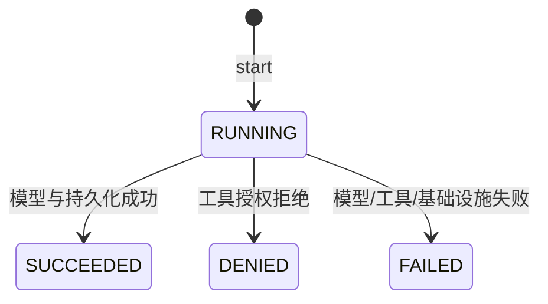
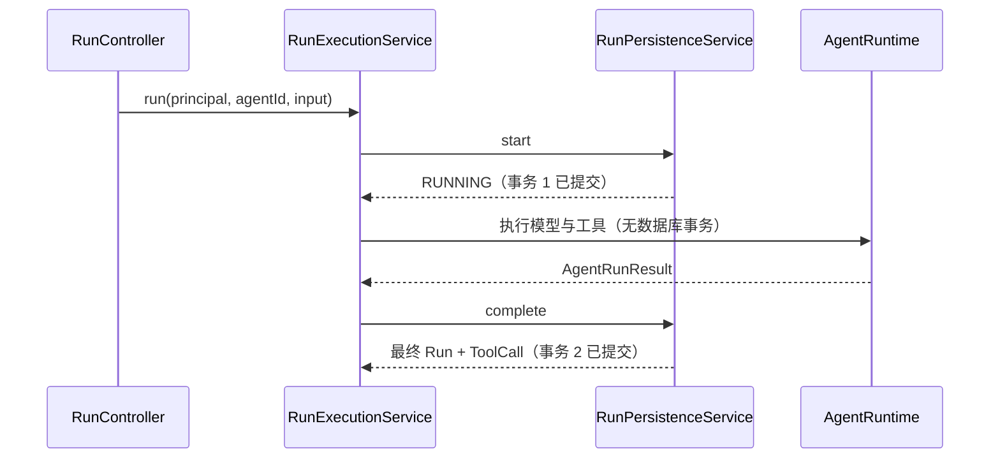

# 阶段 2：生产持久化与安全收口实现技术说明

## 1. 对应任务

本文对应 [阶段 2：生产持久化与安全收口设计](../specs/2026-07-14-phase-2-production-runtime-design.md)。本阶段在首期 Agent/Tool 基线上补齐运行记录、工具调用、严格审计、查询索引和生产安全边界。

## 2. 运行持久化流程

`RunExecutionService` 将一次运行拆分为开始与完成两个阶段：开始阶段创建 Run，执行阶段调用 runtime，完成阶段由 `RunPersistenceService` 写入最终状态、输出和 ToolCall 批次。`RunRecord`、`RunToolCall`、`ToolCallRecord` 及分页请求均在 core 定义，JDBC Repository 负责 tenant 内持久化与游标查询。

## 3. 事务与审计

管理写操作通过 `ManagementCommandService` 使用 `TransactionTemplate`，业务变更和成功审计同一事务提交；审计写入失败即回滚。运行执行不持有长数据库事务，避免模型或工具调用长期锁库；开始、完成和失败分别以可恢复的短事务落库。

## 4. 安全收口

JWT 认证、权限判断、profile 护栏、bootstrap admin 限制、统一错误响应和敏感字段脱敏集中在 server security/audit 层。HTTP 响应不回传栈、SQL、密钥或原始凭据；跨租户对象统一表现为不可见。运行和工具授权在执行前重新校验，不信任先前的页面状态。

## 5. 数据库演进与验证

V2 添加运行查询索引，V3 添加 ToolCall 创建时间索引，均不修改 V1 历史。核心、Web、JDBC/Testcontainers 与安全测试共同覆盖完成/失败运行、分页、审计失败和 tenant 隔离；数据库验证在 Rocky Linux 容器环境完成。

## 6. 代码定位

- 运行编排：`cm-agent-server/src/main/java/com/cmagent/server/runtime`
- 安全与审计：`cm-agent-server/src/main/java/com/cmagent/server/security`、`audit`
- 运行领域与契约：`cm-agent-core/src/main/java/com/cmagent/core/domain`、`repository`
- V2/V3：`cm-agent-persistence/src/main/resources/db/migration`

## 7. Run 状态机

Repository 的 `complete` 只允许更新当前 tenant 中仍为 `RUNNING` 的记录。最终状态不能再次完成，防止重复回调覆盖第一次结果。`finishedAt` 不能早于 `startedAt`；runtime 返回非法时间时由持久化服务使用当前时间收口。

## 8. 为什么是两段短事务

模型调用和工具调用可能持续数秒甚至更久。如果从创建 Run 到模型返回始终持有数据库事务，会占用连接和锁，并让失败恢复复杂化。因此流程拆为：

进程在两段事务之间崩溃时可能留下 `RUNNING`。当前阶段没有后台恢复任务，因此运维需要监控超时 RUNNING；未来补偿任务必须使用明确超时阈值和审计，而不能无条件改成 FAILED。

## 9. 运行前准备逻辑

`RunExecutionService` 依次验证：当前 tenant 的 Agent 存在、Agent 启用、其 ModelConfig 存在且启用。然后读取 Agent 的 grants，只保留 `granted=true`、tenant 匹配且通过 `ToolAuthorizationPolicy` 的工具，按 ID 去重后交给 runtime。

这里得到的是“运行开始可见工具集合”，不是永久授权。真实工具调用时 `GovernedToolInvocationService` 会再次查询定义和 grant，解决管理员在运行中禁用、删除或撤权后的竞态。

## 10. ToolCall 持久化规则

runtime 返回的是 `ToolCallRecord` 摘要。完成阶段依据本次授权工具集合解析 toolId/toolName，拒绝无法映射或名称与 ID 不一致的记录；随后生成持久化 ID、tenant、runId、durationMillis 和 createdAt。整个 `RunToolCallBatch` 在第一条 INSERT 前执行 tenant 校验，避免批次部分落库。

工具输入只保留脱敏摘要，AgentScope 桥接默认仅记录输入字段名。输出、错误信息和 Run 输入在写库前经过 `SensitiveDataRedactor`，API 返回时再次按受控边界处理。

## 11. 失败收口优先级

- runtime 普通异常：尽力把 Run 改为 FAILED，写失败审计，再抛受控 `Agent 运行失败`。
- 审计或数据库异常：优先保留基础设施失败语义，并尽力收口 Run。
- 完成事务失败：`complete` 尝试执行失败收口，但不会用二次失败覆盖原异常，必要时以 suppressed exception 保留上下文。
- memory 模式：没有原子事务，审计顺序与补偿用来避免“返回失败但留下看似成功状态”。

开发者修改异常路径时，要明确“调用方看到什么”“Run 最终是什么状态”“是否有审计”“原始异常是否泄密”四个问题。

## 12. 游标分页

Run 按 `(started_at DESC, id DESC)` 排序，下一页只取严格小于游标元组的记录。游标必须同时包含时间和 UUID，否则同一时间戳的多条 Run 会重复或遗漏。Audit 使用相同思路，排序键为 `(created_at DESC, id DESC)`。

V2/V3 索引顺序与查询前缀保持一致。新增过滤条件时需要重新检查索引，而不是直接加 offset；offset 在不断新增的运行历史上会产生漂移。

## 13. 测试与排障矩阵

| 问题 | 首查位置 | 关键测试 |
| --- | --- | --- |
| Run 未创建 | `RunExecutionService` 前置校验、start 事务 | `RunControllerTest`、`RunPersistenceServiceTest` |
| Run 长期 RUNNING | runtime 进程中止、完成事务 | JDBC persistence 测试 |
| ToolCall 缺失 | runtime 记录映射、batch tenant 校验 | `RunPersistenceServiceTest`、`JdbcToolCallRepositoryTest` |
| 分页重复/漏项 | 游标解析、排序与索引 | `JdbcRunRepositoryTest`、Controller 游标测试 |
| 失败仍返回敏感信息 | redactor 与异常映射 | `SensitiveDataRedactorTest`、`ApiExceptionHandlerTest` |
| 写入成功但无审计 | 事务边界或 memory 顺序 | `AuditAppenderTest`、JDBC 事务测试 |
