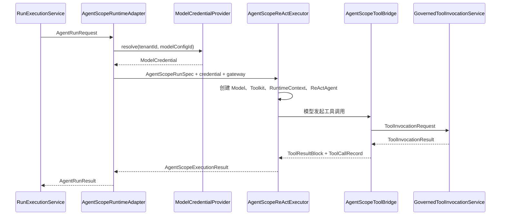

# 阶段 3：真实 AgentScope Runtime 实现技术说明

## 1. 对应任务

本文对应 [阶段 3：接入真实 AgentScope Runtime 设计](../specs/2026-07-16-phase-3-agentscope-runtime-design.md)。实现将 AgentScope Java 2.0.0 置于独立 adapter 模块，server 仅负责配置、运行编排、凭据提供和治理接线，保留 fake runtime 作为 local/test 的可控替代。

## 2. 运行契约与适配器

core 的 `AgentRuntime`、`ModelCredentialProvider`、`ToolInvocationGateway` 和调用结果类型定义稳定边界。`cm-agent-agentscope-adapter` 中的 `AgentScopeRuntimeAdapter`、`AgentScopeModelFactory`、`AgentScopeReActExecutor` 与 `AgentScopeToolBridge` 将 AgentDefinition、模型配置和受治理工具转换为 AgentScope 运行对象，再把结果映射回 core 类型。

## 3. 模型凭据与多租户

`ModelConfigRepository` 仅持久化 provider、baseUrl、modelName 等非敏感元数据；`ExternalModelCredentialProvider` 按 `tenantId + modelConfigId` 从配置或外部实现解析 API Key。缺少凭据、模型配置不属于当前 tenant 或 adapter 不可用均显式失败，绝不降级使用其他租户或默认密钥。

## 4. 工具治理与结果映射

AgentScope 的工具调用必须经 `GovernedToolInvocationService`：重新加载工具、检查启用状态、授权与风险策略、执行器就绪状态，并记录受控结果。`ToolOutputSanitizer` 对模型可见输出和 API 响应应用大小及敏感信息边界。当前实现支持同步单轮 ReAct 执行、超时中止和状态映射，不承诺多轮会话持久化、流式 REST 或手动取消。

## 5. 装配与验证

`AgentScopeRuntimeConfiguration` 仅在显式启用且 fake runtime 关闭时提供真实 runtime；父 POM 管理 AgentScope 及 provider optional 依赖。adapter 合同测试、server 受控 runtime 测试、凭据/授权/超时测试以及全仓回归覆盖该链路。

## 6. 代码定位

- Core 契约：`cm-agent-core/src/main/java/com/cmagent/core/runtime`
- Adapter：`cm-agent-agentscope-adapter/src/main/java/com/cmagent/agentscope`
- Server 装配：`cm-agent-server/src/main/java/com/cmagent/server/config/AgentScopeRuntimeConfiguration.java`
- 运行治理：`cm-agent-server/src/main/java/com/cmagent/server/runtime`

## 7. 端到端执行链

adapter 不写数据库、不读取 Spring Security，也不直接查授权。它只做领域请求与 AgentScope API 的双向转换；持久化和治理仍由 server 完成。

## 8. 请求如何变成 ReActAgent

`AgentScopeRuntimeAdapter.toRunSpec` 保留 runId、tenant、Agent、ModelConfig、主体、输入和可见工具。执行器随后：

1. 为每个工具创建 `AgentScopeToolBridge` 并注册到 `Toolkit`。
2. `AgentScopeModelFactory` 根据 provider 创建 OpenAI Compatible 或 DashScope 模型。
3. Agent 上的 modelName 非空时覆盖 ModelConfig 默认模型名；temperature 来自 Agent。
4. 模型执行设置 `modelTimeout` 和 `modelMaxAttempts`；工具执行固定最多一次，避免 AgentScope 层重复外部副作用。
5. `RuntimeContext` 的 userId 使用 `tenantId:principalId`，sessionId 使用 runId，并附带 tenant/agent/principal/run 元数据。
6. 禁用 meta tool 和 task list，最大迭代次数使用 Agent 定义。

这些设置共同保证一次 REST Run 对应一个 AgentScope 单轮上下文，而不是跨请求复用会话状态。

## 9. 凭据解析边界

默认 `ExternalModelCredentialProvider` 在启动时把配置项索引为 `(tenantId, modelConfigId) → ModelCredential`。重复键导致启动失败；运行时无精确匹配则返回固定“模型凭据不可用”失败。`ModelCredential.toString()` 和 Provider 的 `toString()` 不包含 API Key。

提供自定义 `ModelCredentialProvider` 时，可以连接 secret manager，但必须保持精确双键隔离、无默认跨租户回退、无明文日志，并定义 Secret 轮换后的缓存失效策略。数据库 `model_configs` 只决定使用哪个 provider/endpoint/model，不是凭据来源。

## 10. 工具桥接的双重校验

工具在运行开始前已经经过一次筛选，桥接调用时仍将 tenant、agent、principal、run、toolCallId、toolId、模型给出的 toolName 和输入 JSON 传给治理网关。网关要求当前工具：

- 仍存在、启用且 tenant/ID/名称全部匹配；
- 当前 Agent 仍有有效 grant；
- `ToolAuthorizationPolicy` 仍允许；
- HTTP 配置或 LOCAL 注册快照仍与定义匹配。

名称校验可阻止模型使用旧目录中的同 ID/旧名称调用刚更新的工具。授权拒绝映射为 `DENIED`；执行器不可用映射为受控失败；审计/数据访问这类基础设施失败会中止整次运行，而不是伪装成普通工具返回值。

## 11. 事件流、超时与中断

`AgentScopeReActExecutor` 订阅 `ToolResultTextDeltaEvent`、`ToolResultEndEvent` 和 `AgentResultEvent`。`AgentScopeRunGate` 协调工具调用、超时、取消和基础设施异常：

- 工具超过 `toolTimeout` 后标记超时并只中断 Agent 一次。
- Reactor 取消会标记工具调用被中断。
- ToolResultEnd 到达但桥接器没有完成记录时，门控可识别异常生命周期。
- 中断失败优先作为基础设施异常抛出，并保留原失败关系。
- `finally` 始终关闭 ReActAgent；关闭失败不会无声吞掉。

模型超时、Provider HTTP/传输异常映射为固定失败摘要。模型层可按 `modelMaxAttempts` 重试，但工具层 `maxAttempts=1`，避免不可逆工具被框架自动重放。

## 12. 结果状态映射

| 条件 | 最终状态 | 对外错误语义 |
| --- | --- | --- |
| 有最终消息且无拒绝 | `SUCCEEDED` | 模型最终文本。 |
| 任一工具被策略拒绝 | `DENIED` | 受控拒绝原因。 |
| 模型或工具超时 | `FAILED` | `Agent 运行超时`。 |
| Provider/传输异常 | `FAILED` | `Agent 运行失败`。 |
| 缺少模型凭据 | `FAILED` | `模型凭据不可用`。 |
| 审计、Repository、中断等基础设施异常 | 抛出异常，由 server 收口 | 503 或受控运行失败。 |

工具输入摘要只记录字段名；工具输出和错误进入 server 后还会脱敏。开发者新增事件处理时，不能把 AgentScope 原始异常消息或请求体直接写入 ToolCall。

## 13. 装配条件与启动失败

`cm-agent.agentscope.enabled=true` 才加载真实 runtime 配置。若 fake runtime 同时开启、超时/重试参数非法、默认 Provider 没有任何凭据且又没有自定义 Bean，应用应在启动期失败。`@ConditionalOnMissingBean(AgentRuntime.class)` 允许测试或宿主应用提供受控实现。

## 14. 调试顺序与测试入口

排查真实运行失败时依次确认：ModelConfig 是否属于当前 tenant 且启用；凭据双键是否精确匹配；模型 factory 是否选择正确 provider；运行是否在模型超时、工具超时或授权拒绝分支；Run/ToolCall/审计是否完成收口。

关键测试包括 `AgentScopeModelFactoryTest`、`AgentScopeToolBridgeTest`、`AgentScopeRuntimeAdapterTest`、`AgentScopeRuntimeContractTest`、`AgentScopeRuntimeConfigurationTest` 和 server 的受控 AgentScope 测试配置。修改 adapter 时先跑 adapter 模块，再跑 server 运行链。
