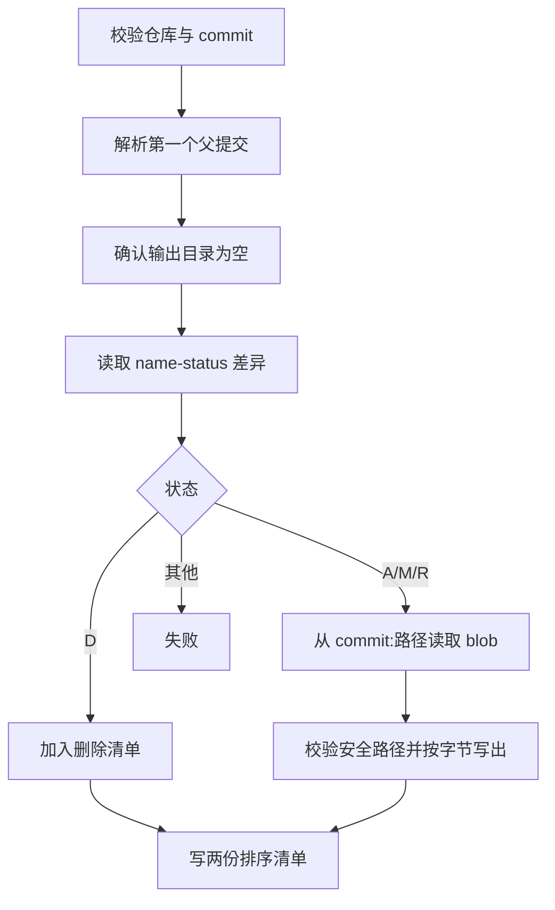

# 指定提交文件导出实现技术说明

## 1. 对应任务

本文对应 [指定提交文件导出设计](../specs/2026-07-17-commit-file-export-design.md)。实现提供可重复的 PowerShell 导出脚本，用于将指定 Git 提交相对其首个父提交新增、修改和重命名后的文件按仓库相对路径导出。

## 2. 导出流程

`scripts/export-commit-files.ps1` 校验提交和目标目录，读取提交差异，逐项从该提交版本提取文件内容并写入输出目录。新增、修改和重命名后的文件会被复制；删除文件不复制，而写入 `deleted-files.txt`，同时由 `exported-files.txt` 记录已导出文件，便于人工覆盖前复核。

## 3. 安全与边界

输出目录必须不存在或为空，防止不同导出批次混合。脚本不执行工作区覆盖、不删除目标文件，也不会替用户处理删除项；重命名以提交后的路径为准。无父提交、非法提交、二进制或路径异常均应以明确错误终止，避免生成不完整包被误用。

## 4. 验证与使用

`scripts/test-export-commit-files.ps1` 使用临时 Git 仓库覆盖新增、修改、重命名、删除、非空输出目录和无效提交。使用方式在 README 中维护：`./scripts/export-commit-files.ps1 -Commit <提交哈希> -OutputDirectory <导出目录>`；导出后的删除清单必须人工处理。

## 5. 代码定位

- 导出脚本：`scripts/export-commit-files.ps1`
- 行为测试：`scripts/test-export-commit-files.ps1`
- 使用说明：[README.md](../../../README.md)

## 6. 输入解析与提交基准

脚本先用 `git rev-parse --show-toplevel` 确认当前目录属于 Git 仓库，再把用户输入解析为确定的 commit object。差异基准固定为该提交的第一个父提交，即：

```text
parent(commit) .. commit
```

这意味着合并提交按 first-parent 视角导出，不聚合所有父分支差异；根提交因为不存在父提交会明确失败。脚本导出的是“该提交版本的文件内容”，不读取当前工作区，因此未提交改动不会混入导出包。

## 7. 变更状态处理

`git diff-tree -M --name-status` 产生状态后，脚本采用以下规则：

| 状态 | 行为 |
| --- | --- |
| `A` | 从目标提交读取新文件。 |
| `M` | 从目标提交读取修改后文件。 |
| `R*` | 只导出重命名后的路径；旧路径不自动删除。 |
| `D` | 不创建文件，记录到 `deleted-files.txt`。 |
| 其他状态 | 立即失败，避免静默漏文件。 |

导出路径和删除路径用 Ordinal HashSet 去重，最终排序写入清单，保证重复运行结果稳定、便于审查。

## 8. 二进制保真与路径安全

文件内容通过独立 Git 进程的标准输出 BaseStream 读取为字节数组，再用 `WriteAllBytes` 写出；因此不会因为 PowerShell 文本编码、换行转换或 NUL 字节破坏二进制文件。

每个 Git 相对路径都经过：拒绝空路径和绝对路径 → 规范化分隔符 → 合并到输出目录 → 取绝对路径 → 校验仍以输出目录为前缀。该检查阻止 `../` 或盘符路径越出导出目录。`git cat-file -t` 还要求对象类型是 blob，子模块或其他非普通对象不会被误写成文件。

## 9. 输出目录策略

目标目录只能“不存在”或“已存在但为空”。脚本不会清空旧目录，因为旧文件与新导出混合后无法判断哪些属于本次提交。目录创建后若中途失败，可能留下部分文件；调用方应把该目录视为失败产物，换一个新空目录重试，而不是继续覆盖使用。

清单统一以无 BOM UTF-8 写出：`exported-files.txt` 是可复制文件，`deleted-files.txt` 是必须人工确认的删除动作。脚本故意不把删除应用到另一个工作区。

## 10. 流程图



## 11. 测试覆盖与扩展注意事项

行为测试在系统临时目录创建隔离 Git 仓库，覆盖修改、重命名、删除、非法提交和清单内容，并在 `finally` 删除临时目录。新增 copy、type-change、submodule 等状态支持时，必须先增加失败测试，再明确输出语义；不能简单把未知状态当普通文件。

排障时优先看脚本的中文错误：Git 解析失败、非空目录、异常状态、非 blob 或路径越界分别对应不同阶段。由于脚本不会修改源仓库，失败后通常只需废弃目标目录即可恢复。
