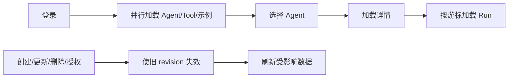

# CM Agent 可操作管理控制台实现技术说明

## 1. 对应任务

本文对应 [CM Agent 可操作管理控制台设计](../specs/2026-07-17-console-capabilities-design.md)。控制台作为 `cm-agent-console` 静态资源随 server 发布，复用现有 REST API，不新增前端构建链、服务端会话或浏览器持久化 Token。

## 2. 页面与数据流

`index.html` 提供登录、概览、Agent、Tool、运行历史和审计视图；`app.js` 负责请求编排、表单、错误提示与页面状态；`console-core.js` 存放可脱离 DOM 测试的载荷、分页、时间和状态转换纯函数。登录后 JWT 仅保存在当前页面内存，刷新或关闭页面必须重新认证。

## 3. 接口与权限

页面调用 `/api/auth`、`/api/agents`、`/api/tools`、`/api/runs` 和 `/api/audits` 等既有接口。服务端仍是唯一权限边界，前端只依据 403、404、409、503 提示用户；工具创建、调试、MCP 发布、编辑、删除和解除关联均由相应权限控制，页面不暴露任何 Secret 原文。

## 4. 异步一致性与安全

控制台以 session epoch、请求 revision 和当前选中对象核对抑制迟到响应，避免旧会话或旧列表覆盖用户的最新选择。URL 路径参数统一编码，错误内容只显示服务端脱敏消息；敏感 token 不写入 localStorage、日志或导出的页面数据。

## 5. 验证与定位

`ConsoleResourceTest` 验证资源发布，`console-core.test.cjs` 验证核心纯函数，`ConsoleSmokeTest` 覆盖 server 侧静态入口。主要文件为 `cm-agent-console/src/main/resources/META-INF/resources/index.html`、`assets/app.js`、`assets/console-core.js` 与 `assets/styles.css`。

## 6. 前端分层

控制台没有框架和打包器，但仍保持两层：

- `console-core.js`：不依赖 DOM 的纯函数与状态门控，可在 Node 中直接测试。
- `app.js`：DOM 绑定、网络请求、页面状态和用户交互。

载荷构造、路径编码、游标拼接、HTTP 映射回填、冲突判断和并发门控必须优先放 core。这样页面调整不会破坏协议逻辑，测试也不需要浏览器环境。

## 7. 状态对象与选择关系

`state` 保存 token、currentUser、Agent/Tool 列表、当前 Agent、运行记录、审计游标、编辑工具 ID 等。需要区分“列表中的摘要”“当前选择 ID”“当前详情快照”：异步请求返回时必须再次确认这三者仍指向同一对象。

Token 只存在于 JS 内存。`api()` 在发请求时捕获 token 和 session epoch；若返回 401，只在它们仍属于当前会话时执行登出，避免旧会话迟到的 401 把新用户踢下线。

## 8. 三类异步所有权门控

| 门控 | 解决的问题 | 判断条件 |
| --- | --- | --- |
| session epoch | 登出/重新登录后旧请求仍返回 | 捕获的 epoch 必须仍是当前值。 |
| load revision | 同一列表的多个加载乱序完成 | 只允许最新 revision 落地。 |
| keyed revision/submit ticket | 不同资源并行写入或共享按钮复用 | key、ticket、会话必须同时匹配。 |

写操作开始前使相关读 revision 失效，写成功后用 `completeWrite()` 取得新的刷新所有权。完成提示只有在刷新结果确实落地且会话仍有效时才显示。工具 A 保存完成时，还要检查表单仍在编辑 A，不能重置用户已经切换到的工具 B。

## 9. API 请求与错误处理

所有资源 ID、Agent ID、工具 ID、示例 key 和 cursor 都通过 `encodeURIComponent`。请求默认发送 JSON 与 Bearer Token，响应按 Content-Type/文本解析为统一错误对象。页面依据状态码采取动作：

- 400：保留表单，展示校验消息。
- 401：仅当前会话触发登出。
- 403：提示权限不足，不隐藏服务端权限边界。
- 404：刷新列表或清理已经失效的选择。
- 409：按具体业务消息处理；只有明确“仍被 Agent 关联”才引导解除关联。
- 503：保留当前表单和页面状态，允许稍后重试。

前端不能显示响应栈、SQL、Secret 或原始认证头。真正的脱敏责任在服务端，前端再避免把敏感信息写进 DOM、浏览器存储和 console。

## 10. HTTP 工具表单的数据往返

后端摘要中的 `inputSchema`、参数映射和 Secret 引用回填为可编辑 JSON 文本。`defaultValueJson` 表示“已经序列化的一段 JSON 值”，编辑时由 `prepareHttpParameterMappingsForEdit` 解析一次，提交时 `buildToolFormPayload` 再统一构造请求，防止对象被重复 stringify。

LOCAL 工具编辑锁定 type 和 name；HTTP 工具必须提交完整配置。`mcpPublished` 是管理意图而非执行就绪的替代，页面同时展示 `runtimeReady`，只有 LOCAL 注册快照或 HTTP 配置匹配时才能调试。

## 11. 游标与增量加载

Run 和 Audit 都使用服务端发出的 opaque cursor。前端只负责把 cursor URL 编码后传回，不能解析或自行生成。首次加载清空列表和 cursor；“加载更多”只在当前会话、当前 Agent 和当前 revision 下追加，防止切换 Agent 后把旧页追加到新列表。

## 12. 修改页面时的测试策略

先为 core 纯函数增加 Node 测试，再连接 DOM。重点覆盖：URL 编码、载荷结构、null/false/0 默认值、HIGH 风险确认、删除冲突识别、会话切换、乱序完成和多资源并发。`ConsoleResourceTest` 确保资源进入 jar，`ConsoleSmokeTest` 确保 server 根路径实际可访问。

排障页面“偶尔显示旧数据”时，不要只加一次 reload；应确定缺少的是 session、revision、selected-id 还是 submit-ticket 所有权判断。
