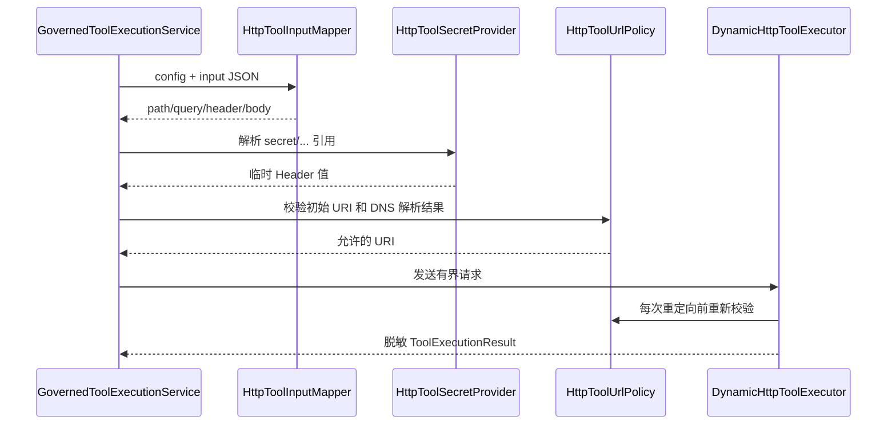
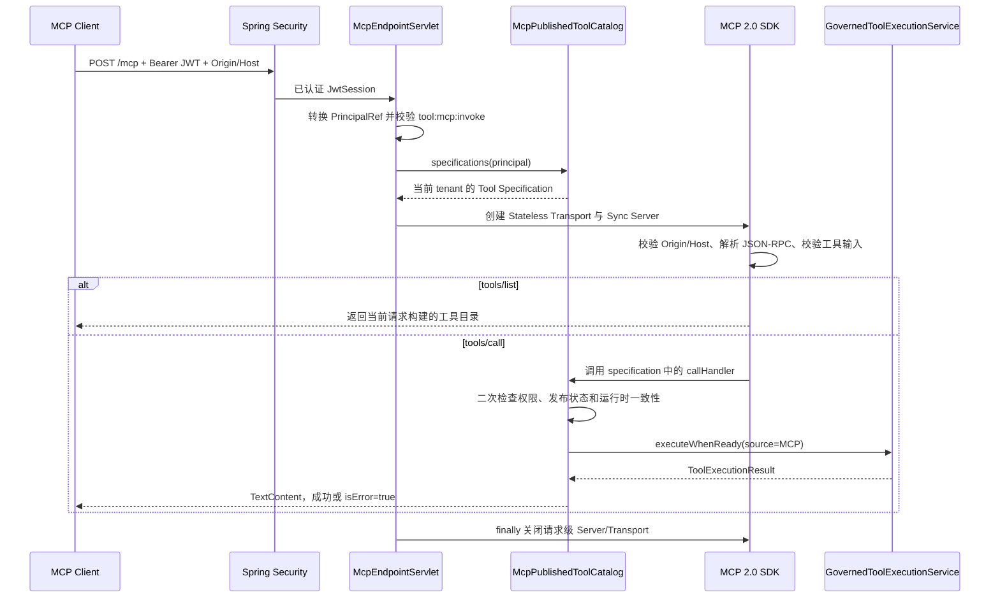

# 动态 HTTP 工具与 MCP 发布实现技术说明

## 1. 对应任务

本文对应 [动态 HTTP 工具与 MCP 发布设计](../specs/2026-07-21-dynamic-http-mcp-tools-design.md)。实现为已治理的工具增加 HTTP 类型、受控调试和可选 MCP Streamable HTTP 发布；HTTP 执行默认关闭，且不支持上传执行代码。

## 2. 数据模型与创建事务

core 定义 `HttpToolConfig`、`HttpParameterMapping`、`McpToolPublication` 等领域类型；Flyway V4 新增 `tool_http_configs` 和 `tool_mcp_publications`。`ManagementCommandService` 在创建或更新 HTTP 工具时原子写入工具定义及附属配置，`ToolQueryService` 聚合配置、发布状态和运行时就绪状态；Repository 读取均过滤 tenant 与软删除墓碑。

## 3. HTTP 执行安全

`HttpToolConfigValidator` 验证方法、URL 模板、输入 JSON Schema、JSON Pointer 映射与默认值。`HttpToolInputMapper` 将输入写入 PATH、QUERY、HEADER 或 BODY；`HttpToolUrlPolicy` 和 `HostAddressResolver` 实施协议、白名单、私网/回环地址、重定向、超时和响应大小限制。`ExternalHttpToolSecretProvider` 只解析 `secret/...` 引用，绝不持久化或返回真实 Header 值。

## 4. 治理、调试与 MCP

`GovernedToolExecutionService` 是 HTTP、LOCAL、Agent 运行和调试的统一执行入口，每次调用重新校验工具状态、授权及风险。`McpPublicationService` 管理发布规则；`McpEndpointServlet`、`McpPublishedToolCatalog` 与 `McpServerConfiguration` 以 MCP 2.0 Streamable HTTP 对外提供已发布工具，调用除 JWT 外仍需 `tool:mcp:invoke`。取消发布、禁用或配置漂移会立即让工具不可调用。

## 5. 控制台与验证

控制台提供 HTTP 配置、发布状态和单工具调试，HIGH 风险调试要求输入完整工具名二次确认。core、JDBC/migration、SSRF/映射、MockMvc、MCP 集成及控制台纯函数测试分别覆盖安全和契约；部署默认值及限制见 `docs/configuration.md`、`docs/operations.md`。

## 6. 代码定位

- HTTP 运行时：`cm-agent-server/src/main/java/com/cmagent/server/runtime/http`
- MCP：`cm-agent-server/src/main/java/com/cmagent/server/mcp`
- API 与服务：`cm-agent-server/src/main/java/com/cmagent/server/web/ToolController.java`、`service`
- V4：`cm-agent-persistence/src/main/resources/db/migration/V4__add_http_tools_and_mcp_publications.sql`

## 7. 一个 HTTP 工具由三类状态组成

| 状态 | 存储位置 | 含义 |
| --- | --- | --- |
| 工具定义 | `tool_definitions` | 名称、描述、类型、Schema、风险、启用状态和 endpoint 快照。 |
| HTTP 运行配置 | `tool_http_configs` | 方法、URL 模板、映射、Secret 引用和超时。 |
| MCP 发布意图 | `tool_mcp_publications` | 当前 tenant 是否希望通过 MCP 暴露该工具。 |

三者存在不代表工具一定可调用。运行时还要求 HTTP 总开关、协议/主机策略、定义 endpoint 与配置 URL 一致；LOCAL 则要求 `ToolRegistry` 快照匹配。`ToolQueryService` 聚合上述状态形成 `runtimeReady`，但调用路径仍会重新校验。

## 8. 创建与更新事务

`ToolController` 把 JSON DTO 转换为 `HttpToolCreateSpec`/`ToolUpdateSpec`，`ManagementCommandService` 统一校验 type 与附属配置组合：HTTP 必须有完整配置，非 HTTP 不能携带 HTTP 配置；请求声明 MCP 发布时还要满足发布规则。

JDBC 模式在一个事务中写工具定义、HTTP 配置、可选发布记录和审计。memory 模式记录各步是否已经写入，后续失败时按发布 → HTTP 配置 → 工具定义的反向顺序补偿。更新返回事务内 `ToolUpdateResult` 快照，避免提交后并发变更影响本次响应。

## 9. 输入 Schema 与参数映射

Schema 固定使用 JSON Schema 2020-12，根必须是 `type: object`。配置校验阶段会验证 meta-schema、编译本地引用、确认 sourcePointer 类型，并检查默认值符合对应子 Schema。

映射规则：

- PATH：标量、必填，目标名必须与 URL `{placeholder}` 集合完全一致。
- QUERY：只允许标量或标量数组；数组展开为重复 query 参数。
- HEADER：只允许标量，禁止 Host、Authorization、Cookie、Content-Length 和逐跳 Header 等动态覆盖。
- BODY：允许对象/数组，通过 targetPointer 创建容器；相同或父子 targetPointer 冲突会被拒绝。

缺失值和显式 null 都会尝试使用非 null 默认值。应用默认值后再执行整份输入 Schema 校验，然后才生成请求。JSON Pointer 的 `~0/~1`、数组索引和容器形状都经过显式验证。

## 10. HTTP 调用完整链

总 deadline 覆盖 URL 校验、Secret 解析、连接、响应头和响应体读取，不是每个阶段各有一份完整超时。阻塞操作放入受控 executor，超时会取消 Future 并关闭响应流。

## 11. SSRF 与传输安全

URL 策略要求协议在允许范围、主机进入显式白名单，并对 DNS 解析结果做回环、链路本地、私网或其他受限地址判断。每次请求和重定向都重新解析/校验，降低 DNS rebinding 风险。重定向只允许同源且不超过上限；303 或 POST 的 301/302 按规则切换 GET。

客户端不接受压缩响应，只允许单一安全 Content-Type，支持 text、application/json 和 `application/*+json`。响应最多读取 `maxResponseBytes + 1` 判定超限，JSON 还会做严格解析。非 2xx、TLS、连接、超时和编码错误都映射为固定摘要。

## 12. Secret 生命周期

数据库和 API 中只出现例如 `secret/integration/orders-token` 的引用。执行时 Provider 解析真实值，与动态 Header 合并前执行 Header 名、换行和大小写重复检查。真实值只在本次调用内存在，并提供给 `ToolOutputSanitizer` 从响应中擦除；不进入工具摘要、审计、异常或 API。

自定义 Secret Provider 必须支持取消/超时语义，并保证引用不属于当前 tenant 时失败。不要把真实 Secret 缓存在 `HttpToolConfig` 或前端表单。

## 13. MCP 目录与调用时复核

这一链路由 `McpServerConfiguration`、`McpEndpointServlet` 和 `McpPublishedToolCatalog` 三层协作完成。管理面负责写入 `tool_mcp_publications` 发布记录；MCP 服务端不缓存“全局已发布工具列表”，而是在每个请求中根据 JWT 主体的 tenant 动态构建工具规格，从结构上避免跨租户发现和调用。

| 组件 | 核心职责 | 明确不负责的内容 |
| --- | --- | --- |
| `McpServerConfiguration` | 按配置启用 MCP Bean、装配目录和 Servlet、把 Servlet 注册到指定 endpoint | 不解析 MCP 消息，不判断工具是否可发布 |
| `McpEndpointServlet` | 完成 HTTP 入口鉴权、安全请求头校验、请求级 MCP Server/Transport 生命周期管理 | 不直接查询工具表，不直接执行 HTTP 或 LOCAL 工具 |
| `McpPublishedToolCatalog` | 将当前 tenant 的有效发布记录转换为 MCP Tool Specification，并把 `tools/call` 接入统一治理执行链 | 不维护跨请求缓存，不绕过 Repository、权限、审计或工具运行时校验 |

### 13.1 条件装配与 Servlet 注册

`McpServerConfiguration` 使用 `@ConditionalOnProperty(prefix = "cm-agent.mcp", name = "enabled", havingValue = "true")` 控制整套 MCP 服务是否装配。关闭时不会创建目录、Servlet 或 Servlet 注册 Bean，避免仅依赖路由权限来“逻辑关闭”端点。

启用时依次完成以下装配：

1. 使用工具定义、HTTP 配置、MCP 发布记录三个 Repository，以及 `ToolRegistry`、`GovernedToolExecutionService`、权限、审计和脱敏组件创建 `McpPublishedToolCatalog`。
2. 使用 `McpServerProperties`、目录和安全组件创建 `McpEndpointServlet`。
3. 使用 `ServletRegistrationBean` 将 Servlet 精确注册到 `cm-agent.mcp.endpoint`，设置固定名称 `cmAgentMcpEndpoint`、开启异步支持并在启动阶段加载。

`McpServerProperties` 在属性绑定完成后校验 endpoint 必须是无通配符、query 和 fragment 的单一绝对路径，并要求 `allowed-origins`、`allowed-hosts` 均非空。`SecurityConfig` 没有把 `/mcp` 加入公开路径，因此请求在进入 Servlet 前必须先通过现有 Bearer JWT 过滤链。

### 13.2 请求级无状态 Server

`McpEndpointServlet.service` 不复用全局 `McpStatelessSyncServer`，而是为每个 HTTP 请求创建一组新的 `HttpServletStatelessServerTransport` 和 `McpStatelessSyncServer`。这样工具规格和调用处理器只捕获本次 JWT 对应的 `PrincipalRef`，不会把 tenant A 构建的目录泄露给 tenant B，也不会在发布、取消发布或禁用工具后继续使用旧目录。

请求处理顺序如下：

入口层先从 `SecurityContextHolder` 中读取 `JwtService.JwtSession` 并转换为 `PrincipalRef`。主体不存在时直接返回 HTTP 401；缺少 `tool:mcp:invoke` 时先写访问拒绝审计，再返回 HTTP 403；拒绝审计无法持久化时返回 HTTP 503。只有入口鉴权通过后才会查询当前 tenant 的发布记录和构建 MCP Server。

请求级 Transport 使用应用现有 `ObjectMapper` 创建 `JacksonMcpJsonMapper`，并配置 `messageEndpoint` 为当前 MCP endpoint。安全校验由两层组成：先拒绝空白、多值、逗号拼接或包含 CR/LF 的 `Origin`、`Host` 请求头，再交给 SDK 的 `DefaultServerTransportSecurityValidator` 按白名单校验。非法 Origin 返回 403，歧义 Host 返回 421，防止请求头走私和 Host/Origin 混淆。

请求级 Server 使用以下能力配置：

- `serverInfo("cm-agent", "0.1.0")` 声明服务端身份；
- `tools(true)` 只声明工具能力；
- `validateToolInputs(true)` 由 SDK 在进入调用处理器前按工具输入 Schema 校验参数；
- `tools(catalog.specifications(principal))` 注入本次 tenant 可见的同步工具规格。

构建失败时先销毁 Transport，再把失败转换为 HTTP 503；正常或异常处理完成后都在 `finally` 中关闭 `McpStatelessSyncServer`，由 Server 释放其 Transport。GET 不建立 SSE 会话，由无状态 Streamable HTTP Transport 返回 405；POST 交给 SDK 处理 initialize、`tools/list` 和 `tools/call` 等 JSON-RPC 消息。

### 13.3 `tools/list`：从发布记录生成协议工具目录

`McpPublishedToolCatalog.specifications` 以 `principal.tenantId()` 为唯一租户边界，调用 `McpToolPublicationRepository.listEnabledByTenant` 读取启用的发布记录。每条发布记录还必须通过实时可用性检查：

- 工具定义仍存在、属于当前 tenant 且处于 enabled 状态；
- HTTP 工具必须仍有同 tenant 的 `HttpToolConfig`，且 `ToolDefinition.endpoint` 与 `HttpToolConfig.urlTemplate` 一致；
- LOCAL 工具必须仍在 `ToolRegistry` 中注册，并且注册快照中的完整 `ToolDefinition` 与持久化定义一致；
- MCP、A2A 等当前不支持的工具类型不会进入目录。

通过检查的工具按 `name`、`id` 稳定排序，并执行名称去重。发布服务本身会在写入时阻止名称冲突，目录层仍保留重复名称检查作为纵深防御，避免 MCP 客户端无法唯一定位工具。

每个 `ToolDefinition` 转换成 `McpSchema.Tool` 时只暴露 `name`、`description` 和解析后的 `inputSchema`；HTTP Secret 引用、Secret 值、内部 endpoint 配置和数据库字段不会进入 MCP 工具描述。随后创建 `SyncToolSpecification`，其 `callHandler` 只捕获本次请求主体和本次列表构建时的工具快照。

### 13.4 `tools/call`：调用前重新校验并进入统一治理链

列表构建成功并不代表后续调用可以直接执行。`callHandler` 在每次 `tools/call` 时再次完成以下检查：

1. 重新校验主体仍拥有 `tool:mcp:invoke`；拒绝时写访问拒绝审计并返回 `isError=true`。
2. 按 tenant 和 toolId 重新读取发布记录，要求记录仍为 enabled。
3. 重新读取当前工具定义和运行时配置，并要求当前工具名称与列表快照一致。工具被取消发布、禁用、删除、重命名或运行时配置发生漂移时，统一返回“工具不可用”。
4. 将 MCP `arguments` 递归按字段名排序并序列化为规范 JSON；空参数转换为空对象，序列化失败返回“工具输入无效”。
5. 构造 `ToolExecutionRequest`：tenant 和 principal 来自 JWT，`source=MCP`，`agentId/runId` 为空，并生成独立 `toolCallId`，因此 MCP 不能伪造 Agent 运行上下文。
6. 调用 `GovernedToolExecutionService.executeWhenReady`。该服务在执行前再次核对工具状态、tenant、HTTP 配置或 LOCAL 注册快照；只有准备完成后才执行 `beforeExecution` 回调写入 `MCP_TOOL_CALL_STARTED`，从而保证开始审计失败时工具不会被调用。

执行成功后，Catalog 对输出再次脱敏并检查 `max-response-bytes`，写入 `MCP_TOOL_CALL_COMPLETED`，再返回单个 `TextContent` 且 `isError=false`。工具返回失败、输出超限、工具不可用或运行时异常时写入 `MCP_TOOL_CALL_FAILED`，对客户端只返回固定错误语义和 `isError=true`，不返回异常类型、堆栈、Secret、下游响应正文或数据库信息。

审计持久化异常以及工具准备阶段的数据访问异常会转换为 MCP `INTERNAL_ERROR`，消息固定为“MCP 工具调用暂不可用”。这类协议级错误与普通工具失败分离：前者表示平台无法满足严格审计或数据一致性要求，后者表示一次已受理的工具调用未成功。

### 13.5 实时一致性与安全边界

- **租户隔离：** tenant 只来自已验证 JWT，不接受 MCP 参数或请求头覆盖；全部 Repository 查询都携带 tenantId。
- **发布即时生效：** 每个 HTTP 请求重建目录，每次工具调用再读发布记录；取消发布和禁用无需重启服务。
- **双重权限校验：** Servlet 在创建目录前校验一次，callHandler 在真正执行前再校验一次，防止未来复用处理器或调用链调整时绕过权限。
- **严格审计：** 权限拒绝、开始、完成、失败均进入审计；关键审计写入失败时拒绝继续执行或返回协议内部错误。
- **统一执行治理：** MCP 不直接调用 `DynamicHttpToolExecutor` 或 `ToolRegistry`，而是统一经过 `GovernedToolExecutionService`，复用 HTTP 安全限制和 LOCAL 注册一致性检查。
- **无状态资源管理：** 不保存跨请求 MCP Session、Server 或 tenant 工具规格；请求结束即关闭 Server/Transport，避免资源泄漏和旧发布状态滞留。

## 14. HTTP、Agent、调试与 MCP 的治理差异

| 来源 | 身份上下文 | 额外权限/授权 | 共同执行入口 |
| --- | --- | --- | --- |
| AgentScope | tenant + Agent + principal + run | Agent grant + 工具策略 | `GovernedToolExecutionService` |
| 控制台调试 | tenant + principal | `tool:debug`，HIGH 名称确认 | 同上 |
| MCP | tenant + principal | `tool:mcp:invoke` + 已发布 | 同上 |

三种来源不能各自实现 HTTP 请求，否则安全策略会漂移。差异只应存在于调用前的权限语义和审计事件类型。

## 15. 故障定位与测试

配置 400 先查 Schema/映射；运行显示“工具不可用”先查定义、配置和 runtimeReady；“目标地址不允许”查协议、白名单和解析地址；MCP 工具消失查发布、启用、名称和 runtime 匹配；503 查 Repository/审计而非外部 HTTP 业务状态。

关键测试分布在 `HttpToolConfigTest`、`HttpToolConfigValidatorTest`、`HttpToolInputMapperTest`、`HttpToolUrlPolicyTest`、`DynamicHttpToolExecutorTest`、`McpPublishedToolCatalogTest`、`McpEndpointServletTest`、MCP 集成测试以及 V4 Repository/迁移测试。
