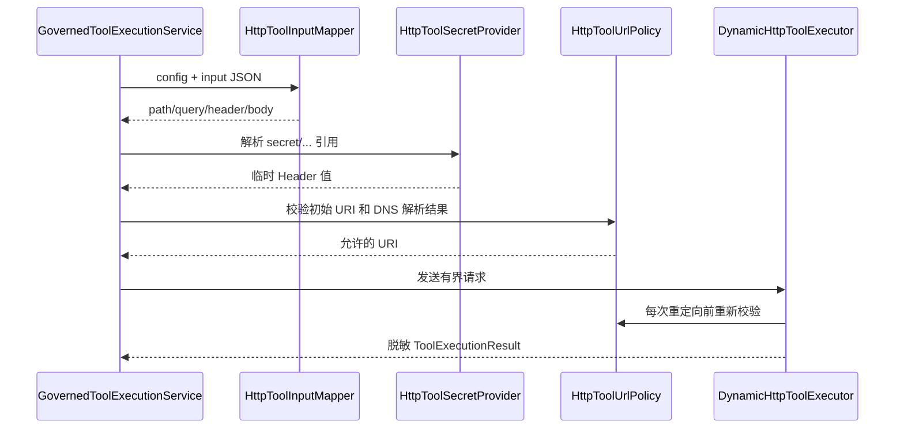

# 动态 HTTP 工具与 MCP 发布实现技术说明

## 1. 对应任务

本文对应 [动态 HTTP 工具与 MCP 发布设计](../specs/2026-07-21-dynamic-http-mcp-tools-design.md)。实现为已治理的工具增加 HTTP 类型、受控调试和可选 MCP Streamable HTTP 发布；HTTP 执行默认关闭，且不支持上传执行代码。

## 2. 数据模型与创建事务

core 定义 `HttpToolConfig`、`HttpParameterMapping`、`McpToolPublication` 等领域类型；Flyway V4 新增 `tool_http_configs` 和 `tool_mcp_publications`。`ManagementCommandService` 在创建或更新 HTTP 工具时原子写入工具定义及附属配置，`ToolQueryService` 聚合配置、发布状态和运行时就绪状态；Repository 读取均过滤 tenant 与软删除墓碑。

## 3. HTTP 执行安全

`HttpToolConfigValidator` 验证方法、URL 模板、输入 JSON Schema、JSON Pointer 映射与默认值。`HttpToolInputMapper` 将输入写入 PATH、QUERY、HEADER 或 BODY；`HttpToolUrlPolicy` 和 `HostAddressResolver` 实施协议、白名单、私网/回环地址、重定向、超时和响应大小限制。`ExternalHttpToolSecretProvider` 只解析 `secret/...` 引用，绝不持久化或返回真实 Header 值。

## 4. 治理、调试与 MCP

`GovernedToolExecutionService` 是 HTTP、LOCAL、Agent 运行和调试的统一执行入口，每次调用重新校验工具状态、授权及风险。`McpPublicationService` 管理发布规则；`McpEndpointServlet`、`McpPublishedToolCatalog` 与 `McpServerConfiguration` 以 MCP 2.0 Streamable HTTP 对外提供已发布工具，调用除 JWT 外仍需 `tool:mcp:invoke`。取消发布、禁用或配置漂移会立即让工具不可调用。

## 5. 控制台与验证

控制台提供 HTTP 配置、发布状态和单工具调试，HIGH 风险调试要求输入完整工具名二次确认。core、JDBC/migration、SSRF/映射、MockMvc、MCP 集成及控制台纯函数测试分别覆盖安全和契约；部署默认值及限制见 `docs/configuration.md`、`docs/operations.md`。

## 6. 代码定位

- HTTP 运行时：`cm-agent-server/src/main/java/com/cmagent/server/runtime/http`
- MCP：`cm-agent-server/src/main/java/com/cmagent/server/mcp`
- API 与服务：`cm-agent-server/src/main/java/com/cmagent/server/web/ToolController.java`、`service`
- V4：`cm-agent-persistence/src/main/resources/db/migration/V4__add_http_tools_and_mcp_publications.sql`

## 7. 一个 HTTP 工具由三类状态组成

| 状态 | 存储位置 | 含义 |
| --- | --- | --- |
| 工具定义 | `tool_definitions` | 名称、描述、类型、Schema、风险、启用状态和 endpoint 快照。 |
| HTTP 运行配置 | `tool_http_configs` | 方法、URL 模板、映射、Secret 引用和超时。 |
| MCP 发布意图 | `tool_mcp_publications` | 当前 tenant 是否希望通过 MCP 暴露该工具。 |

三者存在不代表工具一定可调用。运行时还要求 HTTP 总开关、协议/主机策略、定义 endpoint 与配置 URL 一致；LOCAL 则要求 `ToolRegistry` 快照匹配。`ToolQueryService` 聚合上述状态形成 `runtimeReady`，但调用路径仍会重新校验。

## 8. 创建与更新事务

`ToolController` 把 JSON DTO 转换为 `HttpToolCreateSpec`/`ToolUpdateSpec`，`ManagementCommandService` 统一校验 type 与附属配置组合：HTTP 必须有完整配置，非 HTTP 不能携带 HTTP 配置；请求声明 MCP 发布时还要满足发布规则。

JDBC 模式在一个事务中写工具定义、HTTP 配置、可选发布记录和审计。memory 模式记录各步是否已经写入，后续失败时按发布 → HTTP 配置 → 工具定义的反向顺序补偿。更新返回事务内 `ToolUpdateResult` 快照，避免提交后并发变更影响本次响应。

## 9. 输入 Schema 与参数映射

Schema 固定使用 JSON Schema 2020-12，根必须是 `type: object`。配置校验阶段会验证 meta-schema、编译本地引用、确认 sourcePointer 类型，并检查默认值符合对应子 Schema。

映射规则：

- PATH：标量、必填，目标名必须与 URL `{placeholder}` 集合完全一致。
- QUERY：只允许标量或标量数组；数组展开为重复 query 参数。
- HEADER：只允许标量，禁止 Host、Authorization、Cookie、Content-Length 和逐跳 Header 等动态覆盖。
- BODY：允许对象/数组，通过 targetPointer 创建容器；相同或父子 targetPointer 冲突会被拒绝。

缺失值和显式 null 都会尝试使用非 null 默认值。应用默认值后再执行整份输入 Schema 校验，然后才生成请求。JSON Pointer 的 `~0/~1`、数组索引和容器形状都经过显式验证。

## 10. HTTP 调用完整链

总 deadline 覆盖 URL 校验、Secret 解析、连接、响应头和响应体读取，不是每个阶段各有一份完整超时。阻塞操作放入受控 executor，超时会取消 Future 并关闭响应流。

## 11. SSRF 与传输安全

URL 策略要求协议在允许范围、主机进入显式白名单，并对 DNS 解析结果做回环、链路本地、私网或其他受限地址判断。每次请求和重定向都重新解析/校验，降低 DNS rebinding 风险。重定向只允许同源且不超过上限；303 或 POST 的 301/302 按规则切换 GET。

客户端不接受压缩响应，只允许单一安全 Content-Type，支持 text、application/json 和 `application/*+json`。响应最多读取 `maxResponseBytes + 1` 判定超限，JSON 还会做严格解析。非 2xx、TLS、连接、超时和编码错误都映射为固定摘要。

## 12. Secret 生命周期

数据库和 API 中只出现例如 `secret/integration/orders-token` 的引用。执行时 Provider 解析真实值，与动态 Header 合并前执行 Header 名、换行和大小写重复检查。真实值只在本次调用内存在，并提供给 `ToolOutputSanitizer` 从响应中擦除；不进入工具摘要、审计、异常或 API。

自定义 Secret Provider 必须支持取消/超时语义，并保证引用不属于当前 tenant 时失败。不要把真实 Secret 缓存在 `HttpToolConfig` 或前端表单。

## 13. MCP 目录与调用时复核

MCP 默认关闭；启用时 `McpServerProperties` 要求绝对单一路径及非空 Origin/Host 白名单。`McpEndpointServlet` 先从 SecurityContext 取 JWT 主体并检查 `tool:mcp:invoke`，然后为本次请求创建无状态官方 MCP server/transport，结束后关闭。

目录只包含当前 tenant 中发布、启用且 runtime 匹配的工具，并拒绝重名。工具规格生成后到实际 call 之间可能发生撤销、禁用或更新，因此 call handler 再读取发布记录和当前定义，并要求名称与列表快照一致。执行仍进入 `GovernedToolExecutionService`，写 started/completed/failed 审计。

## 14. HTTP、Agent、调试与 MCP 的治理差异

| 来源 | 身份上下文 | 额外权限/授权 | 共同执行入口 |
| --- | --- | --- | --- |
| AgentScope | tenant + Agent + principal + run | Agent grant + 工具策略 | `GovernedToolExecutionService` |
| 控制台调试 | tenant + principal | `tool:debug`，HIGH 名称确认 | 同上 |
| MCP | tenant + principal | `tool:mcp:invoke` + 已发布 | 同上 |

三种来源不能各自实现 HTTP 请求，否则安全策略会漂移。差异只应存在于调用前的权限语义和审计事件类型。

## 15. 故障定位与测试

配置 400 先查 Schema/映射；运行显示“工具不可用”先查定义、配置和 runtimeReady；“目标地址不允许”查协议、白名单和解析地址；MCP 工具消失查发布、启用、名称和 runtime 匹配；503 查 Repository/审计而非外部 HTTP 业务状态。

关键测试分布在 `HttpToolConfigTest`、`HttpToolConfigValidatorTest`、`HttpToolInputMapperTest`、`HttpToolUrlPolicyTest`、`DynamicHttpToolExecutorTest`、`McpPublishedToolCatalogTest`、`McpEndpointServletTest`、MCP 集成测试以及 V4 Repository/迁移测试。
