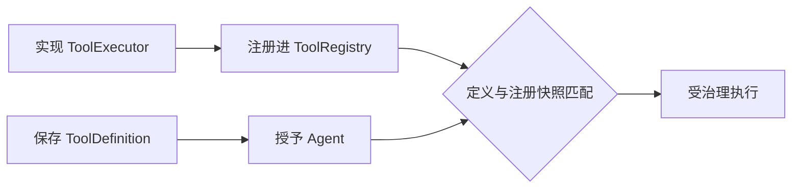
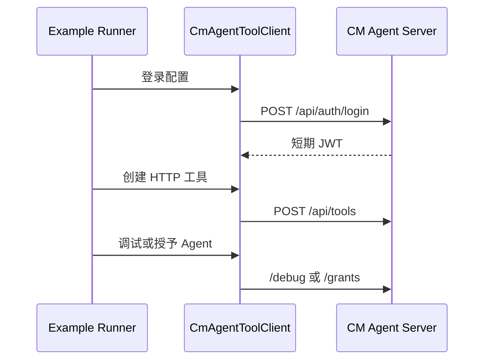

# LOCAL 与 HTTP 工具开发指南及示例工程实现技术说明

## 1. 对应任务

本文对应 [LOCAL 与 HTTP 工具开发指南及示例工程设计](../specs/2026-07-28-tool-development-guide-examples-design.md)。交付内容由中文工具开发指南、可运行 LOCAL 示例和 HTTP 客户端示例组成，目的是将工具治理边界落为可验证的开发路径。

## 2. LOCAL 示例实现

`cm-agent-examples/starter-local-tool` 使用 Starter 启动应用，在 `LocalToolRegistration` 中注册 `EchoToolExecutor` 与 `AddToolExecutor`。示例通过 `ToolExecutor`、`ToolExecutionRequest` 和 `ToolExecutionResult` 展示同 JVM 内注册与执行；工具定义仍需经过平台的授权、风险和运行时就绪检查，示例不提供网页上传或动态编写 Java 执行器的能力。

## 3. HTTP 示例实现

`cm-agent-examples/http-tool-client` 提供 `CmAgentToolClient`、配置属性和 Runner，演示经 REST 创建动态 HTTP 工具、授予 Agent、调试及可选 MCP 发布。客户端只提交 URL、输入 Schema、映射和 Secret 引用；真实 Secret 在服务端 `HttpToolSecretProvider` 解析，示例配置仅使用占位符。

## 4. 指南与验证

[docs/tool-development-guide.md](../../tool-development-guide.md) 说明工具类型选择、LOCAL 注册、HTTP 参数映射、调试/授权/MCP、常见错误和构建方式。两类示例均有单元或 Spring Boot 测试，根工程回归确保示例模块可编译；真实外部 HTTP 端点、生产凭据和非幂等副作用不作为默认测试依赖。

## 5. 代码定位

- LOCAL 示例：`cm-agent-examples/starter-local-tool`
- HTTP 客户端：`cm-agent-examples/http-tool-client`
- 开发指南：[docs/tool-development-guide.md](../../tool-development-guide.md)
- 运行时契约：`cm-agent-core/src/main/java/com/cmagent/core/tool`

## 6. LOCAL 工具的两个生命周期

LOCAL 工具同时有“管理定义”和“JVM 执行器注册”两个生命周期：

只有 ID、tenant、名称都匹配且定义启用时，`runtimeReady` 才为真。数据库保存定义不会自动加载 Java 代码；反过来，只注册执行器而没有当前 tenant 的定义和授权，也不能通过 API 调用。

`ToolExecutor.execute` 接收 `ToolExecutionRequest`，其中包含 tenant、可选 agent/run、主体、toolCallId、toolId、输入 JSON 和调用来源。实现应严格解析 JSON、执行领域计算并返回 `ToolExecutionResult`，不要自行绕过平台写审计或从全局变量推断 tenant。

## 7. echo 与 add 示例逻辑

`echo` 要求根对象只包含非空字符串 `message`，成功时回显受控 JSON；`add` 要求 `left/right` 为数字并使用精确十进制语义，避免二进制浮点的 `0.1 + 0.2` 展示误差。两个执行器都把输入校验失败转换为工具失败结果，而不是让原始 Jackson 异常穿透 API。

`LocalToolDefinitions` 固定定义与 Schema，`LocalToolRegistration` 在 Spring 启动时把定义和执行器成对注册。测试分别验证正常输入、缺失字段、错误类型、额外字段和注册快照。

## 8. 一个正式 LOCAL 工具的实现步骤

1. 在业务模块实现无静态可变状态的 `ToolExecutor`。
2. 定义根为 object 的 JSON Schema，并让运行时校验与 Schema 保持一致。
3. 使用稳定 ID、tenant、名称和风险等级构造 `ToolDefinition`。
4. 启动时向 `ToolRegistry` 注册定义与执行器。
5. 通过管理 API 或受控安装流程持久化相同定义。
6. 显式授予 Agent；HIGH 风险工具还应验证交互确认和策略。
7. 用单元测试覆盖执行器，再用 server 测试覆盖治理入口。

不要在 Controller 动态编译代码，也不要把 endpoint 当作 LOCAL 类名反射执行。多实例部署时，每个可接收流量的实例都必须注册相同执行器，否则 `runtimeReady` 会随实例变化。

## 9. HTTP 客户端示例的数据流

`CmAgentToolClient` 负责认证后的 REST 调用和 JSON 编解码，`HttpToolExampleProperties` 读取服务地址、占位凭据和工具配置，`HttpToolExampleRunner` 按顺序创建工具、调试/授权并输出受控摘要。客户端只展示平台公开契约，不复刻服务端 SSRF、Schema 或权限判断。

示例不能把真实 Secret 当 Header 值提交；`secretHeaders` 只含引用。服务地址、用户名、密码和业务 endpoint 都通过外部配置提供，仓库默认值必须不可用于生产。

## 10. Schema 与映射协同

开发 HTTP 工具时先写输入 Schema，再为每个出站位置设计映射。PATH 占位符必须全部对应必填映射；QUERY 适合标量和标量数组；敏感 Header 使用 `secretHeaders`，普通动态 Header 仍受禁止名单；复杂对象和数组放 BODY。默认值是 JSON 值，不是无类型字符串。

工具调试成功只说明当前输入与网络条件可用，不代表适合授权给所有 Agent。授权前还要评估风险等级、外部 API 幂等性、速率限制、超时以及失败后是否会产生部分副作用。

## 11. 错误处理和可观测性

执行器与示例客户端应对外返回稳定中文摘要，详细异常只进入受控、脱敏日志。工具输出上限由平台控制；示例不能依赖无限响应。对有副作用的工具，平台当前不提供自动幂等键或事务补偿，开发者需要在目标 API 层设计幂等。

## 12. 验证顺序

LOCAL：先跑执行器单测 → 示例 Spring 上下文 → server ToolRegistry/调试测试。HTTP：先跑客户端序列化测试 → 使用受控假服务验证契约 → 再连接本地 server。最后运行全仓测试，确保示例模块没有把 provider、数据库或测试凭据变成主工程的传递依赖。
