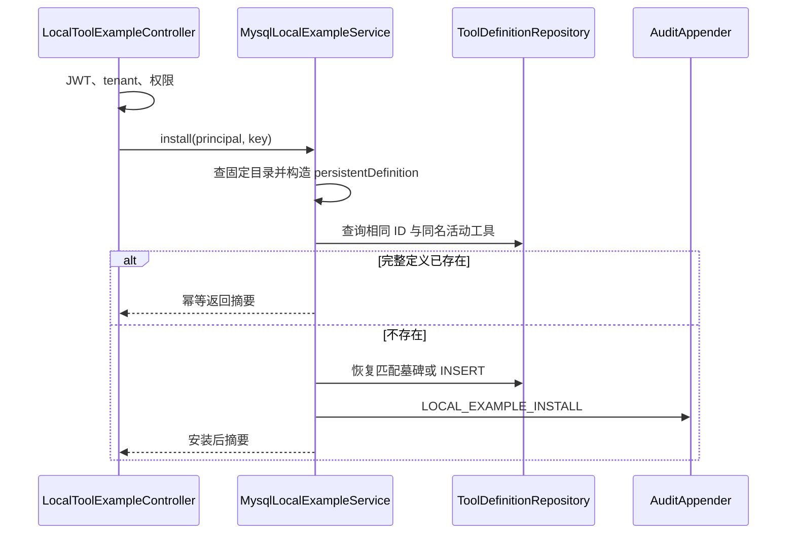

# MySQL Profile 内置 LOCAL 工具实现技术说明

## 1. 对应任务

本文对应 [MySQL Profile 内置 LOCAL 工具设计](../specs/2026-07-30-mysql-builtin-local-tools-design.md)。实现仅为非生产 `mysql` profile 的固定 bootstrap 示例租户提供 `echo`、`add` LOCAL 工具目录和显式安装能力，不将其扩展为通用的动态代码执行平台。

## 2. 目录与运行时注册

`MysqlLocalExampleCatalog` 保存固定 tenant、工具 ID、名称和定义，`MysqlLocalExampleRegistrationConfiguration` 仅在匹配 profile 时注册 `EchoToolExecutor`、`AddToolExecutor` 到运行时。启动注册的是执行器快照而不是数据库定义，因此不会自动向 MySQL 写入工具，也不会影响其他 tenant。

## 3. API 与事务

`LocalToolExampleController` 提供目录查询和安装接口；`MysqlLocalExampleService` 从认证主体取 tenant，确认仅目标 tenant 且具备相应权限后执行。安装使用固定定义与幂等规则，JDBC 模式通过命令事务写入工具、附属状态及审计；其他 tenant 或不满足 profile 条件的请求表现为 `404`，而不是泄露目录信息。

## 4. 运行时和控制台

`ToolQueryService` 将注册表快照转换为“运行时已就绪”状态，但真实调用仍经治理服务重新授权。控制台只在符合条件时展示固定目录、“添加示例工具”和示例输入；安装后刷新工具列表并进入既有调试入口。正式 LOCAL 工具仍由应用开发者在同一 Server JVM 实现并注册。

## 5. 删除恢复与验证

工具软删除后，固定 ID 仍需支持受控恢复，避免历史 ToolCall 外键被破坏；恢复仅允许预定义的 LOCAL 项目匹配 tenant、ID、原名称与类型。服务、Controller、控制台以及 MySQL/JDBC 集成测试覆盖 profile、tenant、权限、重复安装、恢复和实际调用。

## 6. 代码定位

- 目录与注册：`cm-agent-server/src/main/java/com/cmagent/server/runtime/local`
- 服务与 API：`cm-agent-server/src/main/java/com/cmagent/server/service/MysqlLocalExampleService.java`、`web/LocalToolExampleController.java`
- 控制台：`cm-agent-console/src/main/resources/META-INF/resources/assets/app.js`

## 7. 固定目录、数据库和运行时是三种状态

| 状态 | 来源 | 是否随进程重启保留 |
| --- | --- | --- |
| 可安装目录 | `MysqlLocalExampleCatalog` 常量 | 是，来自代码。 |
| 已安装定义 | MySQL `tool_definitions` | 是，来自数据库。 |
| 执行器就绪 | 当前 JVM `ToolRegistry` | 否，启动时重新注册。 |

目录项存在不等于已安装，已安装也不等于所有 JVM 实例都就绪。摘要中的 `installed` 要求数据库定义完整匹配固定模板；`runtimeReady` 还要求注册快照匹配当前定义。

## 8. 激活边界

注册配置使用 `@Profile("mysql & !prod & !production & !supabase")`；Service/Controller 还要求 `cm-agent.persistence.mode=jdbc`。因此只有非严格的 mysql JDBC 调试环境同时满足两层条件。其他 profile 不创建 API Bean，也不注册这套示例入口。

tenant 边界独立于 profile：只有固定示例 tenant 能看到目录和安装。其他 tenant 查询返回空列表，安装返回 404，避免泄露“平台上存在一个特殊目录”。权限上，目录查询需要 `tool:read`，安装需要 `tool:grant`；拒绝访问由统一审计记录。

## 9. 安装流程

定义已存在但任一受管字段不匹配时返回 409，防止固定 ID 被用户对象占用。名称被其他 ID 占用也返回 409。实际写入和成功审计在同一 JDBC 事务；唯一约束竞态统一转换为 409。

## 10. 为什么需要墓碑原位恢复

工具删除后 V5 保留相同主键墓碑，以保护历史 ToolCall 外键。固定示例若直接 INSERT 原 ID 会失败，因此安装先调用 `restoreManagedLocalTool`。Repository 只有在 tenant、ID、`deleted_name`、LOCAL 类型和删除状态全部匹配时才原位恢复，并清理墓碑字段。

这不是通用恢复接口。普通工具创建不能调用它，Controller 也不能接受任意定义触发恢复；否则攻击者可能复活已经删除的工具或改变历史主键含义。

## 11. 执行器契约

`echo` 接收唯一非空字符串字段并回显；`add` 接收两个 number，使用精确十进制相加后返回结果。Catalog 保存不可变 Schema、样例输入、固定定义和执行器。`sampleInput()` 返回深拷贝，避免控制台或调用方修改共享目录对象。

启动注册只操作内存 `ToolRegistry`，绝不自动写 MySQL。这样 DBA/操作者能明确控制管理面出现哪些定义，启动失败也不会悄悄改变数据库。

## 12. 控制台并发逻辑

页面按 example key 使用 keyed revision，允许 echo 和 add 并行安装，同时阻止同一个 key 的旧响应覆盖新状态。安装成功后并行刷新目录和工具列表；只有会话 epoch、key revision 均仍有效时，才把已安装工具选入调试表单并填充样例输入。

## 13. 常见问题定位

- API 为 404：检查 profile 表达式、jdbc mode、当前 tenant 和目录 key。
- 目录有项目但 `installed=false`：检查数据库定义是否缺失或字段不匹配。
- `installed=true` 但 `runtimeReady=false`：检查当前实例是否执行注册配置，以及定义 ID/tenant/name 是否与快照一致。
- 安装 409：区分固定 ID 冲突、同名冲突和墓碑恢复时的唯一约束。
- 调试不可用：除 runtimeReady 外还要检查 `tool:debug`、工具启用状态和风险确认。

## 14. 测试矩阵

Catalog/执行器单测验证固定契约；Registration 测试验证 profile 下注册；Service 测试覆盖 tenant、幂等、冲突、审计与墓碑恢复；Controller 测试覆盖认证和权限；JDBC 测试在 MySQL 验证真实事务/唯一约束；控制台测试覆盖 keyed revision 和会话切换。
