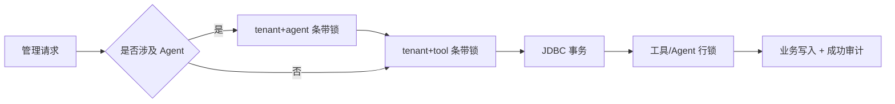
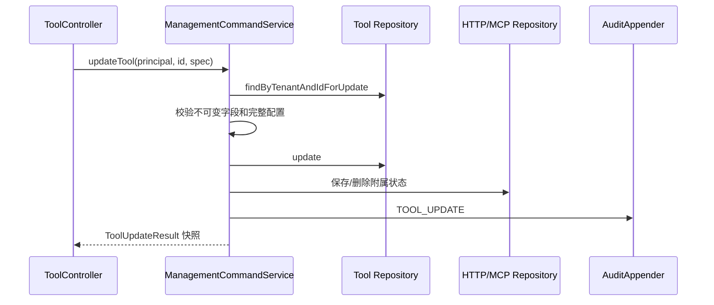
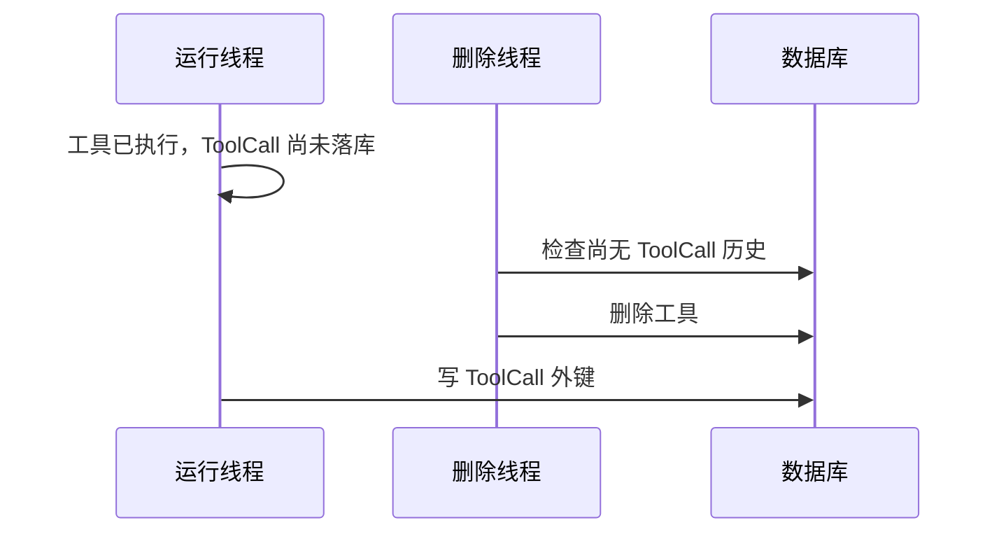

# 工具编辑、删除与 Agent 解除关联实现技术说明

## 1. 对应任务

本文对应 [工具编辑、删除与 Agent 解除关联设计](../specs/2026-07-31-tool-management-edit-delete-design.md)，记录该任务按规格文件名归档的实现说明。当前最终实现细节的补充版本见 [2026-08-03 工具治理实现原理设计](2026-08-03-tool-management-edit-delete-implementation-design.md)。

## 2. 接口与权限

`ToolController` 提供 `PUT /api/tools/{toolId}`、`DELETE /api/tools/{toolId}` 和 `DELETE /api/tools/{toolId}/grants/{agentId}`。编辑和解除关联要求 `tool:grant`，删除要求独立的 `tool:delete`；tenant 只来自认证主体。请求校验失败返回 400，当前 tenant 不存在返回 404，名称冲突、仍被 Agent 引用或已有 ToolCall 历史返回 409，数据库或严格审计不可用返回 503。

## 3. 命令编排与并发控制

`ManagementCommandService` 负责跨 Repository 的字段校验、条带锁、事务和成功审计。JDBC 模式同时对活动工具行执行 `SELECT ... FOR UPDATE`，更新、授权和删除据此在多实例间串行化；memory 模式通过进程内锁及快照补偿维持等价语义。更新接口直接返回事务内快照，Controller 不在提交后再次查询，避免并发请求污染响应。

## 4. 更新、解除关联与删除语义

工具 ID、tenant、类型和创建人不可变；LOCAL 名称不可变，HTTP 工具更新必须提交完整且合法的 HTTP 配置。解除关联在同一事务内删除 `tool_grants` 记录并从 `agent_definitions.tool_ids_json` 移除工具 ID，保证重复操作可收敛。

删除先检查当前 tenant 的 Agent 引用和已有 ToolCall。不存在历史调用时执行软删除，而非物理删除：V5 记录 `deleted_at`、保留 `deleted_name`、替换为内部墓碑名并禁用工具，释放原名称但保留外键锚点，允许在途调用稍后写入 ToolCall。HTTP 配置、MCP 发布和残留授权随删除事务清理，活动查询统一过滤墓碑。

## 5. 控制台与验证

控制台为工具提供编辑、删除确认和冲突提示，在 Agent 详情提供解除关联。只有“仍被 Agent 引用”的 409 才引导用户解除关联；已有调用历史等其他冲突保留服务端消息。会话代际、列表 revision 与编辑对象核对防止迟到响应覆盖最新 UI 状态。Web、服务、JDBC、Flyway、memory 补偿、并发、控制台纯函数及 PostgreSQL/MySQL 集成测试共同覆盖该链路。

## 6. 代码定位

- REST：`cm-agent-server/src/main/java/com/cmagent/server/web/ToolController.java`
- 命令服务：`cm-agent-server/src/main/java/com/cmagent/server/service/ManagementCommandService.java`
- 查询组装：`cm-agent-server/src/main/java/com/cmagent/server/service/ToolQueryService.java`
- 持久化与迁移：`cm-agent-persistence/src/main/java/com/cmagent/persistence`、`db/migration/V5__soft_delete_tool_definitions.sql`
- 控制台：`cm-agent-console/src/main/resources/META-INF/resources/assets/app.js`

## 7. 参与对象与锁顺序

一次工具管理命令可能同时修改 ToolDefinition、HttpToolConfig、MCP Publication、ToolGrant、AgentDefinition 和 AuditEvent。为避免并发授权、解除和删除互相覆盖，服务使用固定锁顺序：涉及 Agent 与 Tool 时先取 Agent 条带锁，再取 Tool 条带锁；只涉及 Tool 时只取 Tool 锁。

条带锁数组是固定大小，按 tenant 与 ID 哈希选择；不同资源可能落在同一条带，只影响并发度，不影响正确性。跨 JVM 的正确性依赖数据库行锁和唯一约束。

## 8. 更新字段矩阵与准备阶段

| 字段/状态 | HTTP | LOCAL | 原因 |
| --- | --- | --- | --- |
| ID、tenant、createdBy、createdAt | 不可变 | 不可变 | 资源身份与审计来源。 |
| type | 不可变 | 不可变 | 防止运行时和附属表语义切换。 |
| name | 可改，同 tenant 唯一 | 不可改 | LOCAL 名称参与注册快照匹配。 |
| description/risk/enabled | 可改 | 可改 | 管理属性。 |
| HTTP config | 必须完整提供 | 禁止提供 | HTTP 附属状态不能局部漂移。 |
| MCP | 可发布/取消 | 已发布可保留或取消；新发布走专用接口 | LOCAL 发布前要验证执行器快照。 |

更新先锁定并读取当前定义，再构造新定义和附属状态，完成全部校验后才写入。HTTP 校验包括 Schema、映射、Secret 引用、超时与发布规则。准备阶段不应产生部分写入。

## 9. 更新事务与稳定响应

`ToolUpdateResult` 包含刚提交的 ToolDefinition、可选 HttpToolConfig 和发布布尔值。Controller 直接调用 `ToolQueryService.summarize` 生成响应，不重新查询数据库。否则另一个线程可能在事务提交后立刻再次更新/删除，导致第一个请求返回第二个请求的结果或 404。

memory 模式保存旧 Tool/HTTP/MCP 快照；任一步或审计失败后恢复旧状态。恢复失败作为 suppressed exception 附到原异常，不能用补偿异常覆盖真正失败原因。

## 10. 删除检查为何分两类 409

删除前必须区分：

1. Agent 当前仍引用工具：操作者可以通过解除关联解决，返回“请先解除关联”。
2. 已存在 ToolCall 历史：为保留历史不能删除，这是不可通过解除关联解决的冲突。

控制台只把第一类 409 识别为“去 Agent 详情处理”，第二类直接显示服务端消息。判断依据包含明确状态和业务语义，不能把所有 409 一概归为引用冲突。

## 11. 在途调用与墓碑竞态

危险时间线如下：

如果删除是物理 DELETE，最后一步会违反外键。V5 因此把删除实现为墓碑：保存原名称到 `deleted_name`，把 `name` 替换为内部唯一值，设置 `enabled=false/deleted_at`。活动查询看不到墓碑，原名称立即可复用，而相同 `(id, tenant_id)` 行继续承接迟到 ToolCall。

删除事务还删除 HTTP 配置、MCP 发布和残留 grant。任何调试、授权、列表、MCP 或附属配置查询都必须先通过活动工具查询，不能直接用附属表绕过墓碑。

## 12. 授权与解除关联的双写语义

当前授权关系同时存在：`tool_grants` 表表达治理授权，`agent_definitions.tool_ids_json` 表达 Agent 配置工具集合。授权时两处都要添加；解除时两处都要移除。只删 grant 会让 Agent 配置继续引用工具，只改 JSON 又会让治理策略仍认为有授权。

解除流程锁定 Agent 和 Tool，确认二者都属于当前 tenant，然后删除 grant 并更新 Agent 工具集合，再写 `TOOL_GRANT_REVOKE`。即使 grant 已缺失，也会把 Agent JSON 收敛到无该 toolId，具有修复性幂等语义。Agent 行锁避免两个并发解除各自基于旧 JSON 写回，造成其中一个 toolId 被重新带回。

## 13. 删除与授权的并发结果

- 授权先取得数据库工具行锁：删除等待；授权提交后，删除看到 Agent 引用并返回 409。
- 删除先取得行锁：授权等待；删除提交墓碑后，授权的活动查询返回 404。
- 同 JVM memory：条带锁提供相同串行结果。

因此正确性不依赖“请求通常不会同时发生”。新增批量授权或批量删除时必须延续全局锁顺序，否则可能引入死锁。

## 14. 权限、错误与审计

| 操作 | 权限 | 成功审计 |
| --- | --- | --- |
| 更新 | `tool:grant` | `TOOL_UPDATE` |
| 删除 | `tool:delete` | `TOOL_DELETE` |
| 解除关联 | `tool:grant` | `TOOL_GRANT_REVOKE` |

权限拒绝由 Controller 的统一入口写 access-denied 审计；成功审计由命令事务写入。跨租户资源统一 404。DuplicateKey/业务冲突为 409，校验为 400，数据库或严格审计异常为 503。响应、日志与审计均不能包含 Secret 原文、SQL 或连接信息。

## 15. 开发者修改指南

新增可编辑字段时要同时更新：Web record 与校验、`ToolUpdateSpec`、领域构造、HTTP/LOCAL 字段矩阵、JDBC UPDATE、memory store、审计摘要、控制台载荷/回填和事务/补偿测试。新增删除前置条件时，要决定它属于可解除冲突、历史保护还是权限拒绝，并给控制台稳定识别语义。

不要在 Controller 拼装多 Repository 写入，不要把软删除改回物理删除，不要让普通创建调用受管 LOCAL 恢复接口，也不要用 JVM 锁替代数据库锁。

## 16. 测试与排障矩阵

| 场景 | 关键测试/位置 |
| --- | --- |
| HTTP/LOCAL 字段限制 | `ManagementCommandServiceTest`、`ToolControllerTest` |
| 更新响应不受并发污染 | 命令服务稳定快照测试 |
| 审计失败回滚 | JDBC 命令服务测试、memory 补偿测试 |
| Agent 引用与历史 409 | Controller/Service 删除测试 |
| 墓碑过滤和名称复用 | `JdbcToolDefinitionRepositoryTest`、MigrationTest |
| 在途 ToolCall 晚落库 | JDBC persistence 专项测试 |
| 并发授权/删除 | PostgreSQL/MySQL 行锁测试 |
| 页面迟到响应 | `console-core.test.cjs` |

排障时先按状态码和审计定位命令阶段，再查询活动工具与墓碑行、Agent `tool_ids_json`、grant、ToolCall 历史和附属配置。不要直接手工修表；双写状态和历史外键需要通过受控流程收敛。
