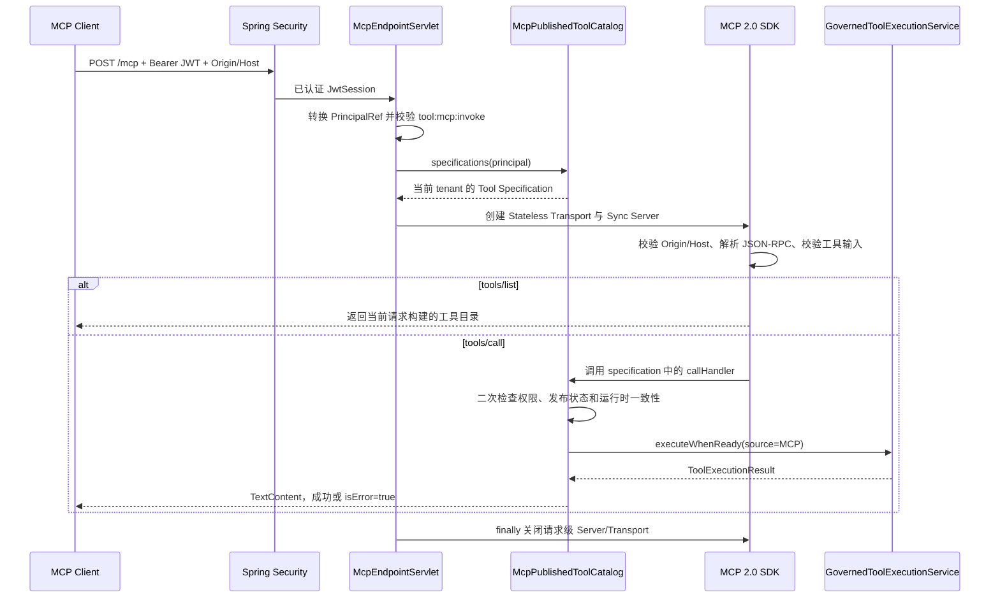

# 动态 HTTP 工具与 MCP 发布实施计划

> **For agentic workers:** REQUIRED SUB-SKILL: Use superpowers:subagent-driven-development (recommended) or superpowers:executing-plans to implement this plan task-by-task. Steps use checkbox (- [ ]) syntax for tracking.

**Goal:** 实现可由控制台配置和调试的动态 HTTP 工具，并通过可选的无状态 MCP Streamable HTTP Server 发布 HTTP 与已注册 LOCAL 工具。

**Architecture:** ToolDefinition 保留模型可见定义，HttpToolConfig 与 McpToolPublication 分别保存执行和发布配置。Agent、页面调试、MCP 完成各自授权后调用 GovernedToolExecutionService；MCP 每个请求只为 JWT 当前 tenant 构建官方 SDK 无状态服务，禁止跨租户发现。

**Tech Stack:** Java 21、Maven 3.9+、Spring Boot 3.5.0、Spring MVC/Security/JDBC、Flyway、Jackson 2、JDK HttpClient、MCP Java SDK 2.0.0、networknt JSON Schema Validator 2.0.0、JUnit/Mockito/MockMvc/Testcontainers/Node test。

## Global Constraints

- 项目落地文字和提交说明使用中文；不覆盖用户原工作区未提交文件。
- 不修改 V1/V2/V3，只新增 V4；Repository 全部显式 tenant 条件。
- Secret 值不进入数据库、DTO、日志、审计、ToolCall、断言或文档。
- HTTP 仅 GET/POST、无自动重试、生产仅 HTTPS、Host 白名单为空即拒绝。
- MCP 默认关闭；官方无状态 Servlet POST 处理 JSON-RPC，GET 返回 405。
- JDBC/Flyway/Testcontainers 只在 ssh rocky 的 maven:3.9.9-eclipse-temurin-21 容器验证。
- 每项任务执行 RED → GREEN → 回归 → 双阶段审查 → commit，并更新 progress ledger。

---

### Task 1：核心领域与依赖契约

**Files:**
- Modify: pom.xml、cm-agent-server/pom.xml、ToolType.java、ToolExecutionRequest.java、ToolExecutionResult.java
- Create: HttpToolMethod.java、HttpParameterLocation.java、HttpParameterMapping.java、HttpToolConfig.java、McpToolPublication.java、ToolInvocationSource.java
- Create: HttpToolConfigRepository.java、McpToolPublicationRepository.java
- Test: HttpToolConfigTest.java、InMemoryToolRegistryTest.java
- Create: docs/superpowers/progress/2026-07-21-dynamic-http-mcp-tools-ledger.md

**Produces:**
- HttpToolConfigRepository.save/findByTenantAndToolId/delete。
- McpToolPublicationRepository.save/findByTenantAndToolId/listEnabledByTenant/delete。
- ToolExecutionRequest 支持 AGENT/DEBUG/MCP，保留旧二参数构造器。
- ToolExecutionResult 增加 statusCode/errorMessage 和 succeeded/failed 工厂。
- ToolType 增加 HTTP；现有 LOCAL/MCP/A2A 枚举值和序列化名称保持不变。

- [ ] **Step 1：写失败测试**

~~~java
@Test
void GET拒绝BODY且集合防御性复制() {
    var mappings = new ArrayList<HttpParameterMapping>();
    mappings.add(new HttpParameterMapping("/order/no", HttpParameterLocation.PATH,
            "orderNo", "", true, "\"A100\""));
    var config = new HttpToolConfig(TENANT, TOOL, HttpToolMethod.GET,
            "https://api.example.com/orders/{orderNo}", "{\"type\":\"object\"}",
            mappings, Map.of("Authorization", "order-token"), Duration.ofSeconds(5));
    mappings.clear();
    assertThat(config.parameterMappings()).hasSize(1);
    assertThatThrownBy(() -> new HttpToolConfig(TENANT, TOOL, HttpToolMethod.GET,
            "https://api.example.com", "{\"type\":\"object\"}",
            List.of(new HttpParameterMapping("/x", HttpParameterLocation.BODY,
                    "", "/x", false, "")), Map.of(), Duration.ofSeconds(1)))
            .isInstanceOf(IllegalArgumentException.class);
}
~~~

运行：

~~~powershell
mvn -q -pl cm-agent-core -am "-Dtest=HttpToolConfigTest,InMemoryToolRegistryTest" "-Dsurefire.failIfNoSpecifiedTests=false" test
~~~

Expected: 缺少新类型导致编译失败。

- [ ] **Step 2：锁定依赖**

父 POM 属性 mcp.version=2.0.0；dependencyManagement 管理 io.modelcontextprotocol.sdk:mcp-core 和 mcp-json-jackson2。Server 仅引入这两个 artifact，不引入 Spring AI/WebFlux。

- [ ] **Step 3：实现领域记录**

~~~java
public enum HttpToolMethod { GET, POST }
public enum HttpParameterLocation { PATH, QUERY, HEADER, BODY }
public enum ToolInvocationSource { AGENT, DEBUG, MCP, LEGACY }

public record HttpParameterMapping(
        String sourcePointer, HttpParameterLocation location,
        String targetName, String targetPointer,
        boolean required, String defaultValueJson) {
    public HttpParameterMapping {
        sourcePointer = Objects.requireNonNull(sourcePointer, "sourcePointer 不能为空");
        location = Objects.requireNonNull(location, "location 不能为空");
        targetName = targetName == null ? "" : targetName.trim();
        targetPointer = targetPointer == null ? "" : targetPointer.trim();
        defaultValueJson = defaultValueJson == null ? "" : defaultValueJson;
        if (!sourcePointer.isEmpty() && !sourcePointer.startsWith("/"))
            throw new IllegalArgumentException("sourcePointer 必须是 JSON Pointer");
        if (location == HttpParameterLocation.BODY) {
            if (!targetName.isEmpty() || !targetPointer.startsWith("/"))
                throw new IllegalArgumentException("BODY 参数必须只提供 targetPointer");
        } else if (targetName.isBlank() || !targetPointer.isEmpty()) {
            throw new IllegalArgumentException("非 BODY 参数必须只提供 targetName");
        }
    }
    public boolean hasDefaultValue() { return !defaultValueJson.isBlank(); }
}
~~~

~~~java
public record HttpToolConfig(
        UUID tenantId, UUID toolId, HttpToolMethod method,
        String urlTemplate, String inputSchema,
        List<HttpParameterMapping> parameterMappings,
        Map<String,String> secretHeaders, Duration timeout) {
    public HttpToolConfig {
        Objects.requireNonNull(tenantId); Objects.requireNonNull(toolId); Objects.requireNonNull(method);
        if (urlTemplate == null || urlTemplate.isBlank()) throw new IllegalArgumentException("urlTemplate 不能为空");
        if (inputSchema == null || inputSchema.isBlank()) throw new IllegalArgumentException("inputSchema 不能为空");
        parameterMappings = List.copyOf(parameterMappings == null ? List.of() : parameterMappings);
        secretHeaders = Map.copyOf(secretHeaders == null ? Map.of() : secretHeaders);
        if (timeout == null || timeout.isZero() || timeout.isNegative())
            throw new IllegalArgumentException("timeout 必须为正数");
        if (method == HttpToolMethod.GET && parameterMappings.stream()
                .anyMatch(it -> it.location() == HttpParameterLocation.BODY))
            throw new IllegalArgumentException("GET 工具不能配置 BODY 参数");
    }
}
~~~

ToolExecutionRequest 八字段 tenantId/agentId/principal/runId/toolCallId/toolId/inputJson/source：非 LEGACY 必须 tenant/principal/toolCallId；AGENT 必须 agentId/runId；DEBUG/MCP 禁止 agentId/runId；tenant 必须等于 principal.tenantId。旧构造器填 LEGACY。ToolExecutionResult 四字段并保留二参数构造器。

- [ ] **Step 4：建立账本、GREEN、依赖树和提交**

账本列：任务、状态、RED、GREEN/回归、审查修复、commit，预建十行。

~~~powershell
mvn -q -pl cm-agent-core -am "-Dtest=HttpToolConfigTest,InMemoryToolRegistryTest" "-Dsurefire.failIfNoSpecifiedTests=false" test
mvn -pl cm-agent-server dependency:tree "-Dincludes=io.modelcontextprotocol.sdk:*"
git add pom.xml cm-agent-server/pom.xml cm-agent-core docs/superpowers/progress
git commit -m "feat: 建立动态HTTP工具领域契约"
~~~

Expected: 测试通过；只解析 MCP 2.0.0 Jackson2，无 Jackson3/WebFlux。

---

### Task 2：V4 与 JDBC/memory Repository

**Files:**
- Create: V4__add_http_tools_and_mcp_publications.sql、两个 Jdbc Repository 和测试
- Modify: MigrationTest.java、JdbcRuntimeRepositoryMySqlTest.java
- Modify: InMemoryPlatformStore.java、ServerRepositoryConfiguration.java、JdbcPersistenceConfiguration.java及测试、账本

- [ ] **Step 1：写 PostgreSQL/MySQL RED**

保存 tenant A/B 配置，覆盖嵌套映射、默认值、Secret 引用、更新、删除、跨租户空结果；发布列表仅返回当前 tenant enabled。

~~~java
assertThat(repository.findByTenantAndToolId(TENANT_A, TOOL)).contains(configA);
assertThat(repository.findByTenantAndToolId(TENANT_B, TOOL)).contains(configB);
assertThat(publications.listEnabledByTenant(TENANT_A))
        .extracting(McpToolPublication::toolId).containsExactly(TOOL);
~~~

在 Rocky 容器执行目标测试，Expected: 缺类/表而失败。

- [ ] **Step 2：新增 V4**

~~~sql
CREATE UNIQUE INDEX ux_tool_definitions_tenant_name ON tool_definitions (tenant_id, name);
CREATE TABLE tool_http_configs (
 tenant_id CHAR(36) NOT NULL, tool_id CHAR(36) NOT NULL,
 method VARCHAR(10) NOT NULL, url_template VARCHAR(500) NOT NULL,
 input_schema TEXT NOT NULL, parameter_mappings TEXT NOT NULL,
 secret_headers TEXT NOT NULL, timeout_ms BIGINT NOT NULL,
 created_at TIMESTAMP NOT NULL, updated_at TIMESTAMP NOT NULL,
 PRIMARY KEY (tenant_id, tool_id),
 CONSTRAINT fk_http_tool FOREIGN KEY (tool_id, tenant_id)
   REFERENCES tool_definitions (id, tenant_id)
);
CREATE TABLE tool_mcp_publications (
 tenant_id CHAR(36) NOT NULL, tool_id CHAR(36) NOT NULL,
 enabled BOOLEAN NOT NULL, published_by VARCHAR(120) NOT NULL,
 created_at TIMESTAMP NOT NULL, updated_at TIMESTAMP NOT NULL,
 PRIMARY KEY (tenant_id, tool_id),
 CONSTRAINT fk_mcp_tool FOREIGN KEY (tool_id, tenant_id)
   REFERENCES tool_definitions (id, tenant_id)
);
INSERT INTO permissions(code,description)
 SELECT 'tool:debug','调试工具'
 WHERE NOT EXISTS (SELECT 1 FROM permissions WHERE code='tool:debug');
INSERT INTO permissions(code,description)
 SELECT 'tool:mcp:invoke','通过 MCP 调用已发布工具'
 WHERE NOT EXISTS (SELECT 1 FROM permissions WHERE code='tool:mcp:invoke');
INSERT INTO role_permissions(role_id,permission_code)
 SELECT r.id,p.code FROM roles r CROSS JOIN permissions p
 WHERE r.code='admin' AND p.code IN ('tool:debug','tool:mcp:invoke')
 AND NOT EXISTS (SELECT 1 FROM role_permissions rp
   WHERE rp.role_id=r.id AND rp.permission_code=p.code);
~~~

- [ ] **Step 3：实现 Repository/Bean**

JDBC 构造器用 JdbcClient+ObjectMapper；save 使用项目已有 UPDATE 后条件 INSERT；JSON 用 TypeReference<List<HttpParameterMapping>> 与 Map；所有 WHERE 带 tenant_id/tool_id。Memory 用 tenantId+":"+toolId key 的 ConcurrentHashMap。注册 JDBC/memory Bean。

- [ ] **Step 4：Rocky GREEN、账本和提交**

~~~bash
docker run --rm -v "$PWD:/workspace" -w /workspace -v /var/run/docker.sock:/var/run/docker.sock \
 maven:3.9.9-eclipse-temurin-21 mvn -q -pl cm-agent-persistence -am \
 -Dtest=MigrationTest,JdbcHttpToolConfigRepositoryTest,JdbcMcpToolPublicationRepositoryTest,JdbcRuntimeRepositoryMySqlTest \
 -Dsurefire.failIfNoSpecifiedTests=false test
~~~

~~~powershell
mvn -q -pl cm-agent-server -am "-Dtest=ServerRepositoryConfigurationTest,JdbcPersistenceConfigurationTest" "-Dsurefire.failIfNoSpecifiedTests=false" test
git add cm-agent-persistence cm-agent-server docs/superpowers/progress
git commit -m "feat: 持久化HTTP工具与MCP发布配置"
~~~

---

### Task 3：HTTP 创建事务与 API

**Files:** Create HttpToolCreateSpec.java、ToolControllerTest.java；Modify ManagementCommandService.java、ToolController.java及测试、账本。

- [ ] **Step 1：写 RED**

覆盖旧 LOCAL；HTTP 缺配置；LOCAL 带配置；嵌套 Schema/default/endpoint；初始 MCP 发布；审计失败事务回滚；同租户重名拒绝、跨租户同名允许。

- [ ] **Step 2：实现 DTO/事务**

~~~java
public record HttpToolCreateSpec(HttpToolMethod method, String urlTemplate,
        String inputSchema, List<HttpParameterMapping> parameterMappings,
        Map<String,String> secretHeaders, Duration timeout) {}
~~~

ToolCreateRequest 增加 Boolean mcpPublished 与 @Valid HttpConfigRequest；HttpConfigRequest 使用 JsonNode inputSchema/defaultValue、映射列表、Secret引用 Map、100..30000 timeoutMillis。Controller canonical JSON 转换；Service 同 tenant 名称检查，HTTP 保存 Tool→Config→可选 Publication→Audit 于同一事务，非 HTTP 保持旧 schema/endpoint。

GET /api/tools 改为 ToolSummaryResponse 列表，保留 ToolDefinition 原有字段名并只追加 httpConfig 与 mcpPublished；httpConfig 返回 URL、方法、Schema、映射、Secret 引用和 timeout，绝不返回 Secret 值。同步修改已有 Controller/Console 测试，证明旧字段仍存在。

- [ ] **Step 3：RED/GREEN/回归/提交**

~~~powershell
mvn -q -pl cm-agent-server -am "-Dtest=ManagementCommandServiceTest,ToolControllerTest" "-Dsurefire.failIfNoSpecifiedTests=false" test
mvn -q -pl cm-agent-server -am "-Dtest=ManagementCommandServiceTest,ToolControllerTest,RunControllerTest" "-Dsurefire.failIfNoSpecifiedTests=false" test
git add cm-agent-server docs/superpowers/progress
git commit -m "feat: 支持创建动态HTTP工具"
~~~

---

### Task 4：嵌套 Schema、默认值与参数映射

**Files:** Create HttpToolConfigValidator.java、HttpToolInputMapper.java、PreparedHttpToolRequest.java及测试；Modify ManagementCommandService、账本。

- [ ] **Step 1：写 RED**

覆盖非法/非 object Schema、Pointer 不存在、default 类型、缺失/null 使用 default、PATH 占位符、GET BODY、重复目标、BODY 父子冲突、敏感 Header、标量数组 QUERY、object/array 仅 BODY。

- [ ] **Step 2：实现结构**

~~~java
public record PreparedHttpToolRequest(Map<String,String> pathValues,
 Map<String,List<String>> queryValues, Map<String,String> headers, JsonNode body) {
 public PreparedHttpToolRequest {
  pathValues=Map.copyOf(pathValues); headers=Map.copyOf(headers);
  queryValues=queryValues.entrySet().stream().collect(Collectors.toUnmodifiableMap(
   Map.Entry::getKey,e->List.copyOf(e.getValue())));
  body=body==null?NullNode.getInstance():body.deepCopy();
 }
}
~~~

Validator 使用 networknt V202012 和 JsonPointer；defaultValueJson 用子 Schema 校验；BODY Pointer 检测相等/前缀冲突；动态 Header 禁止 host/content-length/connection/transfer-encoding/authorization/cookie/proxy-authorization/upgrade。Mapper 先校验输入；Missing/Null 应用 default；required 缺失固定错误；PATH/HEADER 标量、QUERY 标量或标量数组、BODY 构造嵌套 JSON。

- [ ] **Step 3：RED/GREEN/提交**

~~~powershell
mvn -q -pl cm-agent-server -am "-Dtest=HttpToolConfigValidatorTest,HttpToolInputMapperTest" "-Dsurefire.failIfNoSpecifiedTests=false" test
mvn -q -pl cm-agent-server -am "-Dtest=HttpToolConfigValidatorTest,HttpToolInputMapperTest,ManagementCommandServiceTest,ToolControllerTest" "-Dsurefire.failIfNoSpecifiedTests=false" test
git add cm-agent-server docs/superpowers/progress
git commit -m "feat: 支持嵌套HTTP工具参数映射"
~~~

---

### Task 5：Secret、SSRF 与有界 HTTP 执行

**Files:** Create HttpToolProperties、HttpToolSecretProvider、ExternalHttpToolSecretProvider、HostAddressResolver、HttpToolUrlPolicy、DynamicHttpToolExecutor及测试；Modify YAML/profile tests、账本。

- [ ] **Step 1：写 RED**

覆盖 Secret 复合键/toString 脱敏；HTTPS 精确/子域白名单；拒绝 HTTP/userinfo/fragment/端口/localhost/私网/链路本地/组播/保留地址；重定向逐跳重验且最多 3；编码；POST JSON；Secret Header；2xx JSON/text；非2xx无正文；二进制；256KiB；超时；不重试。HttpServer 测试注入固定解析器/测试 allowHttp。

- [ ] **Step 2：实现接口与默认值**

~~~java
@FunctionalInterface public interface HttpToolSecretProvider {
 Optional<String> resolve(UUID tenantId,String secretRef);
}
@FunctionalInterface public interface HostAddressResolver {
 List<InetAddress> resolve(String host) throws UnknownHostException;
}
~~~

HttpToolProperties: enabled=false、allowHttp=false、allowedHosts/secrets空、min=100ms、max=30s、maxResponseBytes=262144、maxRedirects=3。Secret Provider 可被自定义 Bean 覆盖。

- [ ] **Step 3：实现 URL/HTTP**

URL 策略默认 https:443；白名单仅精确或受控子域；解析全部地址必须公网，显式拒绝元数据地址和 IPv6 ULA。DynamicHttpToolExecutor 在 properties.enabled=false 时立即返回“HTTP 工具未启用”且不解析 Secret、不联网。启用后使用 HttpClient Redirect.NEVER；URI 编码；Secret缺失不联网；BodyHandlers.ofInputStream+readNBytes(max+1)；3xx手动逐跳；2xx返回状态+脱敏正文；非2xx固定错误；超时/连接/TLS固定中文语义。

- [ ] **Step 4：RED/GREEN/回归/提交**

~~~powershell
mvn -q -pl cm-agent-server -am "-Dtest=ExternalHttpToolSecretProviderTest,HttpToolUrlPolicyTest,DynamicHttpToolExecutorTest" "-Dsurefire.failIfNoSpecifiedTests=false" test
mvn -q -pl cm-agent-server -am "-Dtest=ExternalHttpToolSecretProviderTest,HttpToolUrlPolicyTest,DynamicHttpToolExecutorTest,ApplicationProfileConfigurationTest" "-Dsurefire.failIfNoSpecifiedTests=false" test
git add cm-agent-server docs/superpowers/progress
git commit -m "feat: 安全执行动态HTTP工具"
~~~

---

### Task 6：统一治理执行入口

**Files:** Create GovernedToolExecutionService.java及测试；Modify GovernedToolInvocationService.java及测试、账本。

- [ ] **Step 1：写 RED**

HTTP 每次重读配置；LOCAL registry 定义一致性；其他类型/禁用/跨租户不可用；DEBUG/MCP 不伪造 Agent；原 Agent 二次授权、撤权、严格审计保持。

- [ ] **Step 2：实现路由**

~~~java
public ToolExecutionResult execute(ToolDefinition tool,ToolExecutionRequest request) {
 if (!tool.enabled() || !tool.tenantId().equals(request.tenantId()) || !tool.id().equals(request.toolId()))
  return ToolExecutionResult.failed("工具不可用",null);
 if (tool.type()==ToolType.HTTP)
  return configs.findByTenantAndToolId(tool.tenantId(),tool.id())
   .filter(c->tool.endpoint().equals(c.urlTemplate()))
   .map(c->http.execute(tool,c,request))
   .orElseGet(()->ToolExecutionResult.failed("工具不可用",null));
 if (tool.type()==ToolType.LOCAL) {
  ToolDefinition registered=registry.find(tool.id()).orElse(null);
  if (registered==null || !tool.tenantId().equals(registered.tenantId())
      || !tool.name().equals(registered.name()))
   return ToolExecutionResult.failed("工具不可用",null);
  return registry.execute(request);
 }
 return ToolExecutionResult.failed("工具不可用",null);
}
~~~

Agent 网关保留查询/grants/policy/审计，只替换执行部分并构造 source=AGENT。

- [ ] **Step 3：RED/GREEN/Server回归/提交**

~~~powershell
mvn -q -pl cm-agent-server -am "-Dtest=GovernedToolExecutionServiceTest,GovernedToolInvocationServiceTest" "-Dsurefire.failIfNoSpecifiedTests=false" test
mvn -q -pl cm-agent-server -am test
git add cm-agent-server docs/superpowers/progress
git commit -m "refactor: 统一受治理工具执行入口"
~~~

---

### Task 7：发布管理与工具调试 API

**Files:** Create ToolDebugService、McpPublicationService及测试；Modify ToolController、AuthController及测试、账本。

- [ ] **Step 1：写 RED**

tool:debug 缺失403+审计；HTTP/注册LOCAL调试；跨租户404；开始审计失败不执行；完成审计失败503。发布覆盖管理权限、HTTP/LOCAL范围、LOCAL注册一致、重名拒绝、取消即时生效、严格审计。

- [ ] **Step 2：实现**

POST /api/tools/{id}/debug 生成 toolCallId，写 TOOL_DEBUG_STARTED，source=DEBUG、无 agent/run，执行并写完成/失败；不创建 Run。

~~~java
public record ToolDebugResponse(boolean success,Integer statusCode,String output,
 String errorMessage,long durationMillis) {}
~~~

PUT/DELETE /api/tools/{id}/mcp-publication 复用 tool:grant；只发布 HTTP/LOCAL，LOCAL核对 registry，enabled publications 名称防冲突；写 MCP_TOOL_PUBLISHED/UNPUBLISHED。Bootstrap admin 加 tool:debug/tool:mcp:invoke。

- [ ] **Step 3：RED/GREEN/提交**

~~~powershell
mvn -q -pl cm-agent-server -am "-Dtest=ToolDebugServiceTest,McpPublicationServiceTest,ToolControllerTest,AuthControllerTest" "-Dsurefire.failIfNoSpecifiedTests=false" test
git add cm-agent-server docs/superpowers/progress
git commit -m "feat: 支持工具发布与独立调试"
~~~

---

### Task 8：官方 MCP 2.0 无状态 Server

**Files:** Create McpServerProperties、McpPublishedToolCatalog、McpEndpointServlet、McpServerConfiguration及测试；Modify SecurityConfig/YAML/profile tests/账本。

- [ ] **Step 1：写 RED**

默认无 Bean；enabled initialize；GET405；无JWT401；坏Origin/Host403；tenant隔离 tools/list；只列 published+enabled+可执行 HTTP/LOCAL；tools/call；缺权限；取消发布；SDK Schema校验；无Secret/堆栈。

- [ ] **Step 2：实现配置/catalog**

properties: enabled=false、endpoint=/mcp、allowedOrigins/allowedHosts；启用时白名单非空。Catalog 按 tenant publications 过滤 HTTP 配置一致/LOCAL registry一致，按 name 排序且不允许重复。发布服务创建记录前用 MCP 2.0 工具名规则校验名称，避免运行期构建 Server 才失败。

- [ ] **Step 3：实现每请求 Servlet**

不能创建全租户全局 Server。每次请求从 SecurityContext 得 PrincipalRef，构建当前 tenant specs，再构建：

~~~java
var transport=HttpServletStatelessServerTransport.builder()
 .messageEndpoint(properties.getEndpoint())
 .jsonMapper(new JacksonMcpJsonMapper(objectMapper))
 .securityValidator(DefaultServerTransportSecurityValidator.builder()
  .allowedOrigins(properties.getAllowedOrigins())
  .allowedHosts(properties.getAllowedHosts()).build()).build();
var server=McpServer.sync(transport).serverInfo("cm-agent","0.1.0")
 .capabilities(McpSchema.ServerCapabilities.builder().tools(true).build())
 .validateToolInputs(true).tools(specifications).build();
try { transport.service(request,response); } finally { server.close(); }
~~~

handler 捕获 principal；每次重读 publication/tool，检查 tool:mcp:invoke，写 MCP 调用审计，source=MCP 调统一服务；成功 TextContent，失败 isError=true。ConditionalOnProperty 注册 /mcp；Security 不 permitAll。

#### 技术实现细化：通过 MCP 2.0 Streamable HTTP 对外提供已发布工具

这一链路由 `McpServerConfiguration`、`McpEndpointServlet` 和 `McpPublishedToolCatalog` 三层协作完成。管理面负责写入 `tool_mcp_publications` 发布记录；MCP 服务端不缓存“全局已发布工具列表”，而是在每个请求中根据 JWT 主体的 tenant 动态构建工具规格，从结构上避免跨租户发现和调用。

| 组件 | 核心职责 | 明确不负责的内容 |
| --- | --- | --- |
| `McpServerConfiguration` | 按配置启用 MCP Bean、装配目录和 Servlet、把 Servlet 注册到指定 endpoint | 不解析 MCP 消息，不判断工具是否可发布 |
| `McpEndpointServlet` | 完成 HTTP 入口鉴权、安全请求头校验、请求级 MCP Server/Transport 生命周期管理 | 不直接查询工具表，不直接执行 HTTP 或 LOCAL 工具 |
| `McpPublishedToolCatalog` | 将当前 tenant 的有效发布记录转换为 MCP Tool Specification，并把 `tools/call` 接入统一治理执行链 | 不维护跨请求缓存，不绕过 Repository、权限、审计或工具运行时校验 |

##### 1. 条件装配与 Servlet 注册

`McpServerConfiguration` 使用 `@ConditionalOnProperty(prefix = "cm-agent.mcp", name = "enabled", havingValue = "true")` 控制整套 MCP 服务是否装配。关闭时不会创建目录、Servlet 或 Servlet 注册 Bean，避免仅依赖路由权限来“逻辑关闭”端点。

启用时依次完成以下装配：

1. 使用工具定义、HTTP 配置、MCP 发布记录三个 Repository，以及 `ToolRegistry`、`GovernedToolExecutionService`、权限、审计和脱敏组件创建 `McpPublishedToolCatalog`。
2. 使用 `McpServerProperties`、目录和安全组件创建 `McpEndpointServlet`。
3. 使用 `ServletRegistrationBean` 将 Servlet 精确注册到 `cm-agent.mcp.endpoint`，设置固定名称 `cmAgentMcpEndpoint`、开启异步支持并在启动阶段加载。

`McpServerProperties` 在属性绑定完成后校验 endpoint 必须是无通配符、query 和 fragment 的单一绝对路径，并要求 `allowed-origins`、`allowed-hosts` 均非空。`SecurityConfig` 没有把 `/mcp` 加入公开路径，因此请求在进入 Servlet 前必须先通过现有 Bearer JWT 过滤链。

##### 2. 请求级无状态 Server

`McpEndpointServlet.service` 不复用全局 `McpStatelessSyncServer`，而是为每个 HTTP 请求创建一组新的 `HttpServletStatelessServerTransport` 和 `McpStatelessSyncServer`。这样工具规格和调用处理器只捕获本次 JWT 对应的 `PrincipalRef`，不会把 tenant A 构建的目录泄露给 tenant B，也不会在发布、取消发布或禁用工具后继续使用旧目录。

请求处理顺序如下：

入口层先从 `SecurityContextHolder` 中读取 `JwtService.JwtSession` 并转换为 `PrincipalRef`。主体不存在时直接返回 HTTP 401；缺少 `tool:mcp:invoke` 时先写访问拒绝审计，再返回 HTTP 403；拒绝审计无法持久化时返回 HTTP 503。只有入口鉴权通过后才会查询当前 tenant 的发布记录和构建 MCP Server。

请求级 Transport 使用应用现有 `ObjectMapper` 创建 `JacksonMcpJsonMapper`，并配置 `messageEndpoint` 为当前 MCP endpoint。安全校验由两层组成：先拒绝空白、多值、逗号拼接或包含 CR/LF 的 `Origin`、`Host` 请求头，再交给 SDK 的 `DefaultServerTransportSecurityValidator` 按白名单校验。非法 Origin 返回 403，歧义 Host 返回 421，防止请求头走私和 Host/Origin 混淆。

请求级 Server 使用以下能力配置：

- `serverInfo("cm-agent", "0.1.0")` 声明服务端身份；
- `tools(true)` 只声明工具能力；
- `validateToolInputs(true)` 由 SDK 在进入调用处理器前按工具输入 Schema 校验参数；
- `tools(catalog.specifications(principal))` 注入本次 tenant 可见的同步工具规格。

构建失败时先销毁 Transport，再把失败转换为 HTTP 503；正常或异常处理完成后都在 `finally` 中关闭 `McpStatelessSyncServer`，由 Server 释放其 Transport。GET 不建立 SSE 会话，由无状态 Streamable HTTP Transport 返回 405；POST 交给 SDK 处理 initialize、`tools/list` 和 `tools/call` 等 JSON-RPC 消息。

##### 3. `tools/list`：从发布记录生成协议工具目录

`McpPublishedToolCatalog.specifications` 以 `principal.tenantId()` 为唯一租户边界，调用 `McpToolPublicationRepository.listEnabledByTenant` 读取启用的发布记录。每条发布记录还必须通过实时可用性检查：

- 工具定义仍存在、属于当前 tenant 且处于 enabled 状态；
- HTTP 工具必须仍有同 tenant 的 `HttpToolConfig`，且 `ToolDefinition.endpoint` 与 `HttpToolConfig.urlTemplate` 一致；
- LOCAL 工具必须仍在 `ToolRegistry` 中注册，并且注册快照中的完整 `ToolDefinition` 与持久化定义一致；
- MCP、A2A 等当前不支持的工具类型不会进入目录。

通过检查的工具按 `name`、`id` 稳定排序，并执行名称去重。发布服务本身会在写入时阻止名称冲突，目录层仍保留重复名称检查作为纵深防御，避免 MCP 客户端无法唯一定位工具。

每个 `ToolDefinition` 转换成 `McpSchema.Tool` 时只暴露 `name`、`description` 和解析后的 `inputSchema`；HTTP Secret 引用、Secret 值、内部 endpoint 配置和数据库字段不会进入 MCP 工具描述。随后创建 `SyncToolSpecification`，其 `callHandler` 只捕获本次请求主体和本次列表构建时的工具快照。

##### 4. `tools/call`：调用前重新校验并进入统一治理链

列表构建成功并不代表后续调用可以直接执行。`callHandler` 在每次 `tools/call` 时再次完成以下检查：

1. 重新校验主体仍拥有 `tool:mcp:invoke`；拒绝时写访问拒绝审计并返回 `isError=true`。
2. 按 tenant 和 toolId 重新读取发布记录，要求记录仍为 enabled。
3. 重新读取当前工具定义和运行时配置，并要求当前工具名称与列表快照一致。工具被取消发布、禁用、删除、重命名或运行时配置发生漂移时，统一返回“工具不可用”。
4. 将 MCP `arguments` 递归按字段名排序并序列化为规范 JSON；空参数转换为空对象，序列化失败返回“工具输入无效”。
5. 构造 `ToolExecutionRequest`：tenant 和 principal 来自 JWT，`source=MCP`，`agentId/runId` 为空，并生成独立 `toolCallId`，因此 MCP 不能伪造 Agent 运行上下文。
6. 调用 `GovernedToolExecutionService.executeWhenReady`。该服务在执行前再次核对工具状态、tenant、HTTP 配置或 LOCAL 注册快照；只有准备完成后才执行 `beforeExecution` 回调写入 `MCP_TOOL_CALL_STARTED`，从而保证开始审计失败时工具不会被调用。

执行成功后，Catalog 对输出再次脱敏并检查 `max-response-bytes`，写入 `MCP_TOOL_CALL_COMPLETED`，再返回单个 `TextContent` 且 `isError=false`。工具返回失败、输出超限、工具不可用或运行时异常时写入 `MCP_TOOL_CALL_FAILED`，对客户端只返回固定错误语义和 `isError=true`，不返回异常类型、堆栈、Secret、下游响应正文或数据库信息。

审计持久化异常以及工具准备阶段的数据访问异常会转换为 MCP `INTERNAL_ERROR`，消息固定为“MCP 工具调用暂不可用”。这类协议级错误与普通工具失败分离：前者表示平台无法满足严格审计或数据一致性要求，后者表示一次已受理的工具调用未成功。

##### 5. 实时一致性与安全边界

- **租户隔离：** tenant 只来自已验证 JWT，不接受 MCP 参数或请求头覆盖；全部 Repository 查询都携带 tenantId。
- **发布即时生效：** 每个 HTTP 请求重建目录，每次工具调用再读发布记录；取消发布和禁用无需重启服务。
- **双重权限校验：** Servlet 在创建目录前校验一次，callHandler 在真正执行前再校验一次，防止未来复用处理器或调用链调整时绕过权限。
- **严格审计：** 权限拒绝、开始、完成、失败均进入审计；关键审计写入失败时拒绝继续执行或返回协议内部错误。
- **统一执行治理：** MCP 不直接调用 `DynamicHttpToolExecutor` 或 `ToolRegistry`，而是统一经过 `GovernedToolExecutionService`，复用 HTTP 安全限制和 LOCAL 注册一致性检查。
- **无状态资源管理：** 不保存跨请求 MCP Session、Server 或 tenant 工具规格；请求结束即关闭 Server/Transport，避免资源泄漏和旧发布状态滞留。

- [ ] **Step 4：官方客户端 GREEN/提交**

用 HttpClientStreamableHttpTransport+McpClient.sync，请求 customizer 加 JWT/Origin，完成 initialize/listTools/callTool。

~~~powershell
mvn -q -pl cm-agent-server -am "-Dtest=McpPublishedToolCatalogTest,McpEndpointServletTest,McpServerIntegrationTest" "-Dsurefire.failIfNoSpecifiedTests=false" test
mvn -pl cm-agent-server dependency:tree "-Dincludes=io.modelcontextprotocol.sdk:*"
git add cm-agent-server docs/superpowers/progress
git commit -m "feat: 发布无状态MCP工具服务"
~~~

---

### Task 9：控制台 HTTP/MCP/调试

**Files:** Modify index.html、styles.css、console-core.js、app.js、Node/Java资源测试、ConsoleSmokeTest、账本。

- [ ] **Step 1：写 RED**

断言 HTTP option、HTTP fields、Schema/mappings/Secret refs/timeout、mcpPublished、debug form/input/result、发布/取消/debug API。Node 测试：

~~~javascript
test("HIGH 风险调试要求名称完全一致",()=>{
 assert.equal(core.canDebugTool({name:"refund",riskLevel:"HIGH"},"refund"),true);
 assert.equal(core.canDebugTool({name:"refund",riskLevel:"HIGH"},"REFUND"),false);
});
~~~

- [ ] **Step 2：实现纯函数**

~~~javascript
function parseJsonField(value,label){
 try{return JSON.parse(value);}catch{throw new Error(label+"不是合法 JSON。");}
}
function canDebugTool(tool,confirmation){
 return tool?.riskLevel!=="HIGH"||confirmation===tool?.name;
}
function buildHttpToolPayload(f){
 return {name:f.name.trim(),description:f.description.trim(),type:"HTTP",
  riskLevel:f.riskLevel,mcpPublished:Boolean(f.mcpPublished),
  httpConfig:{method:f.method,urlTemplate:f.urlTemplate.trim(),
   inputSchema:parseJsonField(f.inputSchema,"输入 Schema"),
   parameterMappings:parseJsonField(f.parameterMappings,"参数映射"),
   secretHeaders:parseJsonField(f.secretHeaders,"Secret 请求头"),
   timeoutMillis:Number(f.timeoutMillis)}};
}
~~~

- [ ] **Step 3：页面编排**

HTTP类型显示字段；列表显示 endpoint/MCP状态；PUT/DELETE后reload；调试只 HTTP/LOCAL，JSON解析后POST；HIGH名称不匹配不请求。动态内容仅 textContent/DOM，不用 innerHTML/localStorage/sessionStorage，不接收Secret值。

- [ ] **Step 4：RED/GREEN/提交**

~~~powershell
node --test cm-agent-console/src/test/js/console-core.test.cjs
mvn -q -pl cm-agent-console -am test
mvn -q -pl cm-agent-server -am "-Dtest=ConsoleSmokeTest,ToolControllerTest" "-Dsurefire.failIfNoSpecifiedTests=false" test
git add cm-agent-console cm-agent-server/src/test/java/com/cmagent/server/web/ConsoleSmokeTest.java docs/superpowers/progress
git commit -m "feat: 控制台管理和调试动态工具"
~~~

---

### Task 10：文档、远程验证与 PR

**Files:** Modify README、configuration/deployment/operations/technical-architecture/release-notes、安全测试、账本。

- [ ] **Step 1：补文档/安全测试并更新文档**

断言文档包含 allowed-hosts、SecretProvider、MCP enable、/mcp、两个权限、GET405、egress、幂等、响应上限。安全测试断言 Authorization/Cookie/API Key/Query/堆栈不泄露。文档示例仅占位符；说明 V4 前检查 tenant 重名工具。

- [ ] **Step 2：本机验证**

~~~powershell
java -version
mvn -v
node --test cm-agent-console/src/test/js/console-core.test.cjs
mvn -q -pl cm-agent-core -am test
mvn -q -pl cm-agent-console -am test
mvn -q -pl cm-agent-agentscope-adapter -am test
mvn -q -pl cm-agent-server -am test
mvn -q "-DskipTests" package
git diff --check
~~~

- [ ] **Step 3：Rocky 全量验证**

推送分支，Rocky 拉取同 commit，确认 Docker/JDK/Maven 后：

~~~bash
docker run --rm -v "$PWD:/workspace" -w /workspace \
 -v /var/run/docker.sock:/var/run/docker.sock \
 maven:3.9.9-eclipse-temurin-21 mvn -q test
~~~

不执行 Docker 全局清理。

- [ ] **Step 4：MCP conformance**

受控代理注入 Bearer/Origin 后：

~~~bash
npx @modelcontextprotocol/conformance@0.1.15 server \
 --url http://127.0.0.1:8080/mcp --suite active
~~~

CLI 若不支持 header，记录准确限制，保留 SDK 集成证据，不能关闭 JWT/Origin。

- [ ] **Step 5：Secret/diff 检查与提交**

~~~powershell
rg -n "sk-[A-Za-z0-9]|Bearer [A-Za-z0-9._-]+|jdbc:(postgresql|mysql)://" README.md docs cm-agent-* -g "!target/**"
git status --short
git diff --check master...HEAD
git add README.md docs cm-agent-server/src/test/java/com/cmagent/server/security
git commit -m "docs: 说明动态工具与MCP运行边界"
~~~

- [ ] **Step 6：独立审查、完成验证和 PR**

使用 superpowers:requesting-code-review 检查规格覆盖、租户、SSRF、Secret、审计、MCP、HIGH确认并自动修复；重跑受影响测试并更新账本。随后使用 verification-before-completion 读取最新输出，再用 finishing-a-development-branch 推送功能分支并创建 PR，正文列出 V4、默认配置、实际测试和未执行项。
