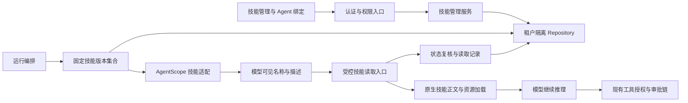

# CM Agent 指令与资源型 Skill 支持设计

## 1. 文档状态与需求来源

- 日期：2026-09-20。
- 主题：`skill-support`。
- 状态：用户已于 2026-09-21 确认包含前端范围的书面设计；本规格作为实施计划的依据。功能尚未实现、未通过运行验证。
- 当前任务范围：完成需求设计和实施计划。已进入 `superpowers:writing-plans` 文档阶段；本次不直接开始业务代码实现。
- 用户已确认：指令与资源型技能、控制台管理、Agent 自动选择、采用“CM Agent 管理与治理 + AgentScope 原生加载”的方案。
- 2026-09-21 范围补充：用户明确要求将前端一起规划。本任务包含后端与前端的完整使用闭环，前端是独立验收的交付范围，不作为后续另开需求。沿用本任务的 2026-09-20 日期与主题命名。
- 本文中的容量限制、接口和数据结构是上述范围内的具体设计决策；截至 2026-09-21，Task 1～Task 6 已按配套实施说明落地，原生 AgentScope 自动加载与前端闭环仍未完成。

同一任务文档统一采用以下路径，不能把未开展的实现或测试写成已完成：

- 设计：`docs/superpowers/specs/2026-09-20-skill-support-design.md`。
- 计划：`docs/superpowers/plans/2026-09-20-skill-support.md`。
- 实现说明：`docs/superpowers/implementation/2026-09-20-skill-support-implementation-design.md`。规划阶段记录当前事实、拟接入位置与尚未实现的边界；执行后更新为实际实现。
- 进度账本：`docs/superpowers/progress/2026-09-20-skill-support-ledger.md`。

相关文档：[实施计划](../plans/2026-09-20-skill-support.md)、[实现说明](../implementation/2026-09-20-skill-support-implementation-design.md)、[进度账本](../progress/2026-09-20-skill-support-ledger.md)。

## 2. 背景与现状依据

CM Agent 当前通过系统提示词、模型配置和已授权业务工具执行 Agent。新增 Skill 的目标是让管理员将可复用的操作指引和参考资料绑定到 Agent，由模型判断何时读取，而不需要把全部技能正文永久拼入系统提示词。

本次已核对的项目事实：

| 位置 | 当前行为与设计约束 |
| --- | --- |
| `pom.xml`、`cm-agent-agentscope-adapter/pom.xml` | Java 21，AgentScope 2.0.2；Adapter 的 AgentScope 依赖为 optional |
| `cm-agent-core/.../domain/AgentDefinition.java` | 当前包含模型、提示词、工具关联，没有技能绑定 |
| `cm-agent-core/.../domain/AgentRunRequest.java` | 当前运行契约校验 Agent、模型、主体和工具的租户一致性 |
| `cm-agent-server/.../runtime/RunExecutionService.java` | 准备运行并筛选工具；审批恢复时重新解析资源和授权 |
| `cm-agent-agentscope-adapter/.../AgentScopeReActExecutor.java` | 每次执行独立创建 Toolkit、Model、RuntimeContext 和 ReActAgent；业务工具经桥接器调用治理网关 |
| `cm-agent-server/.../runtime/RepositoryAgentStateStore.java` | AgentState 按可信租户与 runId 保存为加密检查点 |
| `cm-agent-core/.../domain/RunToolCall.java` | 工具调用记录要求真实 `toolId`，不能把技能读取伪装成普通业务工具记录 |
| `cm-agent-server/.../web/ApiExceptionHandler.java` | 已有中文错误、错误码、错误编号、诊断日志和严格审计失败处理边界 |
| `cm-agent-console/src/main/resources/META-INF/resources/console/v2/` | 保留已有七个页面的职责，新增技能管理入口并沿用列表与详情工作区 |
| `PRODUCT.md`、`DESIGN.md` | 面向管理员与开发者的中文治理工作台，复用现有视觉与交互规范 |

表内 `...` 分别表示对应模块的 `src/main/java/com/cmagent/core`、`src/main/java/com/cmagent/server` 或 `src/main/java/com/cmagent/agentscope` 路径前缀；后续实施计划使用完整仓库相对路径。

原生接口已通过本地 `agentscope-core-2.0.2.jar` 的 `javap` 核对，包含 `AgentSkill`、`AgentSkillRepository`、`SkillBox`、`Toolkit.getTool` 和 Builder 的技能相关方法。官方同版本源码进一步说明：

- 原生读取工具名为 `load_skill_through_path`，通过 `skillId` 与包内路径读取技能正文或资源。
- 默认动态技能中间件会创建工作目录并可能自动写入技能文件；部分仓库、过滤、注册和上传异常会被捕获后继续处理。
- `SkillBox` 的 Builder 入口已属于兼容接口；默认动态中间件不能直接充当 CM Agent 的授权和错误处理边界。

源码依据：

- [AgentScope 2.0.2 DynamicSkillMiddleware](https://github.com/agentscope-ai/agentscope-java/blob/v2.0.2/agentscope-core/src/main/java/io/agentscope/core/skill/DynamicSkillMiddleware.java)。
- [AgentScope 2.0.2 SkillToolFactory](https://github.com/agentscope-ai/agentscope-java/blob/v2.0.2/agentscope-core/src/main/java/io/agentscope/core/skill/SkillToolFactory.java)。
- [AgentScope 2.0.2 SkillBox](https://github.com/agentscope-ai/agentscope-java/blob/v2.0.2/agentscope-core/src/main/java/io/agentscope/core/skill/SkillBox.java)。
- [AgentScope 2.0.2 ReActAgent](https://github.com/agentscope-ai/agentscope-java/blob/v2.0.2/agentscope-core/src/main/java/io/agentscope/core/ReActAgent.java)。

以上是接口和源码核对，不是本项目已完成 Skill 集成的证据。Adapter README 中仍有 2.0.0 的旧描述，实施时同步修订涉及技能接入的版本说明，以实际 POM 和依赖解析结果为准。

## 3. 目标、范围与非目标

### 3.1 成功标准

管理员可以上传一个符合约定的技能包，查看指令与参考资料，启用后绑定到 Agent；用户以自然语言聊天，模型能在需要时自动读取技能与参考资料，并继续通过现有工具治理链执行业务动作。管理员能从运行记录确认实际读取的技能版本和资源，以及失败原因。

“上传成功”“已绑定”“模型实际读取”“任务执行成功”是不同状态，界面和验收必须分别表达。自动选择依赖模型判断和技能描述质量，不承诺任意问题都会命中技能。

### 3.2 第一版包含

1. 单技能 ZIP 导入与校验、查看、上传更新、启用和停用。
2. 当前租户内技能管理，Agent 与技能绑定、解绑。
3. 仅向模型暴露可见技能的名称、描述和不透明标识；正文和参考资料按需进入模型上下文。
4. 不可变内容版本、单次 Run 固定版本、运行期间撤销校验、审批恢复校验。
5. memory 与 JDBC 两种持久化实现，PostgreSQL 16 与 MySQL 8.4 迁移。
6. 技能读取的独立运行记录、管理操作和读取操作审计、可关联的错误诊断。
7. 中文控制台、端到端示例、测试和正式配置说明。

### 3.3 第一版不包含

- Python、Shell、JavaScript 等脚本执行、依赖安装、任意文件系统工具或沙箱建设。
- 技能市场、Git/URL 自动拉取、跨租户共享、自动更新和远程资源抓取。
- 聊天界面手动指定 Skill、固定规则触发器、向量检索或技能推荐服务。
- 在线编辑器、草稿发布流程、版本回滚界面、技能或历史版本物理删除。
- PDF、Word、图片等二进制资料解析。第一版只接收明确支持的文本资源。
- 自动增加 ToolGrant、注册技能包声明的工具/MCP、将 Skill 对外发布为 MCP 工具。
- 通用第三方技能包的无条件兼容；依赖宿主专有工具、脚本或网络资源的技能需要先调整为本设计支持的形式。

## 4. 总体方案与模块职责

选择“CM Agent 管理与治理 + AgentScope 原生加载”。完整自研加载器会重复维护框架能力，全文拼接方案又不满足按需读取，两者不作为本次实施路径。



| 模块 | 新增职责 | 保持的边界 |
| --- | --- | --- |
| API | 技能相关稳定错误码，复用错误响应结构 | 不暴露密文、宿主路径和实现异常 |
| Core | 技能、版本、绑定、Run 快照、读取记录；Repository 与运行时网关契约 | 不引入 AgentScope、Spring、JDBC 类型 |
| Persistence | 六类数据的 JDBC 实现、事务、租户条件与迁移 | 不修改历史迁移，不依赖 Web DTO |
| Server | ZIP 校验、管理编排、认证与权限、快照与撤销校验、审计、诊断、memory 实现 | Controller 只承担 HTTP 入口职责 |
| Adapter | 原生技能对象映射、原生加载器封装、受控调用与终态映射 | 不访问数据库、配置文件、外部 URL 或任意目录 |
| Console | 技能管理、Agent 绑定、运行详情中的技能读取记录 | 前端状态不替代后端权限和归属校验 |

### 4.1 原生接入的具体约束

采用每次运行独立的只读 `AgentSkillRepository` 视图，将本次固定版本映射为原生 `AgentSkill`。正文和资源可在服务端准备阶段装入有界内存集合；“按需加载”指按需进入模型上下文，不承诺数据库逐文件懒加载。

由于 2.0.2 默认动态中间件包含不适用于本系统的落盘和异常处理行为，Adapter 内建立窄适配组件：

1. 从已经完成授权筛选的只读仓库建立原生 `SkillBox`，关闭自动上传与代码执行提示，不设置 `originDir`。
2. 在独立的内部 Toolkit 中注册原生读取工具，保存其委托引用；该 Toolkit 不注册业务工具、MCP 或技能关联工具组。
3. 使用原生技能提示生成能力提供目录摘要；在实际 Agent Toolkit 中只注册 CM Agent 的受控包装工具，包装工具通过校验后委托原生读取实现。
4. 不调用已弃用的 `ReActAgent.Builder.skillBox(...)`，不同时启用 Builder 默认动态技能中间件，防止原生工具覆盖受控入口或额外落盘。
5. `SkillBox` 的直接使用仅限 Adapter 内部兼容封装，并通过本地 Provider Stub 的真实 ReAct 契约测试约束；Core、Server 和公开 SDK 类型不得依赖它。框架升级时优先复核此封装。
6. 原生 `skillId` 与平台技能 ID、版本 ID 建立当前运行内的精确映射，不把模型提交的 ID、路径或 RuntimeContext 的任意扩展值当作授权依据。
7. 保留 `load_skill_through_path` 为运行时专用工具名。若已有业务工具使用该名称，该 Agent 的技能装配明确失败并给出改名提示，不静默覆盖任一工具。

这是对已选原生加载方案的治理适配：继续复用原生目录提示和正文/资源加载实现，不自行重写一套全文检索或技能执行引擎。

### 4.2 SDK 兼容

运行请求增加框架无关的技能快照数据；保留现有构造入口并默认使用空技能集合。新增运行时网关采用显式注入；未配置技能时保持原有运行路径，有技能但未提供对应网关时明确拒绝配置，不能默许旁路访问。

原有业务工具仍全部经过 `AgentScopeToolBridge` 和 `ToolInvocationGateway`。技能读取是独立的只读运行能力，经过专门的技能访问网关；绑定 Skill 绝不等同于授予任何业务工具权限。

## 5. 技能包格式与导入规则

### 5.1 允许结构

一个 ZIP 只包含一个技能。允许 `SKILL.md` 直接位于根目录，或位于唯一的一层外包装目录下；去掉外包装后按统一相对路径保存。拒绝多个技能入口和嵌套技能。

```text
example-skill/
  SKILL.md
  references/
    guide.md
  assets/
    template.txt
```

`SKILL.md` 使用 UTF-8，包含 YAML frontmatter 和非空 Markdown 正文：

```markdown
---
name: support-guide
description: 当用户需要整理故障处理步骤和排查清单时使用。
---

先读取 references/guide.md，再依据用户提供的信息整理排查步骤。
如需业务数据，只调用当前 Agent 已获授权的工具。
```

- `name` 为租户内稳定名称，使用小写字母、数字及连字符，长度 1～64，不允许首尾连字符或连续连字符；上传更新不能改名。
- `description` 为 1～1,024 个 Unicode 码点，描述适用情境；名称和描述中的控制字符、用于破坏目录结构的标记需要拒绝或编码处理。
- YAML 使用安全解析模式，拒绝重复键、自定义对象标签和别名展开；只接受有限深度与有限大小的普通元数据。
- 附加元数据作为说明信息展示，不执行其中的命令、依赖、工具、MCP、权限或文件系统配置。运行目录提示只使用受校验的名称、描述和平台生成标识。
- 允许资源扩展名：`.md`、`.txt`、`.json`、`.yaml`、`.yml`、`.csv`；均要求有效 UTF-8 且不含 NUL。正文按文本读取，不执行或求值。
- 包内脚本、二进制文件和不支持的格式直接拒绝导入，并提示文件类型不受支持；不采用静默丢弃后声称完整导入的方式。

### 5.2 容量与路径上限

| 项目 | 第一版默认上限 |
| --- | --- |
| ZIP 上传大小 | 2 MiB |
| 实际解压后文本总量 | 4 MiB |
| 普通文件数量（含 `SKILL.md`） | 64 |
| `SKILL.md` 大小 | 32 KiB |
| 单个参考资源大小 | 64 KiB |
| 规范化后相对路径长度 | 240 个字符 |
| 单 Agent 绑定技能数量 | 20 |
| 单次运行准备的技能文本总量 | 8 MiB |
| 单次 Run 技能读取尝试次数 | 32 次，审批恢复后累计 |
| 单次 Run 交付模型的技能原文累计字节 | 256 KiB，重复读取也累计，审批恢复不重置 |

上传、解压和运行限制进入 `cm-agent.skills` 配置，默认关闭功能开关；HTTP multipart 限制与应用限制保持一致。第一版管理员可在 1 到上述默认上限之间调低限制，放大上限需要重新评估并同步文档，不能通过用户上传元数据绕过限制。另限制归档总条目为 256（包含目录），防止只限制普通文件数量时被目录条目耗尽资源。开启功能后，原来没有绑定 Skill 的 Agent 行为保持不变。

校验必须根据实际读取字节计数，不能信任 ZIP 声明长度。拒绝加密归档、损坏归档、符号链接、重复及大小写冲突路径、绝对路径、盘符、UNC 路径、反斜杠路径、空段、`.`、`..`、控制字符及冒号。目录项也计入有界条目扫描，避免大量空目录造成资源耗尽。

采用有界内存解析，不解压到服务端目录；不保存上传 ZIP 原件。只在整个包通过校验后，事务性保存定义、版本、资源和审计。网络断开后用户可刷新列表确认结果；再次创建相同名称返回冲突，不自动覆盖。

## 6. 数据模型与持久化

采用六张职责明确的表及对应 Repository。所有数据包含 `tenant_id`，所有读取和写入都带租户条件；关联使用含租户的复合约束或明确的受校验引用。

| 表 | 主要字段与约束 |
| --- | --- |
| `skill_definitions` | `id`、`tenant_id`、`name`、`current_version_id`、`enabled`、`access_epoch`、创建/更新主体与时间；租户内名称唯一；初次上传默认停用 |
| `skill_versions` | `id`、`tenant_id`、`skill_id`、递增 `version_no`、`description`、受限 `metadata_json`、`skill_content`、内容摘要、创建主体与时间；内容不可变；同技能版本号唯一 |
| `skill_resources` | `tenant_id`、`skill_id`、`version_id`、规范化 `path`、`media_type`、UTF-8 文本、字节长度、内容摘要；同版本路径唯一 |
| `agent_skill_bindings` | `id`、`tenant_id`、`agent_id`、`skill_id`、绑定主体与时间；Agent/Skill 组合唯一；重新绑定生成新的绑定 ID |
| `run_skill_snapshots` | `tenant_id`、`run_id`、`agent_id`、快照格式版本、技能引用列表 JSON、创建时间；一个 Run 一条，即使列表为空也保存；引用含技能 ID、版本 ID、绑定 ID、`access_epoch` |
| `skill_load_records` | `id`、`tenant_id`、`run_id`、模型调用标识、尝试序号、技能 ID/版本 ID、已校验路径、结果、原文交付字节数、耗时、错误码/错误编号、创建时间；拒绝非法标识时技能字段可空，不能伪造归属 |

规则：

- 同一技能上传更新形成新版本，使用提交时读取的 `expectedVersionId` 做乐观并发检查；冲突返回 409，保留现有版本。
- 标准化后的技能内容与全部资源路径、内容共同计算摘要；同一技能上传相同有效内容不新增版本，返回现有版本与“内容未变化”。
- 内容更新不会自动启用技能，也不改变撤销纪元。启停使用明确目标状态并保持幂等；从启用变为停用时递增 `access_epoch`。
- 绑定只接受当前租户已启用的技能；既有绑定在技能停用后保留并显示停用状态。解绑删除当前绑定行，重新绑定获得新 ID。
- 新运行绑定当前版本；运行快照通过不可变版本引用保存，不重复保存整包内容。
- 快照 JSON 中的版本引用是受校验的软引用；第一版禁止物理删除定义和历史版本，保证引用可恢复。资源到版本、版本到定义采用数据库约束。
- 定义的 `current_version_id` 为服务端校验的非空软指针；创建时预分配初版 UUID，在同一事务内依次写入定义、版本、资源。该指针不设置造成循环插入的即时外键，事务提交前校验指向当前租户、当前技能的版本；对外领域对象不暴露空当前版本。
- 运行记录展示资源路径和加载结果，不展示或复制技能正文；成功未读取任何技能也能表达为空列表。
- 不给 `tool_calls` 填造假的工具 ID，不改变现有业务工具统计和外键语义。
- JDBC 事务保证导入、更新、启停、绑定、快照保存及相关审计一致；memory 实现保持相同业务拒绝规则，但只用于本地和测试，不宣称具备数据库级持久性。
- 不跨模型请求、外部 HTTP 或审批等待时间持有数据库事务和行锁。运行准备与单次本地读取各使用短事务。
- 新增版本号计划为 V12；执行前复核最新迁移序列。PostgreSQL/MySQL 使用同版本方言文件，逐表逐字段提供中文原生注释。

## 7. 运行、更新、撤销与审批恢复

### 7.1 新运行

1. 认证、`agent:run` 和资源校验沿用现有入口。
2. 对每个 Run 明确创建技能快照，包含当前租户、Agent、启用技能的当前版本和绑定信息。不能将读取失败解释为“没有技能”。
3. 有绑定但全部停用时，快照可以为空；界面已展示停用状态。超过数量/容量限制或持久化失败时，模型调用前返回明确失败。
4. Adapter 从快照构建独立的原生技能集合，检查内部工具名冲突，注入目录摘要并注册受控读取工具。
5. 模型自行决定是否读取技能。每次读取先检查可信 tenant、run、agent、原发起主体、快照成员关系、绑定 ID、启用状态及撤销纪元，再验证资源路径、读取预算。
6. 只有在原生读取成功且最终状态复核、读取记录及严格审计成功提交后，才能将正文交给模型。禁止仅因本地原生加载成功就绕过记录或授权失败。
7. 模型调用业务工具时继续执行现有 ToolGrant、权限和风险审批规则。技能说明不能改变这些规则。

技能资源不可见、越权、已撤销等安全失败导致本轮运行受控终止；资源路径不存在或读取预算耗尽可作为明确的工具错误返回模型，由模型调整任务或说明限制。数据库、审计、未知内部加载失败直接终止，不以空文本或“加载成功”继续。

### 7.2 生效规则

| 变更 | 新 Run | 已在执行或等待审批的 Run |
| --- | --- | --- |
| 上传新内容版本 | 使用新版本 | 继续使用原快照版本 |
| 给 Agent 新绑定技能 | 可见新技能 | 不扩大原快照集合 |
| 技能停用 | 不纳入新快照 | 下一次读取被拒绝；审批恢复前拒绝继续 |
| Agent 解绑技能 | 不纳入新快照 | 下一次读取被拒绝；审批恢复前拒绝继续 |
| 停用后重新启用 | 可用于新运行 | 原撤销纪元不匹配，旧 Run 不复活 |
| 解绑后重新绑定 | 新绑定可用于新运行 | 原绑定 ID 不匹配，旧 Run 不复活 |

停用以状态变更事务提交为界；已通过读取事务并交付模型的内容无法撤回，不承诺立即中断已发出的模型请求。停用不撤销独立存在的业务 ToolGrant；业务工具权限变化始终由原工具治理规则处理。

### 7.3 审批恢复

- 原 runId 恢复时必须读取已有快照，不重新解析为最新技能内容，不把新绑定加入旧 Run。
- 在读取和使用 AgentState 前，校验原快照全部技能仍有效；任一技能撤销则终止恢复，提示“本轮使用的技能已停用或解绑，请重新发起对话”。
- 同时保留原主体、当前 Agent/模型、业务工具授权和审批决定的全部现有复核。
- 读取次数与累计字节预算由已保存的读取记录恢复，不能因恢复运行获得新预算；同一读取完成回调重试不得重复追加成功记录或预算。
- 迁移为既有 Run 创建格式版本为 1、技能列表为空的快照记录，兼容此前没有技能的待审批运行。部署需先停止旧实例写入再迁移并启动新实例，第一版不支持旧新版本混跑。
- 迁移完成后，运行存在但快照丢失视为状态损坏，拒绝恢复；不能回退到当前最新技能。
- 技能快照不复制明文 AgentState；原有 AES/GCM 检查点与有效期机制继续生效，不新增永久会话记忆承诺。

## 8. HTTP 接口与权限

接口位于 `/api`，租户从认证主体取得。以下接口均为拟新增接口，响应使用稳定 DTO，不直接序列化框架对象。

| 方法与路径 | 用途 | 权限与关键规则 |
| --- | --- | --- |
| `GET /api/skills/capabilities` | 返回功能开关及公开上传限制 | `skill:read`；返回 `enabled`、允许格式和容量/数量上限，不返回内部配置、路径或凭据；功能关闭时仍返回 200 |
| `GET /api/skills` | 技能摘要列表 | `skill:read`；`page=0`、`size=20`，size 为 1～200；可选 `q` 和 `enabled`；使用 `ApiPageResponse` |
| `POST /api/skills` | multipart 创建技能 | `skill:write`；成功 201；同名冲突 409 |
| `GET /api/skills/{id}` | 当前版本详情及资源目录 | `skill:read`；跨租户与不存在统一 404 |
| `POST /api/skills/{id}/versions` | multipart 上传更新 | `skill:write`；携带 `expectedVersionId`；新版本 201，相同内容 200 |
| `PUT /api/skills/{id}/enabled` | 显式启用或停用 | `skill:write`；明确布尔目标状态，不使用含糊 toggle |
| `GET /api/skills/{id}/versions/{versionId}/resources?path=...` | 查看 `SKILL.md` 或资源文本 | `skill:read`；精确租户/技能/版本/路径匹配；以 JSON 文本响应 |
| `GET /api/agents/{agentId}/skills` | 已绑定技能摘要 | `agent:read`；只返回绑定所需元数据，不返回正文 |
| `PUT /api/agents/{agentId}/skills/{skillId}` | 绑定技能 | 同时要求 `agent:write`、`skill:read`；同租户、技能启用；幂等 |
| `DELETE /api/agents/{agentId}/skills/{skillId}` | 解绑技能 | `agent:write`；Agent 归属必须先核对；幂等 |
| `GET /api/agents/{agentId}/runs/{runId}/skill-loads` | 查看技能读取记录 | `agent:read`；校验 tenant、Agent 和 Run 归属；`page=0`、`size=20`，size 为 1～200；使用 `ApiPageResponse` |

`skill:read` 管理权限与运行时使用技能分离：有权运行 Agent 的用户，可以在该 Agent 的受控运行中使用已绑定技能；不因新增技能功能要求全部聊天用户获得管理权限。该授权范围必须在接口文档说明。

技能摘要按稳定名称和 ID 排序；读取记录按创建时间和 ID 升序分页。两类分页复用 `ApiPageRequest` 的约束；查询条件在服务端过滤，不能先获取其他租户数据再由页面筛选。

功能关闭时，允许有权限的用户查看既有技能和历史读取记录；禁止上传、更新、启用和新增绑定，返回 409 与 `SKILL_FEATURE_DISABLED`。停用和解绑仍允许，以便管理员收回既有配置。能力接口为前端提供开关与限制的单一来源，避免页面把功能关闭误显示为“暂无技能”，或硬编码过期上传上限。

当前 `AuthController` 的受限 bootstrap 管理员登录权限集合需明确加入 `skill:read` 和 `skill:write`；生产身份签发端按其现有策略显式下发，不新建角色管理系统。不能自动扩权所有历史 JWT；既有令牌在重新登录/正常换发前保持原权限。缺少权限的页面显示中文说明。

加载工具不是一个可由浏览器提交 tenant、run 或 skillId 后任意调用的公开 API。可信运行信息由服务端持有，模型参数仅选择快照内技能和包内路径。

## 9. 前端交付范围与控制台交互

采用现有 Operate 类型工作区。继续保留能力总览、模型配置、Agent 管理、工具治理、会话聊天、运行记录、审计日志；在工具治理之后、会话聊天之前增加“技能管理”。同步所有 v2 页面导航，不改造 v1。

前端必须和后端在本次需求中一并完成；只有 API 可用、没有可操作的控制台入口，不算完成。保留原生 HTML/CSS/JavaScript 技术栈，复用 `PRODUCT.md`、`DESIGN.md` 和现有登录、错误、导航与提交状态封装。

本次前端依据包括当前 `agents.html`、`runs.html`、`app.js`、`console-core.js`、`multipage.css` 和已有测试。查看过的 `.playwright-cli` 历史截图只用于理解既有视觉风格，不作为新增技能功能或当前页面布局已经通过浏览器验证的证据。

### 9.1 技能管理页

- 左侧技能列表支持名称检索与启用状态过滤；每项显示名称、描述摘要、当前版本、启用状态。
- 右侧默认详情，包含元数据、指令、资源目录和使用范围说明；点击资源后按需读取文本，默认按纯文本安全展示，不渲染上传 HTML。
- 主操作为“上传技能”；选中现有技能后可“上传更新”“启用/停用”。上传与详情分阶段展示，避免在同一屏同时铺开全部表单。
- 上传前说明支持格式和上限；上传成功后展示解析到的名称、版本、资源数量，并提示“尚未启用、尚未绑定”。更新成功明确说明“新运行使用新版本”。
- 停用前展示对已绑定 Agent 和待恢复运行的影响；动作完成后更新列表和详情，不声称已清除模型上下文。
- 网络结果不确定时保留当前选择并允许刷新查询，不自动重新提交创建或更新。
- 覆盖空列表、上传中、列表/详情加载失败、无权限、版本冲突、资源不可见、长描述、长路径和窄屏状态。

### 9.2 Agent 管理页

- 在 Agent 详情提供独立“绑定技能”操作区，与编辑模型/提示词分开，避免普通 Agent 更新覆盖并发绑定操作。
- 已绑定列表显示版本、启用状态、解绑入口；候选列表只提供当前租户有读取权限且启用的技能。
- 明示“绑定后由 Agent 自动选择使用；技能不会授予额外工具权限”。
- 技能管理页与 Agent 页分别承担资产管理和使用绑定；不复制完整编辑器。

### 9.3 聊天与运行记录

- 聊天保持自然语言输入，不新增手动选择技能控件；原有业务工具审批交互保持不变。
- 运行详情增加“技能读取”区域，展示技能名称、版本、已校验资源路径、时间、结果和失败编号；不把目录可见误显示为已使用。
- 没有读取时显示“本轮未读取技能”。先使用有界读取记录查询并支持刷新，不为第一版另建技能实时 SSE 协议。
- 界面默认不展示技能正文或资源全文到运行历史；管理详情中的全文查看使用独立权限。
- 页面状态与中文文案遵守 `PRODUCT.md`、`DESIGN.md`；沿用现有 CSS、表单和错误展示，不新建前端框架或独立仪表盘。

### 9.4 前端文件与交付分项

以下路径均相对于仓库根目录，必须在后续实施计划中成为明确的前端任务和验收点。

| 分项 | 文件范围 | 必须交付的行为 |
| --- | --- | --- |
| F1 页面与导航 | 新增 `cm-agent-console/src/main/resources/META-INF/resources/console/v2/skills.html`；修改同目录 `overview.html`、`model-configs.html`、`agents.html`、`tools.html`、`chat.html`、`runs.html`、`audit.html` | 技能页可以直接访问、刷新和从任一业务页进入；导航顺序一致且当前项正确；保留旧七页职责 |
| F2 技能工作区 | 新增 `cm-agent-console/src/main/resources/META-INF/resources/console/v2/assets/skills.js`；修改 `cm-agent-console/src/main/resources/META-INF/resources/console/v2/assets/multipage.css` | 独立封装技能列表、详情、资源查看、上传/更新和启停交互，复用现有视觉与辅助函数，不把全部新逻辑继续堆入共享 app.js |
| F3 请求与页面生命周期 | 修改 `cm-agent-console/src/main/resources/META-INF/resources/assets/console-core.js`、`cm-agent-console/src/main/resources/META-INF/resources/assets/app.js` | 支持 multipart、结构化技能错误和过期响应隔离；注册 `skillsPage` 路由与加载流程；页面替换、前进后退和退出登录时正确清理 |
| F4 Agent 绑定 | 修改 `cm-agent-console/src/main/resources/META-INF/resources/console/v2/agents.html` 与 `assets/app.js` 的 Agent 详情接入点；绑定组件由新增 skills.js 提供 | 查看已绑定技能，查询候选技能，绑定/解绑，提示停用及新运行生效；不覆盖 Agent 普通编辑状态 |
| F5 聊天错误与运行记录 | 修改 `cm-agent-console/src/main/resources/META-INF/resources/assets/app.js` 中既有流式错误和运行详情接入点；按需调整 `console/v2/chat.html`、`console/v2/runs.html`；读取记录组件由 skills.js 提供 | 聊天显示技能加载、撤销和恢复失败的中文原因及编号；运行详情独立加载技能记录，失败时仍保留输入、输出和普通工具记录 |
| F6 资源版本与兼容 | 同步所有引用已修改共享资源的 HTML，包括 `console/v2/login.html` 的共享脚本版本；不向 v1 页面加载 skills.js | 新技能组件在所有 v2 业务页首次装载即可使用，局部导航不重复执行脚本；版本参数与资源测试一致；共享请求改动不破坏原 JSON API 和 SSE |
| F7 前端验证 | 修改 `cm-agent-console/src/test/js/console-core.test.cjs`、`cm-agent-console/src/test/java/com/cmagent/console/ConsoleResourceTest.java`；新增 `cm-agent-console/src/test/js/console-skills.test.cjs` | 请求语义、状态隔离、资源装配和用户操作规则有测试；补真实浏览器桌面/移动端闭环，不能仅依赖字符串匹配断言 |

新增 skills.js 使用项目现有普通脚本风格和显式初始化函数，由 app.js 注入 API 客户端、当前认证状态及必要 UI 协作者；不创建第二套登录状态、请求客户端或持久化令牌。支持 Node 测试的纯状态函数与 DOM 操作分离，不引入打包器或组件框架。

### 9.5 前后端交互契约

- 首次进入技能页先根据当前用户权限判断可用操作，再读取 capabilities 和列表；页面用服务端返回的限制提示允许格式与上限。
- 上传通过 `FormData` 发送 `file`；更新额外提交 `expectedVersionId`。浏览器生成 multipart boundary，公共请求封装不能继续无条件设置 `Content-Type: application/json`，也不能手工拼接 boundary。
- JSON 请求仍保持原有编码和响应处理；multipart 与 JSON 使用相同的同源 Cookie、内存令牌、401 收口、会话代次检查和中文错误格式。
- 列表保持 `items/total/page/size` 响应结构；筛选改变后重置到第一页。查询条件只影响技能列表，不清空其他管理页面状态。
- 技能详情 DTO 明确给出稳定 ID、名称、当前版本 ID/版本号、描述、启用状态、资源目录、更新时间与已绑定 Agent 数量；资源目录包含相对路径、类型和字节数，不返回宿主路径。
- 已绑定列表返回技能 ID、绑定 ID、当前版本号、启用状态与名称描述；明确这些是“下一次运行可使用的版本”，不是上次 Run 实际使用的版本。
- 技能读取记录返回实际版本号、规范化资源路径、结果、耗时、创建时间、稳定错误码和错误编号；非法标识拒绝记录允许展示“不可识别的技能”，不能伪造技能名称。
- 启停、绑定、解绑不采用先乐观显示成功再后台提交的交互；服务端确认后更新当前视图。提交期间禁用对应按钮，不能用禁用整个页面代替独立操作状态。
- 409 版本冲突保留错误上下文，提供“刷新当前版本”动作；不自动覆盖，不自动携带新版本号重试原上传。
- 查询响应至少同时匹配当前登录会话、当前页面、当前技能或 Agent/Run ID、当前请求代次后才能更新 DOM。A 资源的慢响应不得覆盖用户已经选中的 B 资源。
- 技能资源和元数据使用 `textContent` 或项目已有安全文本节点封装，不使用上传内容拼接 `innerHTML`，不复用运行输出的 Markdown 渲染器显示技能原文。

### 9.6 页面状态与操作反馈

| 页面/操作 | 状态 | 用户应看到的内容与下一步 |
| --- | --- | --- |
| 技能管理 | 尚无技能 | 说明技能用途、支持格式和“上传技能”入口；不显示没有意义的空统计卡片 |
| 技能管理 | 功能关闭 | 明示“技能功能尚未启用”；既有资料可只读查看，上传和启用按钮不可操作；不假装是空目录 |
| 技能管理 | 仅有读取权限 | 可查看列表、正文、资源；无上传、更新和启停操作 |
| 技能管理 | 无读取权限 | 展示明确权限提示，不请求和渲染技能正文；保留返回其他控制台页面的路径 |
| 列表/详情/资源 | 加载中或查询失败 | 各区域独立显示加载与重试状态；详情失败不清空已经加载的列表 |
| 上传/更新 | 本地文件不合规 | 提交前提示扩展名或大小问题；服务端仍执行完整校验，不把前端检查当安全边界 |
| 上传/更新 | 正在提交 | 显示“正在上传并校验…”；不伪造百分比进度，不接受重复点击 |
| 上传 | 完成 | 显示名称、版本、资源数和停用状态；引导启用并前往 Agent 绑定 |
| 更新 | 内容未变化 | 保留原版本号，明确提示“内容未变化，未创建新版本” |
| 提交 | 网络结果不确定 | 提示刷新列表/详情确认结果，不显示确定失败或自动重试写操作 |
| Agent 绑定 | 无候选技能 | 区分无启用技能、无读取权限与功能关闭；有管理权限者可前往技能管理 |
| Agent 绑定 | 已绑定技能停用 | 保留绑定条目并标注停用；可解绑；不显示为可用 |
| 运行详情 | 查询成功且确实无记录 | 显示“本轮未读取技能”；不能在查询失败时使用此文案 |
| 运行详情 | 读取记录查询失败 | 保留运行主体内容并提供局部刷新、错误编号，不把整个 Run 标记为执行失败 |
| 聊天/审批恢复 | 技能被撤销或状态不可恢复 | 显示后端受控原因和错误编号，提示重新发起一轮；不自动重新发送用户消息或再次提交审批 |

### 9.7 导航、会话和异步生命周期

当前 v2 通过 `loadMultiPage` 局部切换页面，同时支持直接 HTML 访问。新增组件须兼容两种入口：

1. 每个业务页首次装载 skills.js，加载顺序为共享 core、技能组件、app；不能依赖目标页面被替换后其 script 标签会自动执行。
2. app 只在目标 DOM 已挂载时初始化对应组件；离开页面时注销该组件事件并使未完成读取失效，防止多次进入后一次点击产生多次请求。
3. 前进后退、刷新和直接访问技能页保持正确页面标题与导航选中项；登录后遵守已有返回目标校验，不引入开放重定向。
4. 退出登录清空当前技能文本、待上传文件引用、选中项、绑定列表与读取记录。旧会话返回的 401 不得注销后续新登录会话。
5. 读取请求可取消；取消页面等待不等于取消服务器已接受的上传或更新。再次进入后从服务端查询实际结果。
6. 凭据、技能正文和上传文件不写入 localStorage/sessionStorage；不将上传内容或完整错误响应打印到浏览器控制台。

### 9.8 布局、键盘与窄屏

- 桌面继承现有侧栏、工作区标题、左侧列表和右侧单一阶段面板。详情、上传和更新按操作切换，不同时堆叠。
- 沿用现有 900px/600px 响应式规则；窄屏将列表与工作区纵向排列，主操作可见，资源文本仅在代码查看区域内滚动，不撑出整个页面。
- 长名称、描述、资源路径和错误编号可以换行；按钮与结果不只用颜色区分状态。
- 上传控件有明确 label，说明和错误与控件关联；键盘可触发操作并获得可见焦点。阶段切换后聚焦新阶段标题，取消后返回发起按钮；状态反馈使用现有 `aria-live` 模式。
- 第一版不新增设计系统、动画体系或页面全局重排；技能页的字号、间距、状态色、按钮和表单复用当前规范。

### 9.9 前端验收清单

以下均是实施后的必验项目；本次规划不宣称已经通过：

1. 所有 v2 业务页能进入技能页，直接访问/刷新/前进后退正常；导航及资源版本一致，v1 无技能入口和组件脚本。
2. 上传合法包后能够查看原文与资料、启用、到 Agent 绑定，再发起聊天并在对应 Run 查看实际读取记录。
3. multipart 上传包含浏览器 boundary；既有 JSON 登录/配置请求和 SSE 聊天回归正常；授权 Cookie/内存令牌策略保持不变。
4. 上传同名包、损坏包、超限包、不支持文件或路径不合法包，均显示后端具体安全原因及错误编号；失败后不清空已选上下文或自动重复提交。
5. 更新冲突、内容未变化、停用、解绑、重新绑定与审批恢复失败均有正确状态文案；列表当前版本与历史 Run 版本不混淆。
6. 快速切换两个技能、两个 Agent 或两个 Run，并使旧请求最后返回；页面只显示当前选择。退出再登录后旧请求无效。
7. 注入 HTML/脚本标记的技能正文、描述和路径按普通文本显示，不执行；无权限用户不因隐藏按钮失效而取得全文。
8. 技能读取记录接口失败时，仍能查看运行输出和普通工具调用，并能单独重试；未读取与加载失败有不同文案。
9. 至少在 1440×900 桌面和 390×844 移动视口验证完整流程，同时检查 600px/900px 附近布局；覆盖键盘焦点、长文本和错误状态。
10. 浏览器检查实际加载的脚本/CSS 版本与网络响应，排除旧 target/classes、浏览器缓存或历史截图造成的假通过；验证结果记入同主题账本。

前端任务编排采用“公共请求与状态契约 → 技能页 → Agent 绑定 → 聊天错误与运行记录 → 导航/响应式和端到端回归”的依赖顺序。后续 writing-plans 必须为这些分项给出具体文件、测试代码、运行命令与验收结果要求，不能合并为一句“完善前端”。

## 10. 错误、日志与审计

管理 API 使用正确 HTTP 状态和统一错误响应。新增以下稳定错误码，并在实施时纳入 `ApiErrorCode`；对外沿用 `ApiErrorResponse` 的 `code`、`message`、`timestamp`、`errorId` 字段，不另建 `errorCode` 字段。`errorId` 沿用现有请求/运行关联策略。

| 场景 | HTTP 状态（适用于管理/查询 API） | 错误码与用户可见原因 |
| --- | --- | --- |
| ZIP、frontmatter、名称或路径不合法 | 400 | `SKILL_PACKAGE_INVALID`：技能包格式不符合要求，并附受控的具体原因 |
| 文件类型不支持 | 400 | `SKILL_RESOURCE_UNSUPPORTED`：仅支持约定文本资料，不支持脚本或二进制文件 |
| 大小、条目数超限 | 413 | `SKILL_PACKAGE_TOO_LARGE`：说明触发的限制及允许上限 |
| 同名、并发更新、内部工具名冲突 | 409 | `SKILL_CONFLICT`：名称已存在、版本已更新或工具名称冲突 |
| 功能关闭时上传、更新、启用或新增绑定 | 409 | `SKILL_FEATURE_DISABLED`：技能功能尚未启用，可查看既有资料和历史记录 |
| 技能、版本或资源不存在/跨租户 | 404 | `SKILL_NOT_FOUND`：资源不存在或不可访问，不泄露其他租户信息 |
| 管理权限不足 | 403 | 沿用权限拒绝错误；不暴露资源正文 |
| 运行中的技能撤销或快照无权访问 | 不伪造 HTTP 成功/失败转换 | `SKILL_ACCESS_REVOKED`：停止本轮，请重新发起对话 |
| 快照缺失、版本缺失或恢复不一致 | 恢复 API 409 | `SKILL_SNAPSHOT_UNAVAILABLE`：本轮技能状态无法恢复 |
| 运行读取预算耗尽 | 工具受控失败 | `SKILL_LOAD_LIMIT_EXCEEDED`：本轮技能读取已达上限 |
| 未知内部加载错误 | 非流式边界 500；已开始的流通过失败事件表达 | `SKILL_LOAD_FAILED`：技能加载失败，提供错误编号 |
| 持久化或严格审计不可用 | 503 | 复用 `PERSISTENCE_UNAVAILABLE`、`AUDIT_UNAVAILABLE` |

运行准备容量失败使用 `SKILL_LOAD_LIMIT_EXCEEDED`，在模型调用前通过现有失败边界返回；已开始的 SSE 不修改已发送的 HTTP 状态，使用运行失败事件与同一错误编号。

日志与审计规则：

- 技能读取标识在执行前建立，关联 tenant、principal、agent、run、技能、版本与调用；外部输入只记录受校验的规范化元数据。
- 技能创建、更新、启停、绑定、解绑及读取允许/拒绝都有可检索审计；写操作与严格审计失败不能吞掉。
- 读取记录仅保存元数据、结果、耗时、字节数和稳定错误码/编号；不保存技能全文、资源全文、模型原始输入输出或上传归档。
- 参数校验、普通权限拒绝使用适当级别；未知加载异常、基础设施不可用在最终处理边界记录脱敏堆栈，不在各层重复打印。
- 原生错误文本不得直接返回客户端或模型；包装层将其映射为受控中文原因。异常路径与日志捕获测试必须验证无宿主路径、内部 URL、JWT、Secret 或原始技能正文泄露。
- 原生技能正文进入模型是此功能明确授权的数据流；其自动回显、模型回答和思考内容仍服从现有脱敏规则，但不能宣称可完全防止模型复述所有业务资料。

## 11. 验证与验收矩阵

本阶段不运行 Java、数据库或浏览器功能测试，因为业务实现尚未开展。以下是执行阶段必须满足的验收，不是本次已通过的结果。

| 层次 | 必须覆盖的行为 |
| --- | --- |
| Core 单元测试 | 领域约束、防御性复制、租户一致性、版本快照、撤销纪元、绑定身份变化、空快照与缺失快照区别 |
| 包解析单元测试 | 根目录与外包装兼容、合法文本、重复键/别名/不安全 YAML、解压总量、条目数、重复路径、大小写冲突、路径逃逸、链接、损坏与加密 ZIP、脚本/二进制拒绝 |
| Server MockMvc | 认证、权限、跨租户 404、导入/更新/绑定/停用、并发版本冲突、HTTP 状态、错误码、错误编号与日志一致 |
| 严格失败测试 | 数据库失败、审计失败、快照缺失、原生加载异常不能返回空技能目录或继续交付正文 |
| AgentScope 真实契约测试 | 使用本地模型协议 Stub 驱动真实 ReAct：先看到摘要，再调用原生读取包装工具取得正文，随后读取参考资料；没有命中时不强制加载；不存在旁路原生工具 |
| 运行安全测试 | 同名不同租户隔离、未绑定技能不可见、伪造 ID/路径拒绝、每次读取校验、无业务工具自动授权、内部工具名冲突不覆盖 |
| 版本/恢复测试 | 新 Run 读取新版本，旧 Run 保持原版本；新增绑定不扩充旧集合；停用重启/解绑重绑不复活；审批恢复保持旧版本并复核授权和预算 |
| 无副作用测试 | Skill 功能不创建临时目录、不启动进程、不发起资源 URL 请求；普通业务 HTTP 工具仍按原治理链运行 |
| JDBC 与迁移 | PostgreSQL 16/MySQL 8.4 均通过六表读写、复合归属、并发更新、原子导入与审计、历史 Run 空快照回填及逐表逐字段中文注释检查 |
| 控制台公共能力 | multipart 与 JSON/SSE 兼容、Cookie/内存令牌、结构化错误、登录会话与请求代次隔离、导航挂载/销毁、共享资源版本 |
| 技能页与 Agent 绑定 | 上传—查看—启用—绑定完整交互；权限、空态、功能关闭、并发更新冲突和网络不确定状态；资源文本无脚本执行 |
| 聊天与运行记录前端 | 技能撤销及恢复失败提示、不自动重发消息、实际版本记录、局部查询失败保留运行主体；桌面/移动端完成第 9.9 节全部验收 |
| 兼容回归 | 无技能 Agent、旧 SDK 构造入口、业务工具审批、会话历史、Run 查询、普通工具统计、严格审计与现有错误关联保持正常 |

Java 测试使用 JDK 21；核心/适配层/Server 针对性测试在具备依赖的环境执行。Docker、Testcontainers、迁移及 JDBC 验证必须通过 `ssh rocky` 在项目约定的 `maven:3.9.9-eclipse-temurin-21` 容器中执行，先确认远端 Docker、JDK 和 Git 提交一致；不使用本机 Docker Desktop。

最终浏览器验收使用一个明确描述触发条件的中文文本技能；自动化验收以确定性 Provider Stub 验证调用链，真实模型演示作为补充，不能以模型一次未选择 Skill 判定加载实现必然失败，也不能以一次命中代替安全测试。

## 12. 部署、文档与实施边界

- 配置开关默认关闭，实施时在正式配置文档记录上限、权限、文本格式、激活步骤和模型上下文成本。
- 迁移新增结构后，以先停写、再迁移、再部署的方式避免没有快照的旧实例继续创建 Run；功能关闭不替代迁移兼容要求。
- 如果全局关闭技能功能，含技能快照的待审批 Run 不得在忽略技能状态的情况下恢复，返回明确不可恢复原因；空技能快照的既有运行继续按旧行为处理。
- 文档更新范围包括 `README.md`、`docs/configuration.md`、`docs/operations.md`、`docs/release-notes.md` 和 Adapter README。规划阶段不将未实现能力加入正式已交付清单。
- 读取记录和历史版本第一版保留；容量管理沿用部署备份和现有数据运维流程，不引入未设计的自动清理任务。
- 不修改用户已有 `application.yml`、`application-mysql.yml`、`application-ok.yml`、`.workbuddy/`、`.codex/` 和其他无关改动。实施时若配置模板需要变化，优先修改受控的示例/说明并单独核对具体差异。
- 不引入 JPA、MyBatis、向量数据库、对象存储或新前端框架，不升级 AgentScope 或 MCP。
- 所有新增 Java 领域字段、枚举、接口、安全、事务、资源与框架兼容行为按仓库 AGENTS.md 落地中文 JavaDoc/注释；测试验证实际行为，不仅验证类或配置项存在。

## 13. 书面评审检查

- 已覆盖用户确认的指令与资源型、控制台管理、自动选择以及原生加载方案。
- 已定义格式、容量、权限、持久化、版本、撤销、审批恢复、错误、记录、前端和验收边界。
- 已按用户补充将前端列为同一次需求的独立交付范围，落实到 F1～F7 文件分项、前后端契约、异步生命周期、状态矩阵和浏览器验收；没有将前端推迟到另一个需求。
- 已明确原生接口适配限制，并保留契约测试要求；没有把源码存在当作运行验证结果。
- 已区分当前事实、拟实现设计与执行阶段验证，没有把新接口或页面写为已交付。
- 本文书面评审已通过，按同一主题编写逐任务实施计划，补齐实现说明与进度账本；实施开始仍需后续执行授权。
