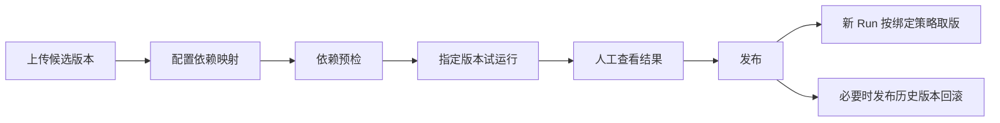
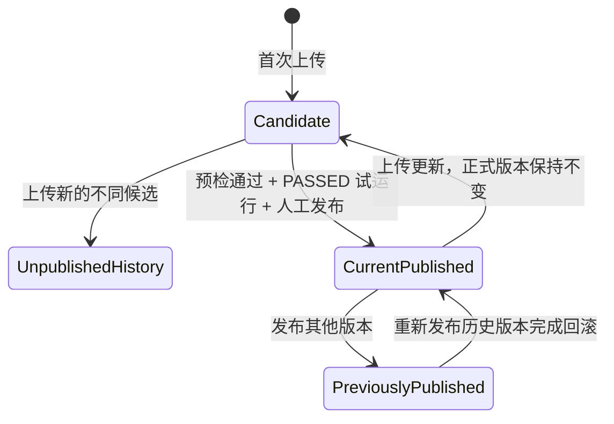

# 技能版本发布、依赖预检与指定版本试运行设计

## 1. 文档状态

- 日期：2026-09-22。
- 主题：`skill-release-validation`。
- 状态：实现、本地回归和 Rocky PostgreSQL 16 / MySQL 8.4 持久化验证已完成；真实浏览器发布闭环未通过，细节见进度账本。
- 当前阶段：候选、发布、依赖预检、TEST Run、运行快照与控制台工作区已落地。
- 后续门禁：部署前须先完成 V13 Flyway 迁移，并由管理员配置映射、授权和真实模型后执行试运行。

本规格扩展现有 [Skill 支持设计](./2026-09-20-skill-support-design.md)。原设计中“在线编辑器、草稿发布流程、版本回滚界面”属于第一版非目标；本次将其中的候选版本、发布控制和版本回滚纳入范围，同时增加依赖预检和指定版本试运行。没有被本文明确改变的技能导入、租户隔离、权限、审计、运行快照和 AgentScope 受控读取规则继续有效。

配套文档：[实施计划](../plans/2026-09-22-skill-release-validation.md)、[实现说明](../implementation/2026-09-22-skill-release-validation-implementation-design.md)、[进度账本](../progress/2026-09-22-skill-release-validation-ledger.md)。

## 2. 背景与问题

现有技能模块已经具备 ZIP 导入、不可变版本、启停、Agent 绑定、Run 固定版本、按需读取、读取预算和审计。上传新内容后，技能定义的当前版本会立即切换；已有 Run 因快照仍使用旧版本，新 Run 则直接采用新版本。

该方式缺少三个发布前控制点：

1. 上传内容与正式生效没有分离，管理员无法在不影响新 Run 的前提下验证候选版本。
2. 技能包不能声明其所需工具，也不能在发布、绑定或运行前解释依赖为何不可用。
3. 管理员不能以真实 Agent、模型和工具治理链路试运行指定版本，因此“导入成功”不能证明技能可用。

本次目标是建立一条连续、可审计且可恢复的交付链路：



## 3. 目标、范围与非目标

### 3.1 目标

- 上传版本默认只形成候选，不改变正式运行使用的版本。
- 发布前验证必需依赖、真实 Agent 授权和候选版本实际读取行为。
- Agent 默认跟随最新发布版本，同时允许固定到曾正式发布的版本。
- 发布、回滚和绑定策略变更不改变已有 Run 的技能及依赖快照。
- 控制台在同一工作区完成候选上传、依赖修复、试运行、审批恢复、发布和回滚，失败后可以原地重试。
- 所有拒绝和基础设施失败具有中文原因、稳定错误码和可检索的 `errorId`。

### 3.2 范围

1. 候选版本和正式发布版本双指针。
2. 不可变发布记录、版本历史、版本差异与回滚。
3. Agent 跟随发布版本或固定历史发布版本。
4. 技能工具依赖声明、租户内逻辑映射和结构/Agent 两层预检。
5. 指定 Agent、指定技能版本的真实模型试运行。
6. `NORMAL` 与 `TEST` Run 分类、试运行结果和审批恢复。
7. memory/JDBC 存储、PostgreSQL 16/MySQL 8.4 迁移、后端 API 和 v2 控制台完整闭环。
8. 旧技能、绑定、Run 和快照的兼容迁移。

### 3.3 非目标

- 多环境晋级、多级审批、定时发布、灰度比例和自动回滚。
- 自动评分、LLM-as-judge、批量评测集和质量阈值；首期由管理员人工判断输出质量。
- 自动创建工具、自动注册 MCP、自动增加 ToolGrant 或降低工具风险等级。
- 技能脚本执行、依赖安装、任意文件系统访问或新的代码沙箱。
- 跨租户共享、技能市场、Git/URL 自动同步和物理删除历史版本。
- 在线编辑技能正文；版本内容仍通过受控 ZIP 上传。

## 4. 核心决策

本次比较过三种实现路径：在现有定义和版本上继续追加状态字段，改动较小但会把上传、发布、回滚和运行取版混在同一聚合中；建设完整的多环境晋级流水线，治理最强但超出当前需求；最终选择“不可变版本 + 独立发布记录”，使内容事实、发布行为和运行选择分别演进，同时不引入多环境审批系统。

### 4.1 不可变版本与独立发布记录

`SkillVersion` 的正文、描述、元数据、依赖声明和资源继续不可变。上传只创建候选版本；正式生效由独立的 `SkillRelease` 表达。发布记录是追加式历史，回滚通过新增记录重新发布历史版本，不能修改或删除过去的发布事实。

`SkillDefinition` 保存两个独立指针：

- `candidateVersionId`：当前有效候选，可以为空；
- `publishedVersionId`：当前正式版本，可以为空。

定义必须至少持有一个有效指针：新技能只有候选，已发布技能至少有正式版本，已发布技能上传更新时同时具有正式版本和候选。两个指针都只能引用同租户、同技能的不可变版本。

每个技能同时只能有一个有效候选。再次上传不同内容时，旧候选保留为“未发布历史”，新版本成为有效候选。上传内容与当前候选相同则返回当前候选；内容与当前发布版本相同且没有候选时返回“内容未变化”，不创建无意义候选。

新技能首次上传后只有候选版本，初始保持停用且不能绑定到正式运行。首次发布后仍不自动启用；启用是独立的显式操作。没有发布版本的技能不能启用。

### 4.2 Agent 版本解析策略

`AgentSkillBinding` 增加两种策略：

- `FOLLOW_PUBLISHED`：默认策略；新 Run 使用技能当前发布版本。
- `PINNED`：使用绑定中指定的、曾正式发布过的版本。

候选版本和从未发布的历史版本不能固定。发布或回滚只影响之后创建的跟随型 Run；固定型 Agent 和已有 Run 不受影响。改变绑定策略不会撤销已有 Run；解绑、技能停用、绑定身份变化和访问纪元仍按现有规则撤销访问。

### 4.3 发布门禁

候选版本必须同时满足以下条件才能发布：

1. 发布时重新执行的结构预检通过。
2. 所有当前使用 `FOLLOW_PUBLISHED` 的绑定 Agent 均通过必需依赖授权预检。
3. 存在该候选版本的合格 `PASSED` 试运行。
4. 具有 `skill:write` 权限的管理员查看结果后显式提交发布。

合格试运行必须关联同一候选版本和当前依赖映射修订。依赖映射变化后，旧试运行仍保留历史，但不能满足发布门禁。发布动作不能使用过期的前端预检结果绕过服务端即时检查。

## 5. 生命周期与状态转换



“候选”“当前发布”“曾发布”“未发布历史”是版本与指针、发布记录共同推导的展示状态，不允许修改版本内容来改变状态。图中只描述版本状态；技能整体的启停状态与版本状态正交，用于紧急撤销所有跟随和固定绑定。

发布操作在同一工作单元中完成：锁定技能、核对候选与预期发布指针、即时预检、核对合格试运行、追加发布记录、切换发布指针、清空候选指针并追加严格审计。任一步失败必须整体回滚。

回滚目标必须是曾正式发布的版本。回滚前重新执行当前环境的依赖预检，成功后追加 `ROLLBACK` 发布记录并切换发布指针。回滚不要求新的试运行，但控制台提供指定历史版本试运行入口供管理员主动验证。

## 6. 依赖声明、映射与预检

### 6.1 包内声明

`SKILL.md` frontmatter 增加受限的工具依赖声明：

```yaml
---
name: order-analysis
description: 查询订单并整理异常原因时使用。
dependencies:
  tools:
    - key: order-query
      required: true
      description: 查询当前租户的订单数据
    - key: customer-profile
      required: false
      description: 补充客户分层信息
---
```

约束如下：

- `key` 是技能包内稳定逻辑名称，不是工具 UUID；格式沿用小写字母、数字和单连字符，版本内唯一。
- `required` 默认为 `true`；必需依赖失败阻止预检对应操作，可选依赖失败只告警。
- `description` 仅用于管理员理解用途，不作为授权依据。
- 依赖声明属于不可变版本内容并参与版本摘要。
- 未声明 `dependencies` 的旧技能视为无工具依赖。
- 声明不能创建工具、授权 Agent、改变风险等级或指定外部端点。

### 6.2 租户内工具映射

管理员为技能维护“逻辑依赖名 → 当前租户具体工具”的映射。映射属于技能的环境配置，同一逻辑名称可以跨版本复用；目标工具 ID 必须由服务端在可信租户范围内解析。

映射更新需要 `skill:write` 权限、技能级预期映射修订号和严格审计。修订号随任一逻辑映射变化单调递增，使预检和试运行能够判断整个映射集合是否过期。技能已启用时，服务端在保存前检查所有受影响的正式绑定：跟随型绑定使用当前发布版本，固定型绑定使用各自固定版本。任何必需依赖在目标 Agent 上不可用时拒绝映射更新；技能停用时允许先调整映射，重新启用前再执行完整预检。

每个 Run 的技能快照同时保存实际解析出的依赖映射，包括逻辑名称和工具 ID。后续修改映射不会改变已有 Run；恢复时继续使用原映射，但仍重新检查工具启用状态、Agent 授权、风险审批和撤销状态。

### 6.3 两层预检

结构预检检查：

- 每项必需依赖存在映射；
- 映射工具属于当前租户；
- 工具存在、已启用、类型与执行配置完整；
- 当前运行环境可以进入既有受治理执行链路。

Agent 预检在结构预检基础上检查：

- Agent 属于当前租户且可运行；
- Agent 对映射工具具有有效 ToolGrant；
- 工具和授权没有被停用或撤销。

预检不真正调用工具，防止检查动作产生业务副作用。候选详情执行结构预检；试运行检查选定 Agent；发布检查所有跟随型 Agent；新绑定、切换策略或固定版本检查目标 Agent。

每次预检保存不可变结果和明细，包括技能版本、依赖映射修订、检查场景、各依赖状态、可选的受检 Agent、工具 ID、失败原因、发起人和时间。发布预检可在同一次检查中为每条明细记录实际 Agent；历史结果用于诊断，涉及写操作时必须由服务端重新检查当前状态。

## 7. 指定版本试运行

### 7.1 隔离边界

试运行选择现有 Agent、目标技能版本和输入文本。目标版本可以是当前候选或任一历史版本。调用方必须同时具有 `skill:write`、`agent:run`，并能在当前租户读取目标技能和 Agent。

试运行使用真实模型配置、系统提示、其他技能、工具授权和审批策略：

- 目标技能已正式绑定时，本次临时替换为指定版本；
- 目标技能未绑定时，只在本次 Run 临时注入，不创建正式绑定；
- 目标技能的必需工具必须已映射并授权给该 Agent；
- 其他技能继续按各自跟随/固定策略解析；
- 试运行不创建会话和消息，不改变候选、发布和绑定状态。

`TEST` 表示与正式会话、正式运行列表和生产统计隔离，不代表外部工具无副作用。真实工具调用继续经过工具启用检查、ToolGrant、风险策略、人工审批、审计和脱敏。控制台在启动前明确提示真实写操作可能改变外部业务数据。

### 7.2 结果状态

- `RUNNING`：模型或工具链正在执行，尚未形成试运行结果。
- `PASSED`：Run 成功完成，且至少存在一条目标技能、目标版本的成功 `SkillLoadRecord`。
- `NOT_TRIGGERED`：Run 成功完成，但模型没有实际读取目标技能。
- `FAILED`：模型、技能读取、工具调用或持久化最终失败。
- `WAITING_APPROVAL`：真实风险工具等待审批；决定提交后恢复同一个 Run。

只有当前候选版本的 `PASSED` 结果可以满足正常发布门禁。目录提示中出现技能名称不算实际读取；单纯获得正常模型回答也不能把 `NOT_TRIGGERED` 提升为 `PASSED`。

### 7.3 连续执行体验

试运行使用流式接口展示输出和受控进度。浏览器断开不会取消已启动的 Run；刷新页面后可继续查看状态。等待工具审批时保留原 Run、技能快照和依赖映射快照，审批完成后从原检查点恢复，不重新创建试运行。

失败不会丢弃候选、映射或历史结果。管理员可以在同一技能工作区修复映射、补充 ToolGrant、调整输入并再次试运行。

## 8. 数据模型与持久化

### 8.1 既有结构调整

| 结构 | 调整 |
| --- | --- |
| `skill_definitions` | 将单一当前版本语义拆分为可空 `candidate_version_id` 和可空 `published_version_id`；增加技能级依赖映射修订；保留启停、访问纪元和审计主体 |
| `agent_skill_bindings` | 增加 `resolution_mode`、可空 `pinned_version_id` 和用于条件更新的修订号 |
| `runs` | 增加 `run_kind`，取值为 `NORMAL` 或 `TEST` |
| `run_skill_snapshots` | 快照格式升级，技能引用增加解析策略结果和逻辑依赖到工具 ID 的映射；旧格式继续可读 |
| `tool_approval_requests` | 增加审批范围并允许 TEST Run 的会话标识为空；正式会话审批仍必须携带会话标识 |

### 8.2 新增结构

| 结构 | 职责与关键字段 |
| --- | --- |
| `skill_releases` | 追加式发布历史；包含发布序号、`PUBLISH/ROLLBACK/BASELINE`、前后版本、关联预检/试运行、操作者和时间 |
| `skill_dependencies` | 保存版本级不可变依赖；包含版本、逻辑 key、是否必需、描述和稳定顺序 |
| `skill_dependency_mappings` | 保存技能级逻辑 key 到租户工具 ID 的映射和更新审计字段；集合修订号由技能定义统一持有 |
| `skill_preflight_checks` | 保存一次预检的版本、映射修订、场景、可选 Agent、汇总状态、发起人与时间 |
| `skill_preflight_items` | 保存各依赖的工具解析结果、必需性、状态、稳定失败码和安全原因 |
| `skill_trials` | 与 `TEST` Run 一一关联；保存目标技能/版本、Agent、映射修订、试运行状态和是否满足发布门禁 |

所有表和查询必须携带 `tenant_id`。PostgreSQL 与 MySQL 使用同版本号的方言迁移，逐表逐字段提供非空中文数据库注释。发布记录、历史版本、预检结果和试运行不支持物理删除。

## 9. API 与权限

在保留现有技能列表、详情、资源、启停和绑定兼容入口的基础上，新增以下职责型接口：

- 查询版本历史、单版本详情和两版本文本差异；
- 上传或查询当前候选版本；
- 查询、创建和条件更新依赖映射；
- 对版本执行结构或 Agent 预检并查询明细；
- 创建指定版本试运行、读取状态与流式事件；
- 发布当前候选、回滚到历史发布版本；
- 设置 Agent 绑定的跟随或固定策略。

权限边界：

- 历史、差异、依赖和发布记录读取需要 `skill:read`；
- 上传候选、修改映射、发布、回滚需要 `skill:write`；
- 试运行同时需要 `skill:write` 与 `agent:run`；
- 查看试运行完整运行详情同时遵守现有 `agent:read` 规则；
- 绑定策略更新需要 `agent:write` 和 `skill:read`。

Controller 只负责请求校验、可信主体解析、权限入口和响应状态。发布事务、预检编排、试运行上下文和状态转换分别进入职责明确的 Service；Core 不依赖 Spring Web、JDBC 或 AgentScope 类型。

候选指针、发布指针、映射和绑定策略均使用预期修订或预期 ID 做条件更新。并发冲突返回 409 和明确中文提示，不允许最后写入者静默覆盖。

## 10. 控制台交互

沿用现有中文“列表—详情—操作”的受控工作台结构。技能详情形成连续步骤，不把每一步拆成互相丢失状态的独立页面：

1. 上传候选版本并展示与当前发布版本的差异。
2. 展示候选依赖，原地配置缺失映射。
3. 执行结构预检并定位到失败依赖。
4. 选择 Agent 和输入，启动指定版本试运行。
5. 持续展示输出、目标技能读取、工具调用、审批和错误编号。
6. 满足门禁后展示发布影响并允许确认发布。

详情页同时提供：

- 版本历史，明确标识候选、当前发布、曾发布和未发布历史；
- 依赖面板，区分映射缺失、工具不可用、Agent 未授权和可选告警；
- 试运行历史，区分 `PASSED`、`NOT_TRIGGERED`、`FAILED` 和等待审批；
- 发布影响，列出会在下一次 Run 采用新版本的跟随型 Agent；
- 回滚入口，选择历史发布版本并展示即时预检结果；
- Agent 绑定中的跟随/固定选项以及固定版本来源。

前端不得把本地步骤状态当作授权或门禁依据。所有动态正文使用安全 DOM API 渲染；错误只展示服务端脱敏消息、错误码和 `errorId`。

## 11. 错误、安全与审计

新增稳定错误类型至少覆盖：候选已变化、发布版本已变化、无发布版本、版本未曾发布、依赖声明无效、依赖未映射、映射工具不可用、Agent 缺少授权、预检已过期、缺少合格试运行、试运行未触发目标技能和发布事务失败。

预期业务拒绝返回对应 4xx、中文可行动原因和稳定错误码。未知异常由最终处理边界生成 `errorId`，记录含可信 tenant、技能、版本、Agent、Run 和操作名称的脱敏堆栈；不得向前端暴露工具端点、原始外部响应、模型密钥、JWT、SQL 或内部路径。

严格审计至少记录：候选创建、候选被取代、依赖映射变更、试运行创建与终态、发布、回滚、绑定策略变化、固定版本变化以及权限拒绝。审计失败时，候选上传后的数据库写入、映射更新、发布、回滚和绑定策略更新必须回滚。模型和外部工具执行不能跨网络调用持有数据库事务；其终态在短事务中收口。

## 12. 兼容迁移

升级时采用以下确定性转换：

1. 现有 `current_version_id` 迁移为 `published_version_id`，`candidate_version_id` 设为空。
2. 为每个现有技能当前版本生成一条 `BASELINE` 发布记录，保留当前启停状态。
3. 现有 Agent 技能绑定统一设为 `FOLLOW_PUBLISHED`，固定版本为空。
4. 现有 Run 统一设为 `NORMAL`。
5. 现有运行快照按旧格式继续读取；新 Run 写入包含依赖映射的新版格式。
6. 从每个历史版本的已保存元数据解析依赖；没有依赖声明的版本写入空集合。
7. 既有权限、多租户条件、访问纪元、读取记录和审计历史保持不变。

迁移前后均不修改已发布的 V12 脚本；使用新的 Flyway 版本。若任一旧定义的当前版本引用不完整，迁移必须失败并报告安全诊断，不能静默生成无发布版本的异常技能。

## 13. 验证与验收标准

### 13.1 自动化验证

- Core 单元测试覆盖候选替换、发布、回滚、跟随/固定解析和状态不变量。
- 包解析测试覆盖依赖格式、重复 key、必需默认值、摘要变化和旧包兼容。
- Service 测试覆盖两层预检、映射修订、发布门禁、审计回滚和并发冲突。
- Runtime 测试覆盖临时注入、目标版本替换、`NOT_TRIGGERED`、依赖映射快照和审批恢复。
- Web 测试覆盖认证、组合权限、租户隐藏、HTTP 状态、错误码/`errorId` 和脱敏。
- PostgreSQL 16 与 MySQL 8.4 Testcontainers 测试覆盖迁移、注释、约束、事务和旧数据转换；按仓库要求在 `ssh rocky` 的 Docker 环境执行。
- 控制台 Node 测试覆盖状态归并、迟到响应隔离、流式错误和版本/依赖展示。
- 真实浏览器覆盖桌面与 390px：候选上传、映射修复、试运行、审批恢复、发布、固定版本和回滚。

### 13.2 业务验收

1. 上传候选不会改变新建正式 Run 使用的发布版本。
2. 缺少必需依赖时不能试运行、发布或建立对应正式绑定；可选依赖只告警。
3. 试运行不会创建会话、消息或正式绑定，但使用真实模型、工具授权和审批链路。
4. 模型未读取目标技能时明确显示 `NOT_TRIGGERED`，不能满足发布门禁。
5. 发布后，跟随型 Agent 的下一次 Run 使用新版本，固定型 Agent 和已有 Run 保持原版本。
6. 回滚产生新发布记录，跟随型 Agent 的下一次 Run 使用目标历史版本，发布历史不可篡改。
7. 修改依赖映射不会改变已有 Run 的工具映射快照；运行恢复仍重新检查当前授权和启用状态。
8. 浏览器断开、预检失败或试运行失败不会丢失候选及已完成步骤，可以在同一页面继续处理。
9. 前端错误编号可以检索到对应后台诊断，响应和受控日志不包含密钥、内部地址、SQL、堆栈或原始外部响应。

## 14. 实施影响范围

- `cm-agent-core`：发布、依赖、预检、试运行、绑定策略和新版快照领域契约及 Repository 接口。
- `cm-agent-persistence`：新 Flyway 方言迁移及 JDBC Repository。
- `cm-agent-server`：包解析、管理编排、预检、试运行、发布、回滚、权限、审计和错误诊断。
- `cm-agent-agentscope-adapter`：指定版本临时注入和解析后依赖上下文，不开放脚本执行或原生自动上传。
- `cm-agent-console`：技能连续工作区、版本历史、差异、依赖、试运行、发布和绑定策略。
- `README.md`、Adapter README、配置说明和发布说明：在实际实现阶段同步更新；本设计阶段不宣称功能已经可用。

本次设计不要求引入 JPA、MyBatis、新消息队列或新的前端框架，继续沿用现有 JDBC/Flyway、Repository、运行编排、原生 AgentScope 技能适配和轻量控制台基线。

## 15. 审查后可靠性补强

- `WAITING_APPROVAL` 的 TEST Run 必须能按 `runId` 查询当前运行级审批；控制台展示脱敏工具摘要、有效期和逐项允许/拒绝操作，再次等待时继续使用服务端返回的新审批。
- 审批创建不属于模型或工具网络调用事务。首次或续轮审批事实创建失败时，服务必须关闭仍活动的 Run、删除加密检查点、追加失败审计并将关联试运行收口为 `FAILED`，不能遗留可恢复但没有审批事实的 HIGH 工具状态。
- 恢复时保持固定依赖映射，但每次实际执行前均以本轮重新解析的已启用工具和 `ToolGrant` 授权复核全部必需依赖；任一依赖被停用或撤销即以 `SKILL_ACCESS_REVOKED` 拒绝继续。
- 关闭技能功能时拒绝创建指定版本试运行及临时快照；运行级审批过期必须在短事务内关闭 Run、删除检查点并严格审计。

## 16. 浏览器验收缺陷修复

- 结构预检结果必须依据预检 API 的 `check.status` 展示，成功、失败与未知状态不得因前后端字段契约不一致而错报。
- 指定版本试运行路由必须显式声明 UUID 路径变量名称，不依赖编译器是否保留 Java 参数名；接口回归应证明请求能到达业务服务。
- 浏览器验收使用 test profile 与 Fake Runtime，验证预检成功和试运行门禁结果；Fake Runtime 返回 `NOT_TRIGGERED` 时必须继续阻止正式发布，不将其描述为真实模型成功。
