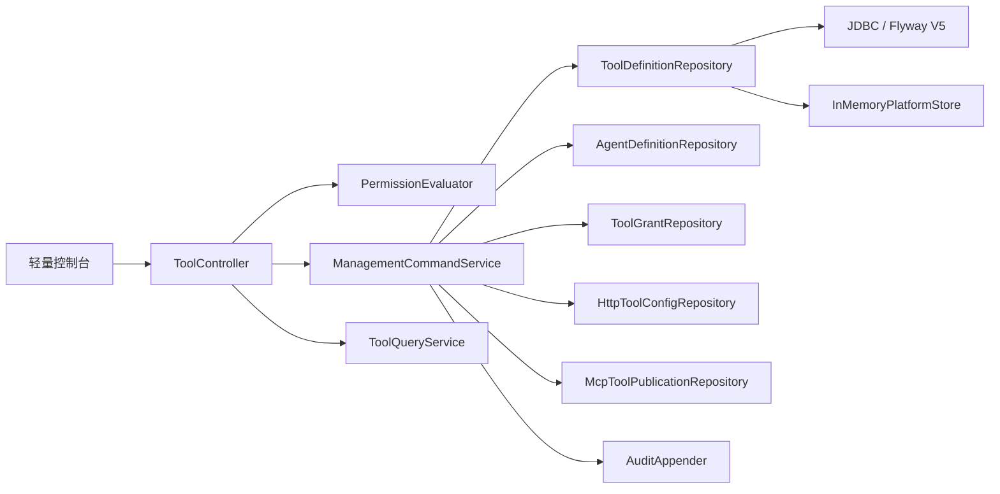
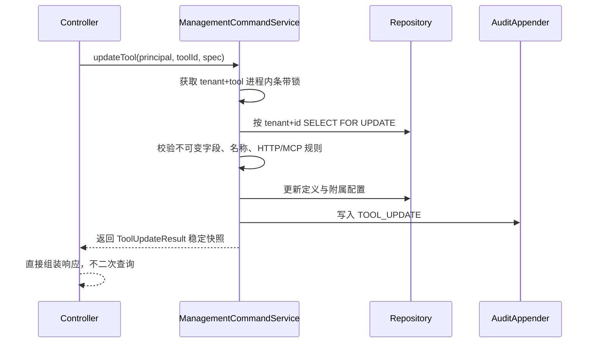

# 工具编辑、删除与 Agent 解除关联技术设计

## 1. 文档目的

本文说明当前工具治理任务的最终实现原理，供代码评审、部署、故障排查和后续演进使用。内容以当前实现为准，覆盖：

- 工具编辑、删除以及 Agent—工具解除关联的 REST 契约；
- 多租户、权限、严格审计和敏感信息边界；
- JDBC 与 memory 两种持久化模式的一致语义；
- V5 软删除、历史 ToolCall 保护和内置 LOCAL 示例受控恢复；
- 同进程及多实例并发控制；
- 控制台编辑、删除冲突提示和异步状态协调。

本文不扩展 Agent 编辑或删除、批量解除关联、工具类型转换、LOCAL 执行器热更新、历史数据清理、后台恢复任务或跨服务分布式锁。

## 2. 设计目标与核心约束

本次实现遵循以下原则：

1. **引用显式解除**：删除工具不会自动修改 Agent。只要任一当前租户 Agent 的 `toolIds` 仍包含工具 ID，删除必须返回 `409 Conflict`，由操作者先执行解除关联。
2. **历史优先**：已经产生 ToolCall 历史的工具不能删除；尚未落库的在途调用则通过工具墓碑保留外键锚点，避免运行结束时写入 ToolCall 失败。
3. **不可变身份**：更新不能改变工具 ID、tenant、类型和创建人；LOCAL 工具名称也不可修改，避免与已注册运行时快照失配。
4. **租户条件下沉**：tenant 只取自认证主体，Repository 的每个读写和锁操作都包含 tenant 条件，跨租户资源表现为不存在。
5. **状态与审计一致**：JDBC 模式下业务变更与成功审计在同一事务提交；memory 模式没有数据库事务，因此使用快照补偿保证失败后恢复原状态。
6. **更新响应属于本次命令**：更新命令直接返回事务内生成的稳定快照，Controller 不在提交后重新查询，避免并发更新或删除污染本次响应。
7. **前端迟到响应无所有权**：会话、列表加载和编辑对象均使用代际判断；旧请求完成后不能覆盖新会话、新选择或新编辑表单。

## 3. 分层结构



- `ToolController` 只负责路由、请求校验、主体解析、权限入口和响应映射。
- `ManagementCommandService` 负责跨 Repository 的校验、锁、事务、补偿和成功审计。
- `ToolQueryService` 负责将工具定义、HTTP 配置、MCP 发布状态和运行时就绪状态组装为摘要。
- Repository 接口位于 core；JDBC 实现位于 persistence；memory 实现由 server 配置装配。

## 4. REST 接口契约

| 操作 | 方法与路径 | 权限 | 成功响应 | 主要冲突 |
| --- | --- | --- | --- | --- |
| 编辑工具 | `PUT /api/tools/{toolId}` | `tool:grant` | `200`，返回本次提交的工具摘要 | 名称冲突 `409` |
| 删除工具 | `DELETE /api/tools/{toolId}` | `tool:delete` | `204` | Agent 引用或已有调用历史 `409` |
| 解除关联 | `DELETE /api/tools/{toolId}/grants/{agentId}` | `tool:grant` | `200`，返回更新后的 Agent | 工具或 Agent 不存在 `404` |

认证主体提供 `tenantId` 和 `principalId`。请求不能传入 tenant 覆盖主体上下文。权限拒绝沿用统一授权入口并记录 `ACCESS_DENIED`；成功写操作分别记录：

- `TOOL_UPDATE`
- `TOOL_DELETE`
- `TOOL_GRANT_REVOKE`

统一异常处理输出脱敏的结构化错误。请求字段非法返回 `400`；资源不存在或跨租户返回 `404`；持久化或严格审计不可用返回 `503`。

## 5. 工具编辑原理

### 5.1 可变与不可变字段

更新请求复用创建请求的大部分结构，但服务端不会信任客户端提供的身份字段。

| 字段 | HTTP 工具 | LOCAL 工具 | 说明 |
| --- | --- | --- | --- |
| `id`、`tenantId`、`createdBy` | 不可变 | 不可变 | 取已有定义 |
| `type` | 不可变 | 不可变 | 类型变化返回 `400` |
| `name` | 可修改 | 不可修改 | 同租户活动名称唯一 |
| `description`、`riskLevel`、`enabled` | 可修改 | 可修改 | `updatedBy` 取当前主体 |
| HTTP 配置 | 必须提供完整配置 | 不允许提供 | 沿用创建时验证规则 |
| MCP 发布状态 | 可随完整配置更新 | 只允许取消已有发布 | 新发布 LOCAL 工具仍走专用发布接口 |

HTTP 配置包括方法、URL 模板、输入 Schema、参数映射、Secret 引用和超时。Secret 字段只保存引用标识，不保存或返回真实 Secret；Map 中的空键、空值或 `null` 元素在请求校验阶段返回 `400`。

### 5.2 更新流程



JDBC 更新 SQL 只匹配 `tenant_id + id + deleted_at IS NULL`。更新行数为零时按资源不存在处理，防止已删除工具被迟到更新复活。

`ToolUpdateResult` 同时包含更新后的工具、HTTP 配置和 MCP 发布状态。Controller 使用这份快照构建响应，避免事务提交后另一请求先完成更新或删除，导致响应展示他人的状态或返回错误。

## 6. 删除与引用保护原理

### 6.1 删除前置检查

删除在锁定工具后执行两项检查：

1. 扫描当前 tenant 的 Agent，若任一 `toolIds` 包含目标工具，返回 `409`：`工具仍被 Agent 关联，请先解除关联后再删除`。
2. 查询当前 tenant 下是否已经存在该工具的 ToolCall；存在时返回 `409`：`工具已有调用历史，为保留运行记录不能删除`。

第一项检查保证 Agent 配置不会被删除动作隐式改写。第二项检查保留已经形成的运行历史语义。

### 6.2 为什么采用软删除

ToolCall 在运行完成阶段才批量持久化，因此存在以下竞态：工具调用已经开始，但 ToolCall 尚未写入；管理员此时解除 Agent 引用并删除工具。如果物理删除定义，迟到的 ToolCall 会因外键缺少工具行而写入失败。

V5 将删除改为墓碑更新：

```sql
deleted_name = 原名称
name         = 内部唯一墓碑名
enabled      = false
deleted_at   = 当前时间
```

这样同时满足：

- 活动查询通过 `deleted_at IS NULL` 隐藏工具；
- 原名称立即释放，可供同租户的新工具使用；
- 原 `id + tenant_id` 物理行继续存在，迟到 ToolCall 可以完成外键写入；
- 调试、授权、HTTP 配置和 MCP 目录不能绕过活动工具查询访问墓碑。

删除事务依次清理 HTTP 配置、MCP 发布记录和残留授权，再软删除工具定义并写 `TOOL_DELETE` 审计。JDBC 任一步失败会整体回滚。

### 6.3 删除与授权并发

同一工具的授权、更新和删除都先取得 `tenantId + toolId` 对应的进程内条带锁。JDBC 模式还对活动工具行执行 `SELECT ... FOR UPDATE`：

- 若授权先锁定，删除等待授权事务提交，随后引用检查可看到 Agent 关联并返回 `409`；
- 若删除先锁定，授权等待删除提交，随后活动工具查询因 `deleted_at` 非空返回不存在；
- 因而多实例部署不依赖单 JVM 锁保证正确性，数据库行锁才是跨实例串行化边界。

进程内条带锁主要统一 memory 语义并减少同进程竞争；它不是分布式锁。

## 7. Agent—工具解除关联原理

授权关系同时存在于两处：

- `tool_grants` 中的授权记录；
- `agent_definitions.tool_ids_json` 中的工具 ID。

解除操作必须在同一事务中同时处理两处：删除 `tool_grants` 对应记录，并从 Agent 的 `toolIds` 移除工具 ID，最后写入 `TOOL_GRANT_REVOKE`。即使授权记录已不存在，操作仍会收敛 Agent 的 `toolIds`，因此具备幂等清理效果。

JDBC 修改 Agent 工具集合前对 `tenant_id + agent_id` 行执行锁定读取，避免并发授权或解除不同工具时发生“最后写入覆盖”而丢失其他工具 ID。服务层的 Agent 条带锁与工具条带锁为 memory 模式提供对应的串行化行为。

## 8. 事务、补偿与严格审计

### 8.1 JDBC 模式

编辑、删除、解除关联均由 `TransactionTemplate` 包裹。业务数据与成功审计共享事务：

- 审计成功：业务数据和审计一起提交；
- 审计失败：事务回滚，API 返回审计服务不可用；
- 数据库异常：事务回滚，API 返回数据服务不可用。

### 8.2 memory 模式

memory 模式用于本地和测试，没有数据库事务。命令执行前保存必要快照，失败时反向恢复：

- 更新恢复工具、HTTP 配置和 MCP 状态；
- 删除恢复刚生成墓碑的工具快照及授权；
- 解除关联恢复 Agent 工具集合及授权。

`restoreDeletedToolForCompensation` 只允许恢复本命令刚删除、且 tenant、ID、原名称和类型均与快照一致的墓碑。它不是业务恢复接口，JDBC 实现不使用该能力。

## 9. V5 数据库迁移与受控恢复

迁移文件 `V5__soft_delete_tool_definitions.sql` 新增：

- `deleted_at TIMESTAMP NULL`
- `deleted_name VARCHAR(160) NULL`
- 索引 `(tenant_id, deleted_at)`

所有活动工具查询、锁定查询，以及 HTTP/MCP 附属配置的读取都过滤墓碑。V5 兼容 PostgreSQL 16 和 MySQL 8.4，不修改既有 V1–V4 历史迁移。

固定目录中的 LOCAL 内置示例使用固定 ID。删除后的墓碑仍占用该主键，普通 `INSERT` 不能重新安装。为此提供受控恢复能力 `restoreManagedLocalTool`，仅安装服务可调用，并要求同时匹配：

- tenant；
- 固定工具 ID；
- 墓碑保存的原名称；
- `LOCAL` 类型；
- `deleted_at IS NOT NULL`。

恢复在原物理行上清空 `deleted_at/deleted_name` 并更新受管定义，因此不会破坏历史外键。如果原名称已被其他活动工具占用，数据库唯一约束会使恢复返回冲突。普通工具创建仍然只执行 `INSERT`，不能通过该能力复活任意墓碑。

## 10. 多租户、权限与敏感信息边界

- Controller 从认证主体构建 `PrincipalRef`，不接受客户端 tenant。
- Repository 查询、更新、删除、锁和授权清理均包含 `tenant_id` 条件。
- 跨租户 ID 不会泄露资源存在性，统一表现为 `404`。
- 工具删除使用独立权限 `tool:delete`；编辑和解除关联沿用 `tool:grant`。
- 权限拒绝记录审计；成功变更在严格审计路径中提交。
- API、审计和日志不返回 Secret 原文、JWT Secret、数据库密码或模型 API Key。
- HTTP `secretHeaders` 保存的是 Secret 引用关系，运行时真实值由受控 Secret Provider 解析。

## 11. 控制台交互与异步状态协调

### 11.1 编辑与删除

- 工具卡片提供“编辑”和“删除”。
- 编辑复用创建表单；工具类型锁定，LOCAL 名称只读。
- HTTP 参数映射中的 `defaultValueJson` 在回填时还原成表单使用的 JSON 值，提交时只解析一次。
- 删除先弹出确认框；只有服务端返回包含 Agent 引用语义的 `409` 时，才提示前往 Agent 详情解除关联。其他 `409`（例如已有调用历史）保留服务端原始业务消息。

### 11.2 解除关联

Agent 详情中的关联工具提供“解除关联”。成功后刷新仍处于选中状态的原 Agent 和工具列表；如果用户等待期间已切换 Agent，旧操作不会把界面强制切回。

### 11.3 防止迟到响应覆盖新状态

控制台使用三类门控：

- `sessionEpoch`：登录态或会话切换后，旧请求不能写入新会话界面；
- 加载 revision：只允许最新有效的工具或 Agent 加载结果落地；
- 编辑对象核对：保存工具 A 完成时，只有表单仍在编辑 A 才能重置，不能清空用户随后开始编辑的工具 B。

请求路径中的工具 ID 和 Agent ID 统一经过 URL 编码。前端只构造业务载荷和提示，不接触真实 Secret。

## 12. 关键错误语义

| 状态码 | 场景 | 客户端行为 |
| --- | --- | --- |
| `400` | 类型变化、LOCAL 改名、HTTP 配置缺失、字段校验失败 | 修正表单后重试 |
| `403` | 缺少 `tool:grant` 或 `tool:delete` | 不重试，申请权限 |
| `404` | 当前租户内工具或 Agent 不存在 | 刷新列表 |
| `409` | 名称冲突、Agent 仍引用、已有调用历史、内置示例恢复冲突 | 按消息处理；引用冲突先解除关联 |
| `503` | 数据库或严格审计不可用 | 保持原状态，待服务恢复后重试 |

## 13. 测试与验证

自动化测试覆盖：

- Controller 的认证、权限、校验、成功响应、`409` 和跨租户不可见；
- 命令服务的更新快照、事务回滚、memory 补偿、删除冲突和解除关联；
- JDBC Repository 的 tenant 条件、行锁、软删除、墓碑过滤和恢复约束；
- PostgreSQL/MySQL 下的 V1→V5 迁移和并发行为；
- 在途工具调用完成后对 ToolCall 的迟到持久化；
- 控制台载荷、路径、冲突识别、会话代际和编辑对象所有权。

最终验证环境与结果：

- Rocky Linux 容器：Maven 3.9.9、JDK 21.0.7；
- 全仓 Java 测试：678/678 通过；
- PostgreSQL 16.14、MySQL 8.4 与 memory 专项：53/53 通过；
- 控制台 Node 测试：35/35 通过。

## 14. 兼容性、运维与后续演进

- 新增接口不改变既有创建、查询、授权、调试和 MCP 路径。
- 自定义角色需要显式增加 `tool:delete` 才能使用删除接口。
- 运维统计活动工具时必须过滤 `deleted_at IS NULL`；不得手工物理删除墓碑或重写历史 ToolCall 外键。
- 删除前扫描当前租户 Agent，复杂度随 Agent 数量线性增长。当前实现以跨 PostgreSQL/MySQL 的一致性优先；规模增长后可考虑规范化 Agent—工具关系并以数据库约束替代 JSON 列引用检查。
- 后续若需要业务级恢复、批量解除或墓碑清理，必须先定义历史保留期限、审计权限和在途运行协调协议，不能直接复用内置 LOCAL 示例的受控恢复入口。

## 15. 代码定位

- REST 入口：`cm-agent-server/src/main/java/com/cmagent/server/web/ToolController.java`
- 命令编排：`cm-agent-server/src/main/java/com/cmagent/server/service/ManagementCommandService.java`
- 查询组装：`cm-agent-server/src/main/java/com/cmagent/server/service/ToolQueryService.java`
- Repository 契约：`cm-agent-core/src/main/java/com/cmagent/core/repository`
- JDBC 实现：`cm-agent-persistence/src/main/java/com/cmagent/persistence`
- V5 迁移：`cm-agent-persistence/src/main/resources/db/migration/V5__soft_delete_tool_definitions.sql`
- 控制台交互：`cm-agent-console/src/main/resources/META-INF/resources/assets/app.js`
- 控制台纯函数：`cm-agent-console/src/main/resources/META-INF/resources/assets/console-core.js`
